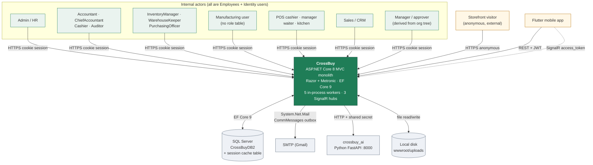

# 01 — System Context

## Scope
Who uses CrossBuy and what it actually talks to. Integrations are split into **real** (code exists and is
reachable) and **planned** (named in design docs with no implementation).

## Evidence
`Program.cs` (auth schemes, DI, hubs) · `appsettings.json` sections · `BL/CommService.cs` (SMTP) ·
`BL/AiService.cs` + `BL/AiInsightsService.cs` (AI proxy) · `Hubs/*.cs` · `Controllers/Api/*` ·
`BL/FileManagerService.cs` · `BL/CalendarService.cs` · `Models/SessionValidationMiddleware.cs`.

## Actor catalogue (from role tables and access services)

| Actor | How the system knows them | Evidence |
|---|---|---|
| **Employee** (base identity for everyone) | ASP.NET Identity `Users` 1:1 to `Employee` via `Employee.UserId` | `CrossDbContext.OnModelCreating` `HasOne(e => e.User)` |
| Administrator | Identity roles + `AdminController` | `Controllers/AdminController*.cs` (4 partials) |
| Accountant / ChiefAccountant / Cashier / Auditor | `AccountingUserRoles.Role` | `BL/AccountingAccessService.cs` — actions `read`/`post`/`pay`/`manage`/`currency-override` |
| InventoryManager / WarehouseKeeper / PurchasingOfficer / InventoryAuditor | `InventoryUserRoles.Role` | `BL/InventoryAccessService.cs` — `read`/`doc`/`purchase`/`manage` |
| SalesManager / SalesRep / Marketing / CrmViewer | `CrmUserRoles.Role` | `BL/CrmAccessService.cs` — `read`/`edit`/`manage` (+ row-level `VisibleOwnerIdsAsync`) |
| POS cashier / manager / waiter / kitchen | `BranchUserRoles.PosRole` (branch-scoped) | `BL/PosAccessService.cs` — `pos-cashier`/`pos-manager`/`pos-waiter`/`pos-kitchen` |
| Manufacturing user | **no role table** — governed by inventory roles; WO actions carry no `[InvPerm]` | `Controllers/InventoryController.cs:1046-1150` |
| HR user | **no role table** — `PeopleController`/`AdminController` gated by `[SessionValidation]` only | `Controllers/PeopleController.cs` |
| Manager (approver) | derived at runtime from the org tree, not a role | `BL/LeaveWorkflowService.ManagerChainAsync` |
| Mobile app user | JWT bearer | `Program.cs` JwtBearer + `Controllers/Api/AuthApiController.cs` |
| **Storefront visitor (external, anonymous)** | no login; visitor session | `SessionValidationMiddleware` `isStorefront` bypass for `/home/store` + `/store*` |

**Finding (Inconsistency).** Four modules have role tables; **Manufacturing, HR, Projects and Tasks have
none**. Their screens rely on authentication only. See 13.

## Real external systems

| System | Direction | Implementation | Config |
|---|---|---|---|
| **SQL Server** | read/write | EF Core 9 `CrossDbContext`, single database | `ConnectionStrings:DefaultConnection` |
| **SQL Server (session store)** | read/write | `Microsoft.Extensions.Caching.SqlServer` distributed session | `Program.cs` |
| **SMTP (Gmail)** | outbound | `BL/CommService.cs` → `System.Net.Mail`; queued in `CommMessages` | `Smtp:*` (host/port/user/**password in appsettings**) |
| **Python AI service** (`crossbuy_ai`, FastAPI, :8000) | outbound HTTP | `BL/AiService.cs` typed `HttpClient` + shared-secret header; `BL/AiInsightsService.cs` gathers module data first | `AiService:BaseUrl`, `AiService:Secret` |
| **SignalR clients** (browser + Flutter) | bidirectional | `Hubs/NotificationsHub`, `ChatHub`, `PosHub`; dual auth (cookie + `access_token` query) | `Program.cs AddSignalR` |
| **Flutter mobile app** | inbound | 10 API controllers under `Controllers/Api/`, JWT | `Jwt:*` |
| **Local file system** | read/write | `wwwroot/uploads/...` via `FileManagerService`, `HrDocumentService`, chat/email attachments | `IWebHostEnvironment.WebRootPath` |

## Not integrated (Missing / Planned)

| Capability | Status | Evidence |
|---|---|---|
| Payment gateway | **Missing** | no provider SDK, no payment HTTP client anywhere |
| SMS / WhatsApp / Push | **Missing** | explicitly out of scope in `docs/CrossBuy_Communication_Hub_Analysis.md` §1 |
| External calendar (M365/Google) | **Missing** — the calendar is internal-only | `Models/Context/Calendar/CalendarEvent.cs`, no CalDAV/Graph client |
| Meetings / calls / voice notes | **Planned** | Book 1 Rev 2.0 Layer 4; no code |
| External identity provider (SSO/OIDC) | **Missing** | only Identity cookies + JWT; `Authentication.Certificate` is referenced but no cert scheme is wired for users |
| Reporting/BI system | **Missing** — reports are in-app Razor + `ClosedXML` export | `BL/ExcelExporter.cs` |
| Message broker / external scheduler | **Missing** — all async work is in-process | 15-Background-Workers |

## System context diagram (real integrations only)

## Planned capabilities (separate, not in the diagram)
Meetings · calls · voice notes · SMS/WhatsApp/push · external calendar sync · payment gateway · global search ·
AI context platform · SaaS tenant onboarding. All from Book 1 Rev 2.0 and the module analysis docs; **none has
an implementation**.

## Gaps
- No SSO; no external IdP.
- SMTP credentials sit in `appsettings.json` (gitignored, so per-environment, but still plaintext on disk).
- AI shared secret likewise in configuration.
- The storefront is the only external-facing surface and is anonymous.

## Risks
- **Secrets in config files** rather than a secret store (`Smtp:Password`, `AiService:Secret`, `Jwt:Key`).
- The AI service is a separate process with no health check or circuit breaker in `AiService`.
- Mobile and web share one authorization surface but different auth schemes; see 13 and 16.

## Dependencies
03-Container-Architecture, 13-Security, 16-API-Integration-Map.

## Recommendations
1. Move `Smtp:Password`, `AiService:Secret` and `Jwt:Key` to environment variables/secret store (the deployment
   doc already states env vars as the convention — it is not enforced in `appsettings.json`).
2. Add a timeout + failure policy to the `AiService` typed client.
3. Decide explicitly whether Manufacturing/HR/Projects get role tables (blocks several later stages).
