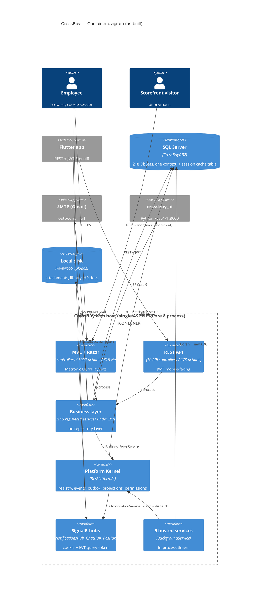
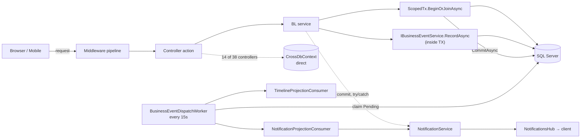
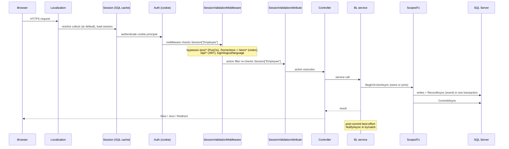
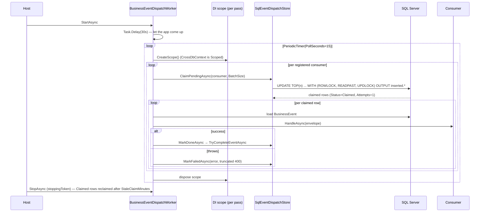

# 03 — Container and Runtime Architecture

## Scope
Runtime topology, process/transaction boundaries, request and background lifecycles, configuration sources and
DI lifetimes.

## Evidence
`CrossBuy/Program.cs` (whole file: DI, auth, session, SignalR, middleware order, hosted services) ·
`BL/ScopedTx.cs` · `Models/SessionValidationMiddleware.cs` · `Models/SessionValidationAttribute.cs` ·
`appsettings*.json` · `BL/BusinessEventDispatchWorker.cs` (in `BL/Platform/`).

## Containers

**One deployable process.** The web host also runs every background worker and both SignalR hubs. There is no
separate worker service, no queue broker, no cache server (session cache is a SQL Server table).

## Runtime interaction

## Request lifecycle

Middleware order in `Program.cs` matters and is fragile (flagged in the Comm-Hub analysis). Observed order:
localization → static files → routing → session → authentication → authorization →
`SessionValidationMiddleware` → endpoints.

**Two overlapping session gates.** `SessionValidationMiddleware` (path-based) **and**
`SessionValidationAttribute` (per-controller) both check `Session["Employee"]`. This is duplicated enforcement
with two different bypass lists — an **Inconsistency**, and the reason a new public path must be added in two
places.

## Background lifecycle

## Boundaries

| Boundary | Reality | Evidence |
|---|---|---|
| **Process** | One. Web + workers + hubs co-hosted | `Program.cs AddHostedService` ×5 |
| **Database** | One database, one `DbContext`, **no schemas** (all `dbo`) | `CrossDbContext`, `deploy/sql/*` all unqualified or `dbo.` |
| **Transaction** | `ScopedTx.BeginOrJoinAsync` — own-or-join. **57 sites** across BL | `grep ScopedTx.BeginOrJoinAsync` |
| **Tenant** | `CompanyID` column convention. **No EF global query filter** | see 08 |
| **Module** | Namespace/folder only; no assembly boundary | 02 |

### Transaction ownership
`ScopedTx` is the only transaction primitive. It owns a transaction when the `DbContext` has none and becomes a
no-op joiner when one exists — which is what lets `ManufService` wrap `StockService` without editing it
(ADR-001 slice-2 addendum). Highest concentrations: `StockService` (15 sites), `PosOrderService` (5),
`ReceivableService` (6), `PayableService` (4), `JournalEntryService` (3).

**Gap:** three write paths had *no* transaction until slice 2 (`CreateCustomerAsync`, `SaveCustomerAsync`,
`ManufService.CreateAsync`/`SaveHeaderAsync`). Others may remain — see 10.

## Configuration sources

| Source | Contents |
|---|---|
| `appsettings.json` | `ConnectionStrings:DefaultConnection`, `Jwt:*`, `AiService:*`, `Smtp:*`, `Platform:EventDispatch:*` |
| `appsettings.Development.json` / `appsettings.Production.json` | environment overrides |
| Environment variables | the documented convention for prod secrets (`docs/DEPLOYMENT.md`) — **not enforced**; secrets are present in `appsettings.json` |
| Options binding | only `BusinessEventDispatchOptions` uses `Configure<T>`. Everything else reads `IConfiguration` inline |

`appsettings.json` is **gitignored** (`.gitignore:20`), so it is per-environment by construction — but it is
also invisible to review.

## DI lifetimes

Overwhelmingly **Scoped** (all 115 registered services except `IdProtector`, which is Singleton, and the 5
hosted services). This is deliberate: everything shares the request `CrossDbContext`, which is what allows
`IBusinessEventService` to enlist in the caller's ambient `ScopedTx`.

**Consequence:** any service that needs to run outside a request must create its own scope. All five workers do.

## Gaps
- No health checks, no metrics, no readiness/liveness endpoints.
- No response caching, no output caching, no distributed cache other than session.
- No schema separation in the database; module ownership of tables is implicit.
- Four of five workers are unsafe to scale out (see 15).

## Risks
- **Single process** means workers cannot be scaled or restarted independently of the web tier.
- **Middleware/attribute duplication** for session gating: a bypass added in one place and not the other is a
  security or availability bug.
- Runtime Razor compilation (`Mvc.Razor.RuntimeCompilation`) is referenced — good for dev, a cost in prod.

## Dependencies
01-System-Context, 09-Platform-Kernel, 13-Security, 15-Background-Workers, 18-Deployment.

## Recommendations
1. Collapse the two session gates into one.
2. Add health checks (DB, SMTP reachability, worker last-success) before any scale-out.
3. If scale-out is ever needed, workers must move behind a leader election or the claim pattern (see 15).
