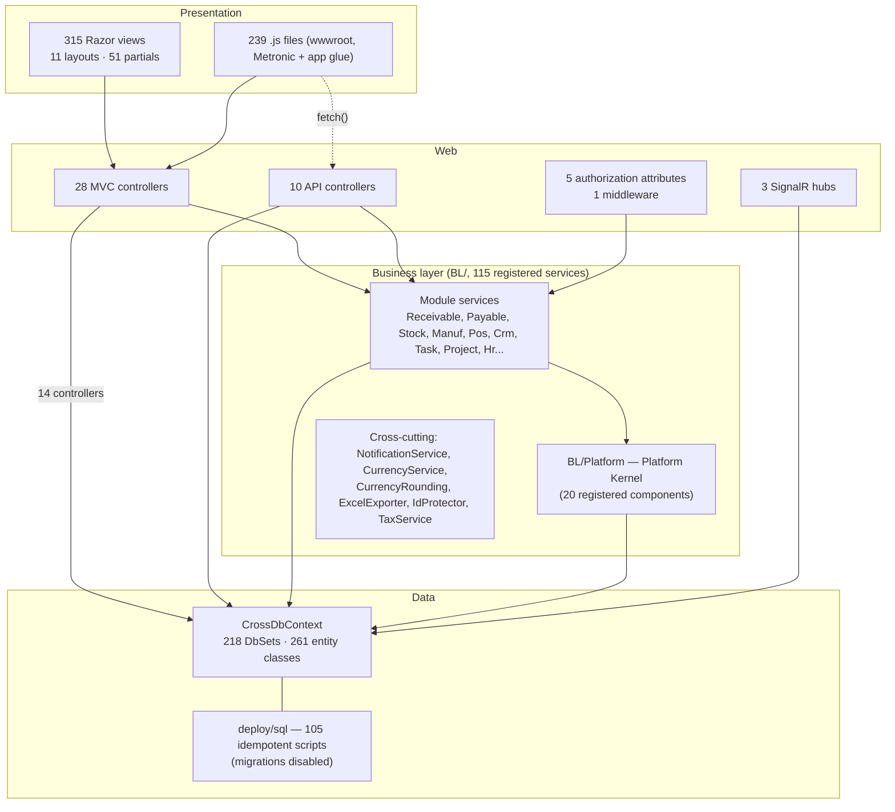

# 04 — Component Architecture

## Scope
The internal component structure of the single web project: layers, cross-cutting components, shared UI parts,
and the abstractions that exist versus those that are missing.

## Evidence
`evidence/Controller-Inventory.csv`, `Service-Inventory.csv`, `Screen-Inventory.csv`,
`Hub-Filter-Middleware-Inventory.csv` · `Program.cs` · `Models/Menu/MainMenu.cs`.

## Layer reality

**Missing layer: repository / unit-of-work.** Services hold `CrossDbContext` directly. `ScopedTx` supplies
transaction scoping but not aggregate boundaries.

**Leak: controllers reaching the database.** `direct_dbcontext = True` for **14 of 38 controllers**
(`Controller-Inventory.csv`). Where those controllers also write, they bypass service-level invariants
(transaction, event recording, notification) entirely.

## Cross-cutting components

| Component | Type | Role | Evidence |
|---|---|---|---|
| `SessionValidationMiddleware` | middleware | path-based session gate with bypass lists | `Models/SessionValidationMiddleware.cs` |
| `SessionValidationAttribute` | action filter | per-controller session gate | `Models/SessionValidationAttribute.cs` |
| `AccPermAttribute` / `InvPermAttribute` / `CrmPermAttribute` | action filters | module RBAC gates → the access services | `Models/*Attribute.cs` |
| `PosLaneActivityGuardAttribute` | action filter | POS lane/activity whitelist | `Models/PosLaneActivityGuardAttribute.cs` |
| `ScopedTx` | transaction handle | own-or-join transaction, 57 sites | `BL/ScopedTx.cs` |
| `NotificationService` | service | persists + SignalR push + mute rules | `BL/NotificationService.cs` |
| `NotificationTypes` | static catalog | type → category/icon/priority/URL | `BL/NotificationTypes.cs` |
| `CurrencyService` + `CurrencyRounding` | services | the single source of FX + rounding precision | `BL/CurrencyRounding.cs` |
| `IdProtector` | **Singleton** | encrypts entity ids in public storefront URLs | `Program.cs AddSingleton` |
| `PredicateBuilder` | static helper | OR-term search predicates for list screens | `BL/PredicateBuilder.cs` |
| `ExcelExporter` | service | `ClosedXML` list exports | `BL/ExcelExporter.cs` |
| `MainMenu` | static | the one data-driven navigation tree | `Models/Menu/MainMenu.cs` |
| `SharedResources` | resx marker | localization root | `SharedResources.cs` + 821 `.resx` |

## Platform Kernel components (implemented)

See 09 for behaviour. Structurally, `BL/Platform/` contains the only components in the codebase with an
explicit contract-per-concern split:

`IEntityRegistry`/`EntityRegistry` · `IBusinessContextAccessor`/`BusinessContextAccessor` ·
`IBusinessEventService`/`BusinessEventService` · `BusinessEventTypes` (naming validator) ·
`IEventDispatchStore`/`SqlEventDispatchStore` · `BusinessEventDispatchWorker` · `IBusinessEventConsumer` +
2 consumers · `ITimelineProjectionService`/`TimelineProjectionService` · `TimelineEventPresenter` ·
`ILegacyTimelineAdapter` + 4 adapters + `LegacyTimelineSupport` ·
`IPlatformPermissionProvider`/`PlatformPermissionProvider` + 6 module adapters ·
`IBusinessEventNotificationMapper`/`BusinessEventNotificationMapper`.

## Shared UI components (partials)

| Partial | Uses | Purpose |
|---|---|---|
| `_CbToastr` | 5 | project-wide confirm+toast bridge |
| `_NotificationBell` | 4 | real bell (replaced the Metronic demo) |
| `_MainMenu` | 4 | data-driven navigation |
| `_AnnouncementsBanner` | 4 | announcements |
| `_CalendarReminders` | 4 | calendar reminders |
| **`_DocEventTimeline`** | **4** | **Platform Kernel event timeline** (SalesInvoice, PurchaseInvoice, Customer, ManufWorkOrder) |
| `_DocTimeline` | 3 | document **comments** widget (SalesInvoice, PurchaseInvoice, Quotation) |
| `_QuickAdd`, `_HrDocGallery`, `_Timeline`, `_CrmCustomFields`, `_ValidationScriptsPartial` | 1–2 | module-specific |

**Naming inconsistency:** `_DocTimeline` is the **comments** widget while `_DocEventTimeline` is the
**timeline**. Two more, `_Timeline` (CRM) and `_CrmCustomFields`, add a third timeline-ish component. See 20.

## Duplicated abstractions found

| Duplication | Evidence | Impact |
|---|---|---|
| Two session gates | middleware + attribute, different bypass lists | security/availability |
| Three "timeline" components | `_DocTimeline` (comments), `_DocEventTimeline` (events), `_Timeline` (CRM activities) | user confusion, dev confusion |
| Two approval step tables with identical shape | `LeaveApprovalStep` vs `EmployeeRequestStep` | see 14 |
| Four access services with three different action vocabularies | `read/post/pay/manage` · `read/doc/purchase/manage` · `read/edit/manage` · sync role predicates | see 13 |
| Two `deploy/sql` folders | `CrossBuy/deploy/sql` + `deploy/sql` | deployment ambiguity |
| Two base layouts | `_Layout` and `_mainLayout` | unclear ownership |
| `Attachment` (HR-shaped) vs `LibraryItem` vs chat/email attachments | three unrelated file models | see 07, 12 |

## Gaps
- No repository/UoW, no domain model (entities are anaemic POCOs by design — see ADR-002).
- No shared validation layer; validation is inline in services returning `(bool ok, string? error)`.
- No shared paging/search abstraction beyond `PredicateBuilder` + per-controller `SetPaging`.
- No component-level tests other than the Platform Kernel's.

## Risks
- The `(bool ok, string? error)` convention carries **Arabic error strings from services to controllers**,
  mixing presentation into the business layer (e.g. `return (false, "العميل غير موجود", null)`).
- Cross-cutting concerns are attribute-based, so any endpoint that forgets the attribute silently loses them.

## Dependencies
03-Container, 09-Platform-Kernel, 13-Security.

## Recommendations
1. Rename the collaboration partials so `_DocTimeline` no longer means "comments".
2. Introduce one access-service contract (`CanAsync(BusinessContext, action)`) so the four can converge —
   this is also the prerequisite for real per-recipient notification authorization (see 13, 21).
3. Move service error strings to resource keys so `BL/` stops carrying UI text.
