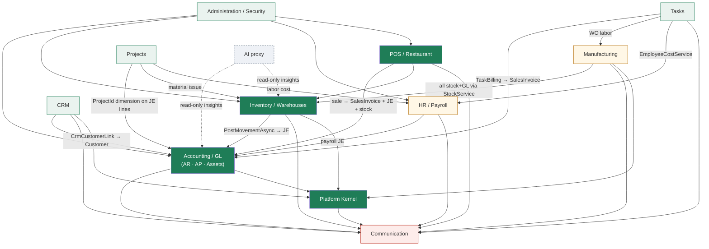

# 05 — Complete Module Map

## Scope
Every functional module discovered **from code** (controllers, `BL/` services, `Models/Context/*` namespaces,
`MainMenu.cs` entries), not from a document's module list. **14 modules.**

## Evidence
`evidence/Controller-Inventory.csv`, `Service-Inventory.csv`, `Entity-Inventory.csv`, `DbSet-Inventory.csv`,
`Screen-Inventory.csv`, `Module-Dependency-Matrix.csv` · `Models/Menu/MainMenu.cs`.

## Maturity scale
**Strong** = complete flows, transactional, tested or integrity-checked · **Functional** = complete flows, thinner
guarantees · **Partial** = some flows missing or screens absent · **Legacy** = works but conflicts with a newer
pattern here · **Experimental** = proxy/stub only · **Missing foundation** = the module's governing concern
(usually RBAC) does not exist.

## Module register

| # | Module | Maturity | Controllers | Key services | Entities/DbSets | Governing RBAC |
|---|---|---|---|---|---|---|
| 1 | **Accounting / GL** | **Strong** | `AccountingController` (157 actions), `CurrencyController` | `JournalEntryService`, `GeneralLedgerService`, `ChartOfAccountsService`, `AccountingPostingService`, `FiscalPeriodService`, `ClosingService`, `FinancialStatementService`, `TaxService`, `BankService`, `CostCenterService`, `CurrencyService`, `CurrencyRounding`, `FxRevaluationService`, `OpeningBalanceService`, `AccountingDashboardService` | 17 | `AccountingUserRoles` (`read/post/pay/manage/currency-override`) |
| 2 | **Accounts Receivable** | **Strong** | `AccountingController` | `ReceivableService` (6 tx sites) | `Customer`, `SalesInvoice(+Line)`, `SalesReturn(+Line)`, `Receipt`, `ReceiptAllocation` | Accounting |
| 3 | **Accounts Payable** | **Strong** | `AccountingController` | `PayableService` (4 tx sites) | `Vendor`, `PurchaseInvoice(+Line)`, `PurchaseReturn(+Line)`, `Payment`, `PaymentAllocation` | Accounting |
| 4 | **Inventory / Warehouses** | **Strong** | `InventoryController` (largest MVC surface), `BrandController` | `StockService` (**15 tx sites — sole stock+GL writer**), `ItemService`, `WarehouseService`, `ProcurementService`, `SellingService`, `PricingService`, `ThreeWayMatchService`, `IntegrityCheckService`, `InventoryApprovalService` | 31–33 | `InventoryUserRoles` (`read/doc/purchase/manage`) + warehouse scope |
| 5 | **Manufacturing** | **Functional / Missing foundation (RBAC)** | `InventoryController` (WO actions 1046–1150) | `ManufService` | 7 (`ManufWorkOrder`, `ManufWorkOrderComponent`, `ManufWorkOrderLabor`, `ManufWorkCenter`, `ManufRoutingOp`, `ManufPlan`, `ManufPlanDemand`) | **none** — WO actions carry no `[InvPerm]` |
| 6 | **POS / Restaurant / Hypermarket** | **Strong** | `PosController`, `PosAppController`, `HyperController`, `HyperPosController` | `PosOrderService` (5 tx sites), `PosSetupService`, `PosAccessService` | 11 | `BranchUserRoles.PosRole`, branch-scoped |
| 7 | **CRM** | **Functional** | `CrmController` (72 actions) | `CrmService`, `CrmAccessService`, `CrmAutomationService`, `CrmCustomFieldService`, `CrmCustomerLink`, `CrmReminderHostedService` | 14 | `CrmUserRoles` (`read/edit/manage`) + row-level owner scope |
| 8 | **HR / Payroll / Attendance / Recruitment** | **Functional / Missing foundation (RBAC)** | `AdminController` (+3 partials: Appraisals, Recruitment, Training), `PeopleController` | `EmployeeService`, `LeaveWorkflowService`, `LeaveAccrualService`, `LeaveDashboardService`, `EmployeeRequestService`, `AttendanceService`, `AppraisalService`, `RecruitmentService`, `TrainingService`, `HrDocumentService`, `FinalSettlementService`, `HolidayService`, `PolicesService`, `JobTitleService`, `AdministrativeStructureService`, `EmployeeCostService` | 26–27 | **none** — `[SessionValidation]` only |
| 9 | **Projects & Contracting** | **Functional** | `ProjectController` | `ProjectService`, `BoqService`, `ContractService`, `ProgressService`, `ProgressBillingService`, `ProjectMaterialIssueService`, `ProjectLaborService`, `ProjectBudgetService`, `SubcontractBillingService`, `VariationOrderService`, `EquipmentDepreciationService` | 11 | **none** |
| 10 | **Tasks & Timesheet** | **Functional** | `TasksController` | `TaskService`, `TaskLinkResolver` (now a kernel wrapper), `TimesheetService`, `TaskCostService`, `TaskBillingService`, `TaskGeneratorService`+worker, `TaskScheduleMatcher`+worker, `TaskReportService` | 4 | **none** |
| 11 | **Fixed Assets & Maintenance** | **Functional** | `AccountingController` | `FixedAssetService`, `EquipmentDepreciationService`, `MaintenanceService` | 4 | Accounting |
| 12 | **Communication & Collaboration** | **Partial** | `NotificationsController`, `ChatController`, `CommController`, `AnnouncementsController`, `CommentsController`, `CalendarController`, `FileManagerController`, `ApprovalsController` | `NotificationService`, `ChatService`, `CommService` (SMTP), `AnnouncementService`, `DocCommentService`, `CalendarService`, `FileManagerService` | 11 | **none** (per-feature ad hoc) |
| 13 | **Platform Kernel** | **Strong (narrow)** | `PlatformTimelineController` | 20 registered components under `BL/Platform/` | 2 (`BusinessEvent`, `BusinessEventDispatch`) | `IPlatformPermissionProvider` + 6 adapters |
| 14 | **Administration / Security / Storefront / AI** | **Mixed** | `AdminController`, `AccountController`, `HomeController`, `StoreController`, `PortalController`, `ServiceController`, `DevSeedController`, 10 API controllers | `UserService`, `CompanyService`, `TokenService`, `StoreCatalogService`, `IdProtector`, `AiService` (**Experimental**), `AiInsightsService` | 4 + Identity | Identity roles; `DevSeedController` is `[DevOnly]` |

## Module dependency diagram

Derived from interface references across module boundaries (`Module-Dependency-Matrix.csv`).

**The hub is Accounting.** Every value-bearing module posts to it. `StockService` and `JournalEntryService` are
the two chokepoints: `StockService` is documented as the *sole* stock + GL writer, and `JournalEntryService` is
the only journal writer. That is a genuine architectural strength and the main reason financial integrity holds.

## Module-to-service matrix
Complete in `evidence/Service-Inventory.csv` (columns `module`, `cls`, `interface`, `di_lifetime`,
`uses_scopedtx`, `scopedtx_sites`, `uses_businessevent`). Summary of transaction ownership:

| Module | Services with `ScopedTx` | Total tx sites |
|---|---|---|
| Inventory | `StockService` | 15 |
| Accounting (AR) | `ReceivableService` | 6 |
| POS | `PosOrderService`, `PosSetupService` | 6 |
| Accounting (AP) | `PayableService` | 4 |
| Accounting (GL) | `JournalEntryService` | 3 |
| Admin | `CompanyService` | 2 |
| Manufacturing | `ManufService` (added slice 2) | 6 |
| Platform | (participates, never owns) | 0 |

## Module-to-database matrix
Complete in `evidence/DbSet-Inventory.csv`. By declared namespace: Inventory 31 · HR 26 · Accounting 17 ·
CRM 14 · POS 11 · Projects 11 · Communication 11 · Manufacturing 7 · FixedAssets 4 · Tasks 4 · Admin 4 ·
Platform 2 · **unclassified 78** (Identity tables, lookups, line tables, and `Models/Context/Admin` which mixes
HR + platform-wide entities).

## Module-to-screen matrix
Complete in `evidence/Screen-Inventory.csv`. Non-partial screens: Admin 78 · Inventory 55 · Accounting 42 ·
POS 24 · CRM 15 · Communication 12 · Projects 10 · HR/People 9 · Tasks 5 · Shared 51 partials.

## Module-to-permission matrix

| Module | Role table | Attribute | Platform adapter | Coverage |
|---|---|---|---|---|
| Accounting | `AccountingUserRoles` | `[AccPerm]` | `AccountingPermissionAdapter` | Partial (16 write actions total across all modules carry a module attribute) |
| Inventory | `InventoryUserRoles` | `[InvPerm]` (+ warehouse scope) | `InventoryPermissionAdapter` | Partial |
| CRM | `CrmUserRoles` | `[CrmPerm]` | `CrmPermissionAdapter` | Partial |
| POS | `BranchUserRoles` | `[PosLaneActivityGuard]` | `PosPermissionAdapter` | Functional (lane whitelist) |
| Manufacturing | **none** | **none on WO actions** | `ManufacturingPermissionAdapter` (delegates to Inventory) | **Missing foundation** |
| HR, Projects, Tasks, Communication | **none** | `[SessionValidation]` only | `DefaultPermissionAdapter` (View only) | **Missing foundation** |

## Known architectural issues by module

| Module | Issue | Category |
|---|---|---|
| Manufacturing | no RBAC; WO release/complete/cancel reachable by any authenticated user | **Inconsistency / security** |
| HR | `AdminController` is split across 4 partial class files and mixes HR, appraisals, recruitment, training | Debt |
| Inventory | `InventoryController` holds both inventory and manufacturing surfaces | Coupling |
| Communication | 8 controllers, no shared RBAC; `ApprovalsController` is read-only (see 14) | Partial |
| Admin | `DevSeedController` ~12.7k lines, 176 unguarded write actions (mitigated by `[DevOnly]` 404 in prod) | Debt / risk |
| CRM | `Activity` is the only pre-kernel polymorphic timeline; overlaps the kernel's | Legacy |
| Tasks | `TaskLinkResolver` promoted to a kernel wrapper — the only legacy component already migrated | (resolved) |
| AI | proxy only; 3 insight endpoints; no context pipeline | Experimental |

## Gaps
- Four modules have no RBAC foundation at all.
- No module owns its tables explicitly (no schemas, no ownership metadata).
- Manufacturing has no controller of its own.

## Risks
- `StockService` and `JournalEntryService` are single points of both integrity **and** change risk: 15 and 3
  transaction sites respectively, touched by Inventory, Manufacturing, POS, Projects and Tasks.
- Module boundaries are conventions; nothing prevents a new controller writing to any table.

## Dependencies
08 (tables), 13 (RBAC gaps), 14 (approvals), 21 (roadmap ordering).

## Recommendations
1. Add role tables + attributes for Manufacturing, HR, Projects, Tasks — this unblocks several later stages.
2. Split `InventoryController`'s manufacturing actions into a `ManufacturingController`.
3. Record table ownership per module (even as a comment/manifest) before Enterprise Search indexes them.

---

## Stage 1 Batch C — module access services (2026-08-04)

Eight of the project's modules now have a context-aware `IModuleAccessService`; before Batch C it was four.

| Module | Access service | Role source |
|---|---|---|
| Accounting | `AccountingAccessService` | `AccountingUserRoles` (legacy table, not migrated) |
| Inventory | `InventoryAccessService` | `InventoryUserRoles` (legacy) |
| CRM | `CrmAccessService` | `CrmUserRoles` (legacy) |
| POS | `PosAccessService` | `BranchUserRoles` (legacy — **permanent exception**, ADR-026 §4) |
| Manufacturing | *(delegates to Inventory)* | — |
| **HR** | `HrAccessService` | **`PlatformRoleAssignments`** (`Scope = Hr`) |
| **Projects** | `ProjectsAccessService` | **`PlatformRoleAssignments`** + `ProjectMembers` |
| **Tasks** | `TasksAccessService` | **`PlatformRoleAssignments`** |
| **Communication** | `CommunicationAccessService` | **`PlatformRoleAssignments`** + `ConversationMember` |

**Two role models coexist** — legacy tables for four modules, the shared table for four others. A real, temporary
inconsistency, disclosed rather than described as unified; the fold-in is a later batch (ADR-026 §4).
