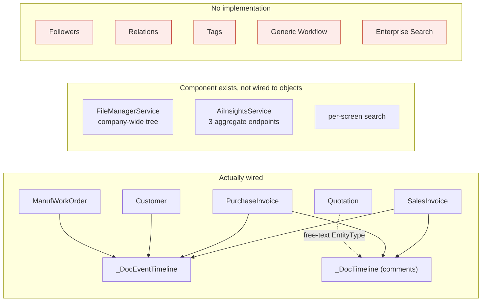

# 07 — Business Object Capability Matrix

## Scope
For each business object: which platform capabilities are **actually wired to that object's real screen and
business flow**. Per the discovery rule, the existence of a shared component is *not* evidence of support.

## Evidence
`evidence/Business-Object-Capabilities.csv` (58 rows) · view-level scan for
`ViewBag.TimelineEntityType` / `ViewBag.CommentEntityType` across all 315 views ·
`Event-Producer-Consumer-Matrix.csv` · `BL/Platform/EntityRegistry.cs` capability flags.

## Verification method

| Capability | What counts as "wired" | How it was verified |
|---|---|---|
| Timeline | a real screen sets `ViewBag.TimelineEntityType` **and** the registry flag `SupportsTimeline` is true | scanned all views for the assignment |
| Comments | a real screen sets `ViewBag.CommentEntityType` | same scan |
| Files | an object-scoped file table `(EntityType, EntityId)` exists and a screen uploads to it | **no such table exists** |
| Followers | a follower table exists | **no such table exists** |
| Relations | a generic relation table exists | **no such table exists** |
| Workflow | an approval record/state machine exists for the object | per-silo inspection (see 14) |
| Notifications | a producer targets this object (legacy producer or `BusinessEventNotificationMapper`) | grep + mapper read |
| Search | resolvable through `IEntityRegistry.SearchAsync`, vs screen-local search only | registry switch arms |
| AI Context | the object's data reaches an AI call under permission filtering | `AiInsightsService` has 3 fixed endpoints |
| Audit History | durable per-change history | `BusinessEvents` vs `CreatedAt/By` columns only |

## The matrix

✅ wired · ◐ partial/indirect · ✖ absent

| Object | Timeline | Comments | Files | Followers | Relations | Workflow | Notifications | Search | AI Ctx | Audit |
|---|---|---|---|---|---|---|---|---|---|---|
| **SalesInvoice** | ✅ | ✅ | ✖ | ✖ | ✖ | ✖ | ✅ (kernel) | ✅ registry | ◐ aggregate | ✅ events |
| **PurchaseInvoice** | ✅ | ✅ | ✖ | ✖ | ✖ | ✖ | ✅ (kernel) | ✅ registry | ◐ aggregate | ✅ events |
| **Customer** | ✅ | ✖ | ✖ | ✖ | ◐ `CrmCustomerLink` | ✖ | ✖ | ✅ registry | ◐ aggregate | ✅ events |
| **ManufWorkOrder** | ✅ | ✖ | ✖ | ✖ | ✖ | ✖ | ✅ (kernel) | ✅ registry | ✖ | ✅ events |
| **Quotation** | ✖ | ✅ **free-text type** | ✖ | ✖ | ✖ | ✖ | ✖ | ✖ screen-local | ✖ | ✖ |
| Supplier (`Vendor`) | ✖ | ✖ | ✖ | ✖ | ✖ | ✖ | ✖ | ✅ registry | ✖ | ✖ |
| Item | ✖ | ✖ | ✖ | ✖ | ✖ | ✖ | ✖ | ✅ registry | ◐ aggregate | ✖ |
| Employee | ✖ | ✖ | ◐ `EmployeeDocuments` (dedicated table) | ✖ | ✖ | ✖ | ✅ HR expiry | ✅ registry | ✖ | ✖ |
| Project | ✖ | ✖ | ✖ | ✖ | ◐ `ProjectId` dimension | ✖ | ✖ | ✅ registry | ✖ | ✖ |
| PosOrder | ✖ | ✖ | ✖ | ✖ | ✖ | ✖ | ✖ | ✅ registry | ✖ | ✖ |
| PurchaseOrder | ✖ | ✖ | ✖ | ✖ | ✖ | ✅ **silo 3** (amount) | ✅ legacy | ✖ | ✖ | ✖ |
| StockTransfer | ✖ | ✖ | ✖ | ✖ | ✖ | ✅ **silo 3** | ✅ legacy | ✖ | ✖ | ✖ |
| StockCount | ✖ | ✖ | ✖ | ✖ | ✖ | ✅ **silo 3** | ✅ legacy | ✖ | ✖ | ✖ |
| LeaveRequest | ✖ | ✖ | ✖ | ✖ | ✖ | ✅ **silo 1** (chain) | ✅ legacy | ✖ | ✖ | ◐ steps |
| EmployeeRequest | ✖ | ✖ | ◐ `Attachment` | ✖ | ✖ | ✅ **silo 2** (chain) | ✅ legacy | ✖ | ✖ | ◐ steps |
| Sales invoice line discount | — | — | — | — | — | ✅ **silo 4** (no record) | ✅ warn | — | — | ✖ |
| JournalEntry | ✖ | ✖ | ✖ | ✖ | ◐ `SourceType`+`SourceId` | ✖ | ✖ | ✖ | ◐ anomaly scan | ◐ `Reversed` chain |
| SalesReturn / PurchaseReturn / Receipt / Payment | ✖ | ✖ | ✖ | ✖ | ◐ allocations | ✖ | ✖ | ✖ | ✖ | ✖ |
| FixedAsset | ✖ | ✖ | ✖ | ✖ | ✖ | ✖ | ✖ | ✖ | ✖ | ✖ |
| CrmLead / Opportunity / Account / Contact / Ticket | ✖ | ✖ | ✖ | ✖ | ◐ `Activity` polymorphic | ✖ | ✅ legacy | ✖ | ✖ | ◐ `Activity` |
| TaskItem | ✖ | ✖ | ✖ | ✖ | ◐ `EntityType`+`EntityId` (7 types) | ✖ | ✅ legacy | ◐ picker | ✖ | ◐ `TaskAutoLogs` |
| Payslip / Appraisal / JobApplication / Contract / FinalSettlement | ✖ | ✖ | ◐ HR docs | ✖ | ✖ | ✖ | ✅ legacy (some) | ✖ | ✖ | ✖ |
| ProgressBilling / Subcontract / VariationOrder | ✖ | ✖ | ✖ | ✖ | ◐ `ProjectId` | ✖ | ✖ | ✖ | ✖ | ✖ |
| CalendarEvent / Announcement / LibraryItem / DocComment / ChatMessage / CommMessage | ✖ | ✖ | ◐ own attachments | ✖ | ✖ | ✖ | ✅ own | ✖ | ✖ | ◐ soft-delete |
| All remaining objects (≈30) | ✖ | ✖ | ✖ | ✖ | ✖ | ✖ | ✖ | ✖ | ✖ | ✖ |

## Coverage summary

| Capability | Objects with it | of 58 | Notes |
|---|---|---|---|
| **Timeline** | 4 | **7%** | SalesInvoice, PurchaseInvoice, Customer, ManufWorkOrder |
| **Comments** | 3 | **5%** | SalesInvoice, PurchaseInvoice, **Quotation (unregistered)** |
| **Files** | 0 generic | **0%** | 3 unrelated mechanisms: `EmployeeDocuments`, `Attachment` (HR-shaped), `LibraryItem` (company-wide) |
| **Followers** | 0 | **0%** | no table |
| **Relations** | 0 generic | **0%** | 3 partial mechanisms: `TaskItem` link (7 types), `Activity` link, `SourceType`+`SourceId` |
| **Workflow** | 5 objects / 4 silos | **9%** | none reusable |
| **Notifications** | ~14 | ~24% | 4 via kernel, the rest legacy producers |
| **Search** | 9 | **15%** | registry only; every list screen has its own search |
| **AI Context** | 0 object-scoped | **0%** | 3 aggregate endpoints (journal anomalies, cashflow, inventory) |
| **Audit History** | 4 durable | **7%** | `BusinessEvents`; everything else has `CreatedAt/By` at best |

## Claims explicitly NOT made

Per the "do not claim support because a shared component exists" rule:

- **`DocCommentService` supports any `(EntityType, EntityId)`** — but only 3 screens call it. Comments are
  therefore **5% wired**, not "supported platform-wide".
- **`NotificationService` can notify about anything** — but only ~14 objects have a producer.
- **`FileManagerService` stores files** — but they are a company-wide library tree, **not** attached to any
  business object. `LibraryItem` has `ParentId`, not `EntityType`/`EntityId`.
- **`ITimelineProjectionService` can project any registered entity** — but `SupportsTimeline` is true for 4.
- **`IPlatformPermissionProvider` routes every registry code** — but for HR/Projects the adapter is
  `DefaultPermissionAdapter`, which grants `View` to any authenticated user and denies all elevated actions.
- **`AiInsightsService` exists** — it has three fixed company-level endpoints and no per-object context path.

## Capability wiring diagram

## Gaps
The three Book-1 Layer-1 capabilities with **zero** implementation: Followers, Relations, Tags. Files exist three
times but never object-scoped.

## Risks
- Onboarding more objects to the timeline is cheap; onboarding them to **workflow** is not, because there is no
  engine and four incompatible silos.
- `Quotation`'s free-text comment type will collide the moment `Quotation` is registered (existing rows use the
  same string, so it will actually *work* — but only by luck, and that luck should be verified before relying
  on it).

## Dependencies
06 (catalogue), 09 (kernel), 14 (workflow), 21 (roadmap order).

## Recommendations
1. Register `Quotation` and confirm existing `DocComments` rows resolve.
2. Build `EntityFile(EntityType, EntityId)` before Followers/Relations — files are the most-requested and the
   three existing mechanisms already prove demand.
3. Do not claim "collaboration by default" anywhere until coverage exceeds a threshold agreed with the product
   owner; today it is 5–7%.
