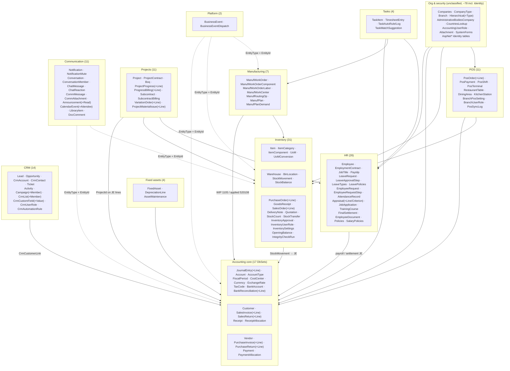
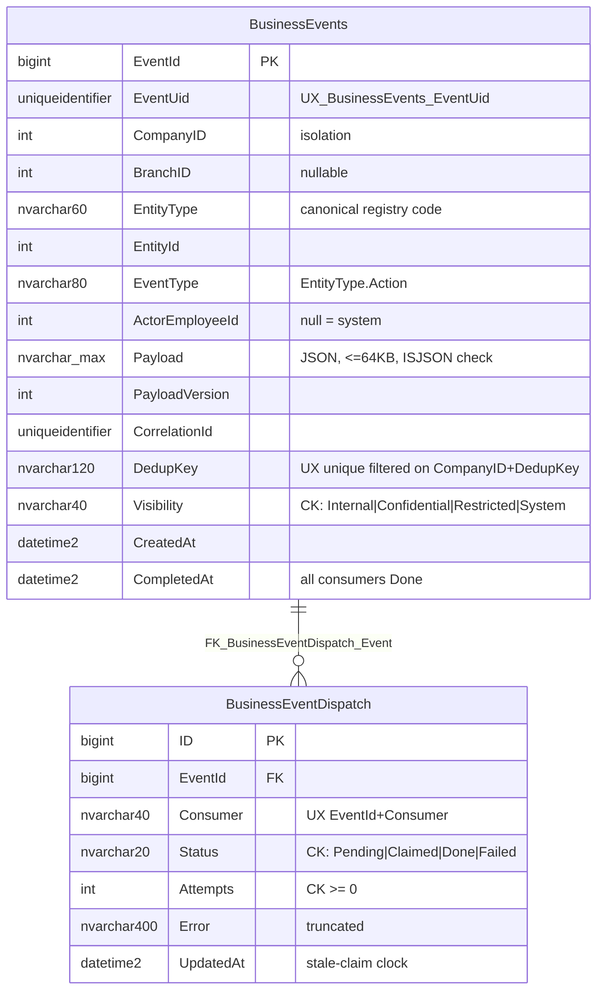
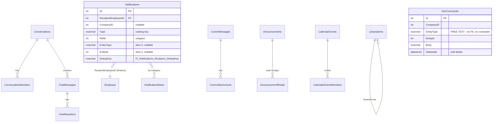
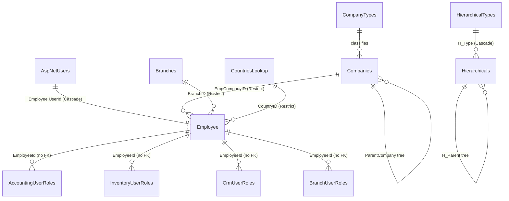
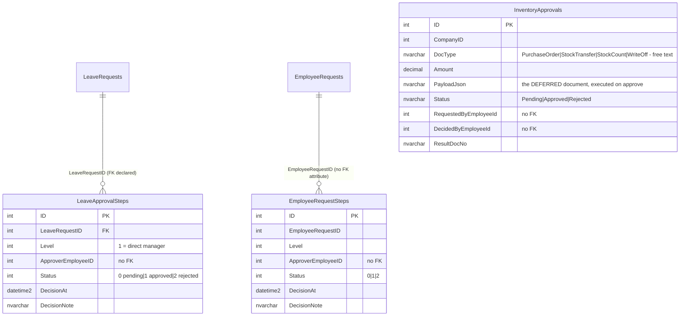
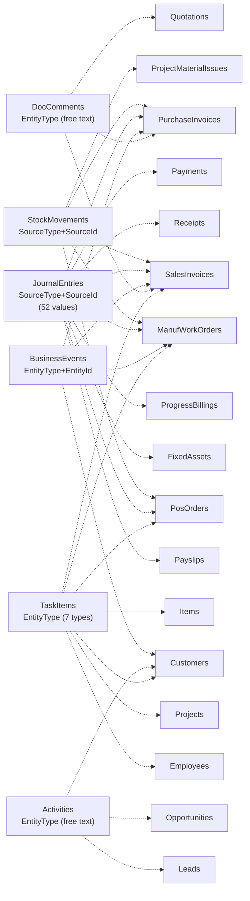

# 08 — Database Domain Map

## Scope
The complete data layer: **218 `DbSet<>` properties over 261 entity classes in one `CrossDbContext`**, plus the
105 SQL deployment scripts that are the actual schema authority (migrations are disabled).

## Evidence
`CrossBuy/Models/Context/CrossDbContext.cs` · `evidence/DbSet-Inventory.csv` ·
`evidence/Entity-Inventory.csv` · `evidence/SQL-Script-Inventory.csv` · `CrossBuy/deploy/sql/*` + `deploy/sql/*`.

## Structural facts

| Fact | Value | Evidence |
|---|---|---|
| Databases | 1 (`CrossBuyDB2`) + a session-cache table in the same DB | `ConnectionStrings`, `Caching.SqlServer` |
| Schemas | **1 — everything is `dbo`** | no `ToTable(..., schema:)` anywhere; scripts use bare or `dbo.` names |
| Contexts | 1 (`CrossDbContext : IdentityDbContext<Users>`) | class declaration |
| Migrations | **disabled** — `Migrations/` is empty | folder present, no migration classes |
| Schema authority | 105 idempotent SQL scripts (96 with guards) | `SQL-Script-Inventory.csv` |
| Decimal policy | global `(19,4)` convention + **60 explicit per-column pins** so model == DB on all 352 decimal properties | `CrossDbContext.ConfigureConventions` + the `pin` dictionary |
| Global query filters | **none** | no `HasQueryFilter` in the context |

**The decimal pinning block is a genuine strength** — it documents and enforces model/DB parity for every money,
rate and quantity column, and an integrity test asserts it. It is also the only place in the data layer with that
level of rigour.

## High-level domain map

## Platform tables ERD

This is the **only** table pair in the database with check constraints on a frozen vocabulary, a filtered unique
index for idempotency, and a filtered work index (`Status <> 'Done'`).

## Communication tables ERD

## Security and organization tables ERD

**The four role tables have no declared foreign key to `Employee`** — they are plain `int EmployeeId` columns.
Deleting an employee leaves orphan role rows.

## Approval / workflow tables ERD

`LeaveApprovalStep` and `EmployeeRequestStep` are **structurally identical** — the same table duplicated for two
business objects. `InventoryApproval` is a completely different model (single row, no chain, carries the deferred
document as JSON). There is **no** table for the fourth silo (discount approval). See 14.

## Isolation report

### Tables/entities **without** a company field where isolation may be required
**78 entity classes** have no `CompanyID`/`CompanyId`. Complete list in `Entity-Inventory.csv`
(filter `company_field` empty). They fall into four groups:

| Group | Examples | Assessment |
|---|---|---|
| **Line/child tables** (isolation inherited from the parent) | `SalesInvoiceLine`, `PurchaseInvoiceLine`, `JournalEntryLine`, `ProgressBillingLine`, `VariationOrderLine`, `AppraisalLine`, `DepreciationLine`, `BankReconciliationLine` | **Acceptable** — always queried through the parent |
| **Global lookups** | `AccountType`, `CountriesLookup`, `CompanyType`, `Currency`, `ExchangeRate`, `SystemForms` | **Acceptable by design** — but `ExchangeRate` being global is a real multi-company question |
| **HR entities reaching company only via `Employee`** | **`LeaveRequest`**, `LeaveApprovalStep`, `EmployeeRequestStep`, `LeavePolicies`, `LeaveTypes`, `AttendancePolicies`, `SalaryPolicies`, `Policies`, `PolicyAssignments`, `JobTitle` | 🔴 **Risk** — every query must join `Employee`; nothing enforces it |
| **Platform-wide / infra** | `Users` (Identity), `Attachment`, `NotificationMute`, `Hierarchical`, `AdministrativeBodiesCompany`, `CalendarEventAttendee`, `AnnouncementRead` | 🟠 Mixed — `Attachment` and `NotificationMute` are per-employee, so acceptable; `Hierarchical` is the org tree and should arguably be scoped |
| **`FiscalPeriod`** | — | 🔴 **Highest concern** — period open/close is a company-level control with no company column |

### Cross-company leakage risk
**No EF global query filter exists.** Isolation therefore depends on every single query writing
`.Where(x => x.CompanyID == companyId)` by hand, with `companyId` usually supplied by
`private const int DefaultCompanyId = 1` in eight controllers. A missed filter is a silent cross-tenant read.
Evidence of the pattern already leaking into services: `AccountingAccessService`, `InventoryAccessService`,
`CrmAccessService` and `InventoryApprovalService` each declare `private const int CompanyId = 1`.

### Text-based polymorphism (no FK possible)
**10 entities** key on a string type discriminator:

| Table | Discriminator | Constrained? |
|---|---|---|
| `BusinessEvents` | `EntityType` | ✅ validated by `IEntityRegistry` in code |
| `DocComments` | `EntityType` | ✖ **free text** (`Quotation` proves it) |
| `Activities` (CRM) | `EntityType` | ✖ free text (doc comment lists 5 values) |
| `TaskItems` | `EntityType` | ◐ validated against 7 picker types in code |
| `TaskMatchSuggestions` | `EntityType` | ◐ same |
| `CampaignMembers`, `CrmListMembers` | `EntityType` | ✖ free text |
| `CrmCustomFieldValues` | `EntityType` | ✖ free text |
| `Notifications` | `EntityType` (slice 2) | ✅ registry codes only |
| `InventoryApprovals` | `DocType` | ✖ free text (4 known values) |
| `JournalEntries` | `SourceType` + `SourceId` | ✖ **free text, 52 distinct values observed** |
| `StockMovements` | `SourceType` + `SourceId` | ✖ free text |

`JournalEntry.SourceType` with **52 values** is the largest untyped polymorphic surface in the database and the
backbone of every legacy timeline reconstruction.

### Soft delete
Only **5** entities: `CalendarEvent`, `ChatMessage`, `CommMessage`, `DocComment`, `LibraryItem` — all
Communication. `DeletedAt` with no query filter, so every read must remember `.Where(x => x.DeletedAt == null)`.

### Audit columns
`BaseEntity` supplies `CreatedBy` / `CreatedAt` / `updatedBy` / `UpdatedAt` (note the lowercase `updatedBy`).
Not all entities inherit it; many declare `CreatedAt` alone. There is **no automatic audit interceptor** — every
service sets the stamps by hand.

## Cross-domain relationship map

Every cross-domain link in the system is **string-based**. There is no `BusinessRelation` table (Book 1 Layer 3
— **Planned**, not implemented).

## Tables lacking proper foreign keys
Systematic pattern: **role tables, approval approver columns, and every polymorphic link have no FK.**
Specifically: `AccountingUserRoles.EmployeeId`, `InventoryUserRoles.EmployeeId`, `CrmUserRoles.EmployeeId`,
`BranchUserRoles.EmployeeId`, `LeaveApprovalStep.ApproverEmployeeID`,
`EmployeeRequestStep.ApproverEmployeeID` + `.EmployeeRequestID`, `InventoryApproval.RequestedByEmployeeId` /
`.DecidedByEmployeeId`, `Notification.ActorEmployeeID`, `BusinessEvent.ActorEmployeeId`, all `EntityId` columns.

Declared FKs exist mainly where EF needed them for navigation (`CrossDbContext.OnModelCreating`: `Employee`↔
`Users`/`Country`/`Company`/`Branch`, `Companies`↔`CompanyType`/parent, `Hierarchical` tree, `LeaveRequest`↔
`Employee`/`LeaveType`, `Notification`↔`Recipient`, `BusinessEventDispatch`→`BusinessEvents`).

## SQL deployment scripts
105 scripts, **96 with idempotency guards**. The 9 without guards need review (`SQL-Script-Inventory.csv`,
`idempotent = False`). Scripts live in **two folders** — `CrossBuy/deploy/sql` (101) and `deploy/sql` (4) — with
no manifest or ordering file. Only `platform_business_events*.sql` declare check constraints; only two declare
foreign keys.

## Gaps
- No schemas → no database-level module ownership.
- No global query filters → isolation is manual everywhere.
- No audit interceptor → audit stamps are per-service discipline.
- No relation table, no tag table, no object-file table.
- No script manifest / applied-migrations table.

## Risks
| Risk | Severity |
|---|---|
| Cross-company read via a forgotten `CompanyID` filter | **Critical** |
| `FiscalPeriod` has no company column — period control may be global | **High** |
| HR entities scoped only through `Employee` | **High** |
| Orphan role rows after employee deletion (no FK) | Medium |
| `JournalEntry.SourceType` free text with 52 values | Medium |
| Soft-delete rows leaking into reads (no filter) | Medium |
| Two `deploy/sql` folders, no manifest | Medium |

## Dependencies
06, 07, 09, 13, 18.

## Recommendations
1. Add EF **global query filters** for `CompanyID` and `DeletedAt` — the single highest-value data-integrity
   change available, and it is additive.
2. Give `FiscalPeriod` a company column (or prove globality is intended).
3. Add FKs to the four role tables and the approval approver columns.
4. Consolidate `deploy/sql` and add an applied-scripts table.
