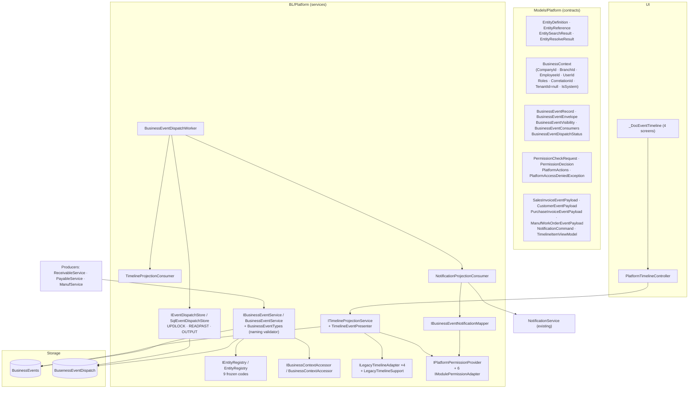
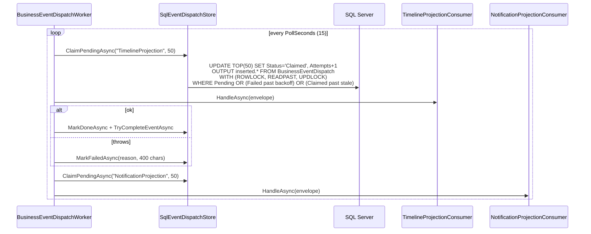
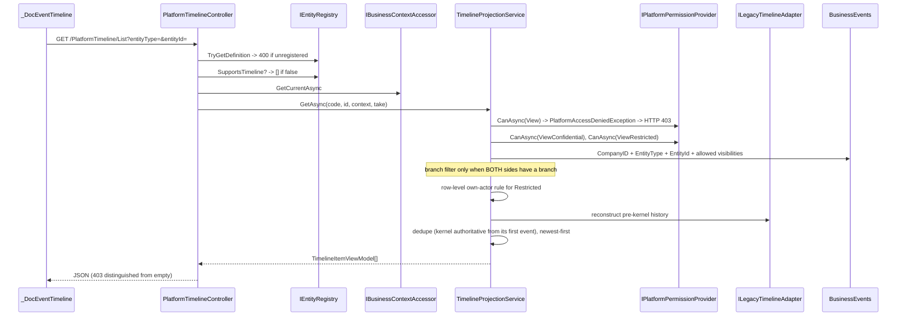
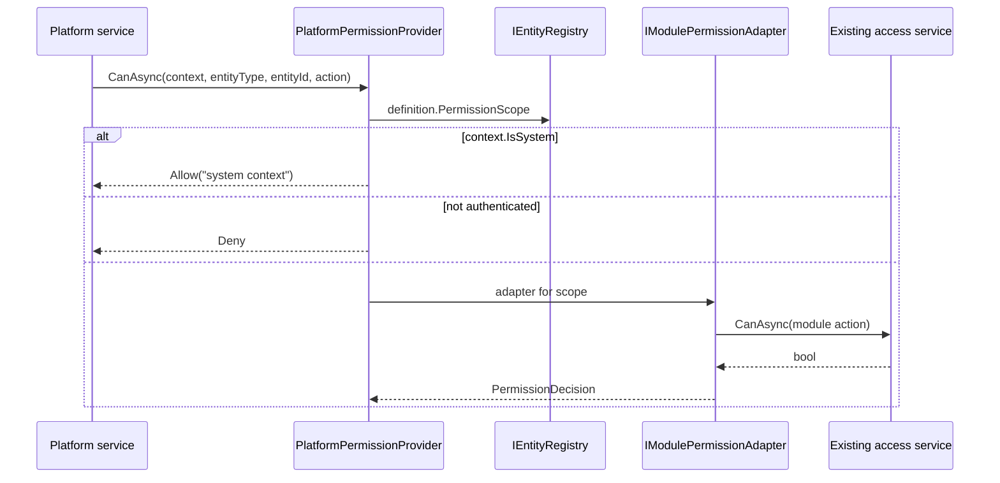

# 09 — Platform Kernel (implemented)

## Scope
The Platform Kernel as built in slices 1 and 2. This is the only part of the system with uniform transaction,
audit, retry and authorization guarantees — and it currently covers **4 of 58 business objects**.

## Evidence
`CrossBuy/BL/Platform/*` (20 registered components) · `CrossBuy/Models/Platform/*` ·
`CrossBuy/Models/Context/Platform/BusinessEvent.cs` · `deploy/sql/platform_business_events*.sql` ·
`Program.cs` Platform Kernel DI block · `docs/platform/PKS-001` + ADR-001..007 ·
`CrossBuy.Tests/` (91 tests).

## Component diagram



## 1. IEntityRegistry

9 frozen PascalCase codes, compared **ordinally**. `EntityDefinition` carries
`Code · DisplayNameAr/En · Module · Icon · Color · RouteTemplate · SupportsSearch · SupportsTimeline ·
SupportsComments · SupportsFiles · SupportsFollowers · PermissionScope · ListedInRecordPicker`.

| Code | Module | Scope | Route | Search | Timeline | Comments | Files | Followers | Picker |
|---|---|---|---|---|---|---|---|---|---|
| `SalesInvoice` | Accounting | Accounting | `/Accounting/SalesInvoiceDetail?id={id}` | ✅ | ✅ | ✅ | ✖ | ✖ | ✅ |
| `PurchaseInvoice` | Accounting | Accounting | `/Accounting/PurchaseInvoiceDetail?id={id}` | ✅ | ✅ | ✅ | ✖ | ✖ | ✖ |
| `Customer` | Accounting | Accounting | `/Accounting/CustomerStatement?id={id}` | ✅ | ✅ | ✖ | ✖ | ✖ | ✅ |
| `Supplier` | Accounting | Accounting | (none) | ✅ | ✖ | ✖ | ✖ | ✖ | ✖ |
| `ManufWorkOrder` | Manufacturing | **Manufacturing** | `/Inventory/WorkOrderDetails?id={id}` | ✅ | ✅ | ✖ | ✖ | ✖ | ✅ |
| `PosOrder` | Pos | Pos | (none) | ✅ | ✖ | ✖ | ✖ | ✖ | ✅ |
| `Employee` | Hr | **None** | `/Admin/EmployeesList` (list-only) | ✅ | ✖ | ✖ | ✖ | ✖ | ✅ |
| `Project` | Projects | **None** | `/Project/Projects` (list-only) | ✅ | ✖ | ✖ | ✖ | ✖ | ✅ |
| `Item` | Inventory | Inventory | `/Inventory/EditItem?id={id}` | ✅ | ✖ | ✖ | ✖ | ✖ | ✅ |

`TaskLinkResolver` (TM-2) is now a **compatibility wrapper** delegating to the registry; its DTOs, signatures and
the picker's 7 types/order are unchanged and test-pinned.

## 2. BusinessContext
Built once per DI scope by `BusinessContextAccessor` from the two sources the project already used: the
`Session["Employee"]` blob, then `ClaimTypes.NameIdentifier` → `IEmployeeService` → `Employee.EmpCompanyID`.
Falls back to company **1**, which is the same `DefaultCompanyId = 1` eight controllers hard-code.
`TenantId` is present and always `null` — contract-ready, feature-deferred.

## 3. BusinessEvent write sequence

```mermaid
sequenceDiagram
  participant C as Controller
  participant S as Business service
  participant TX as ScopedTx
  participant BES as BusinessEventService
  participant REG as IEntityRegistry
  participant DB as SQL Server
  participant N as NotificationService

  C->>S: write action
  S->>TX: BeginOrJoinAsync (own or join)
  S->>DB: business rows + JE + stock
  S->>BES: RecordAsync(record)
  BES->>REG: GetDefinition(EntityCode)  — throws if unknown
  BES->>BES: BusinessEventTypes.Validate("<Entity>.<Action>")
  BES->>BES: visibility in frozen set? PayloadVersion >= 1?
  BES->>BES: serialize payload, enforce 64 KB cap
  BES->>BES: REFUSE if Database.CurrentTransaction == null
  opt DedupKey present
    BES->>DB: existing (CompanyID, DedupKey)? -> return original EventId
  end
  BES->>DB: INSERT BusinessEvents
  BES->>DB: INSERT BusinessEventDispatch x registered consumers
  BES-->>S: EventId
  S->>TX: CommitAsync
  Note over S,N: post-commit only: NotifyAsync in try/catch<br/>(best-effort; never blocks)
```

Rules enforced **in code**: inside the ambient `ScopedTx`; never after `CommitAsync`; no swallowing catch;
**refuses to run with no ambient transaction**; entity + event-type validated; company/branch/actor/correlation
from `BusinessContext` (overridable only for `IsSystem`); dedup per company; dispatch rows in the same
transaction; **no side effects** (no notify, AI, search or workflow inside `RecordAsync`).

## 4. Event type catalog

`<EntityCode>.<Action>`, PascalCase action, ≤80 chars, validated against the entity.

| Entity | Event | Producer | Method | DedupKey | Visibility |
|---|---|---|---|---|---|
| SalesInvoice | `.Created` | `ReceivableService` | `CreateSalesInvoiceAsync` | `SalesInvoice.Created:{id}` | Internal |
| SalesInvoice | `.Updated` | `ReceivableService` | `EditSalesInvoiceAsync` | — | Internal |
| SalesInvoice | `.Cancelled` | **declared, no producer** | — | — | — |
| PurchaseInvoice | `.Created` | `PayableService` | `CreatePurchaseInvoiceAsync` | `PurchaseInvoice.Created:{id}` | Internal |
| PurchaseInvoice | `.Updated` | `PayableService` | `EditPurchaseInvoiceAsync` | — | Internal |
| PurchaseInvoice | `.Cancelled` | **declared, no producer** | — | — | — |
| Customer | `.Created` | `ReceivableService` | `CreateCustomerAsync`, `SaveCustomerAsync` (upsert) | `Customer.Created:{id}` | Internal |
| Customer | `.Updated` | `ReceivableService` | `SaveCustomerAsync` | — | Internal |
| ManufWorkOrder | `.Created` | `ManufService` | `CreateAsync` | `ManufWorkOrder.Created:{id}` | Internal |
| ManufWorkOrder | `.Updated` | `ManufService` | `SaveHeaderAsync` | — | Internal |
| ManufWorkOrder | `.Released` | `ManufService` | `SetStatusAsync`, `ReleaseAsync` | `ManufWorkOrder.Released:{id}` | Internal |
| ManufWorkOrder | `.Produced` | `ManufService` | `ProducePartialAsync` | — | Internal |
| ManufWorkOrder | `.Completed` | `ManufService` | `CompleteAsync`, `ProducePartialAsync` (finalise) | `ManufWorkOrder.Completed:{id}` | Internal |
| ManufWorkOrder | `.Cancelled` | `ManufService` | `SetStatusAsync`, `CancelAsync` | `ManufWorkOrder.Cancelled:{id}` | Internal |

**Names rejected because the transition does not exist:** `PurchaseInvoice.Posted` (creation *is* posting),
`PurchaseInvoice.Approved`, `Customer.StatusChanged`, `ManufWorkOrder.Started`. Every payload is version 1 and
every event is `Internal` — **no `Confidential`/`Restricted`/`System` event exists yet**, so those visibility
tiers are exercised only by tests.

## 5. Dispatch sequence and locking



**No cursor, ever.** Eligibility is by `Status` only, because identity values are assigned at INSERT but visible
at COMMIT — a high-water mark silently skips an event whose transaction committed after a higher-numbered one.
Verified against real SQL Server (ADR-007).

Retry: `MaxAttempts=5`, `RetryBackoffSeconds=30`, `StaleClaimMinutes=10`, `BatchSize=50`, `PollSeconds=15` —
configurable under `Platform:EventDispatch`. An exhausted row stays `Failed` **with its error**, never deleted.
`CompletedAt` is stamped only when **every** registered consumer is `Done` and is explicitly a reporting
roll-up, never a dispatch input.

## 6. Consumer matrix

| Consumer | Implemented | What it does | Failure behaviour |
|---|---|---|---|
| `TimelineProjection` | ✅ | **Validates renderability at write time** (registry code still registered, `SupportsTimeline` true, visibility in vocabulary, presenter can render, payload version not from the future). Writes nothing — the projection is read-time. | throws → its row `Failed` + reason |
| `NotificationProjection` | ✅ | maps event → `NotificationCommand`s, resolves the audience from the module role tables, excludes the actor, authorizes each recipient, checks idempotency by `evt:{EventUid}:{recipient}`, persists via `NotificationService` | throws → its row `Failed`, timeline stays `Done` |
| Search · AI · Dashboards · Integrations | ✖ **not registered** | — | a registered consumer with no implementation would accumulate undrained rows; the worker logs an error if that state is ever reached |

## 7. Notification mapping

| Event | Notification | Audience | Note |
|---|---|---|---|
| `SalesInvoice.Created` | "New sales invoice" | `acc`/ChiefAccountant | **replaced** the legacy `NotifyRoleAsync` deleted from `ReceivableService` |
| `PurchaseInvoice.Created` | "New purchase invoice" | `acc`/ChiefAccountant | **replaced** the legacy call deleted from `PayableService` |
| `ManufWorkOrder.Released` | new | `inv`/InventoryManager + WarehouseKeeper | manufacturing's first-ever notification |
| `ManufWorkOrder.Completed` | new | `inv`/InventoryManager | new |
| all Customer events, both `.Updated`, WO `.Created`/`.Updated`/`.Produced`/`.Cancelled` | none | — | deliberate (noise / no legacy precedent) |

**Legacy notification producers deliberately retained** (documented, not duplicated): the stale-exchange-rate
warning and the credit-limit block in `ReceivableService` — neither has an event, and the credit-limit one fires
on a *rejected* invoice where no business fact exists.

## 8. Timeline projection sequence



## 9. Permission-filtering sequence



| Scope | Access service | View | ViewConfidential | ViewRestricted |
|---|---|---|---|---|
| Accounting | `IAccountingAccessService` | `read` | `post` | `manage` |
| Inventory | `IInventoryAccessService` | `read` | `doc` | `manage` |
| **Manufacturing** | `IInventoryAccessService` (delegated) | `read` | `doc` | `manage` |
| Crm | `ICrmAccessService` | `read` | `edit` | `manage` |
| Pos | `IPosAccessService` | any POS role | `CanSell` | `IsManager` |
| **None** (HR, Projects) | *(none exists)* | authenticated | **denied** | **denied** |

## 10. Visibility
Frozen four-value vocabulary — `Internal` · `Confidential` · `Restricted` · `System` — enforced in **three
places**: the `BusinessEventVisibility` static set, `RecordAsync` validation, and
`CK_BusinessEvents_Visibility`. `Restricted` is readable by a module manager **or the event's own actor**, split
into a SQL filter plus a row-level pass. A bug that collapsed the two — granting every viewer every restricted
event — was caught by the slice-1 test suite and is recorded in ADR-004.

## 11. Test coverage
91 tests: 82 in-process (SQLite, real transactions) + 9 SQL Server integration (opt-in via
`CROSSBUY_TEST_SQL`, scratch database per run, **refuses** `CrossBuyDB`/`CrossBuyDB2`/`CrossBuy`). See 17.

## Gaps
- **4 of 58 objects onboarded** (timeline); 9 of 58 registered.
- No `Confidential`/`Restricted`/`System` event exists in production data.
- Per-recipient notification authorization is structurally present but not effective — the access services read
  the employee from the **HTTP session**, and the dispatcher has none.
- Manufacturing borrows inventory RBAC; HR/Projects fall to `DefaultPermissionAdapter`.
- The projection is read-time; no persisted projection table.
- `_DocEventTimeline`'s five UI strings were missing from resx until discovered during slice 2.

## Risks
| Risk | Severity |
|---|---|
| Producers that write business data **without** recording an event leave the audit trail partial and silently so | High |
| A new consumer added to `Registered` without an implementation accumulates undrained rows (worker logs, does not fail) | Medium |
| `BusinessEvents` will become the largest table; no archival is implemented (direction documented only) | Medium |
| Notification recipient authorization gives false assurance if read as per-recipient | Medium |

## Dependencies
07 (coverage), 13 (session-bound access services), 14 (the engine will consume events), 21.

## Recommendations
1. Make **one** access service resolve its employee from `BusinessContext` — this converts the notification
   permission loop from structural to effective, and is a prerequisite for AI Context.
2. Onboard `Quotation` (already storing comments under a free-text type).
3. Implement `BusinessEvents` archival before the table becomes unmanageable.
4. Add an event-producer completeness check: which write services still record nothing.
