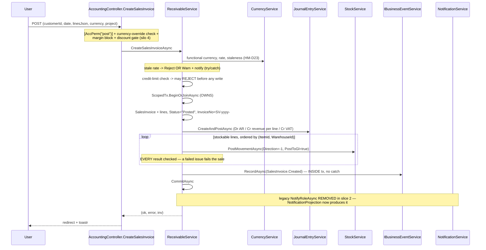
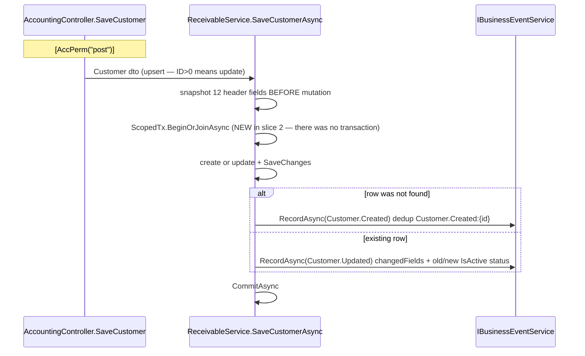
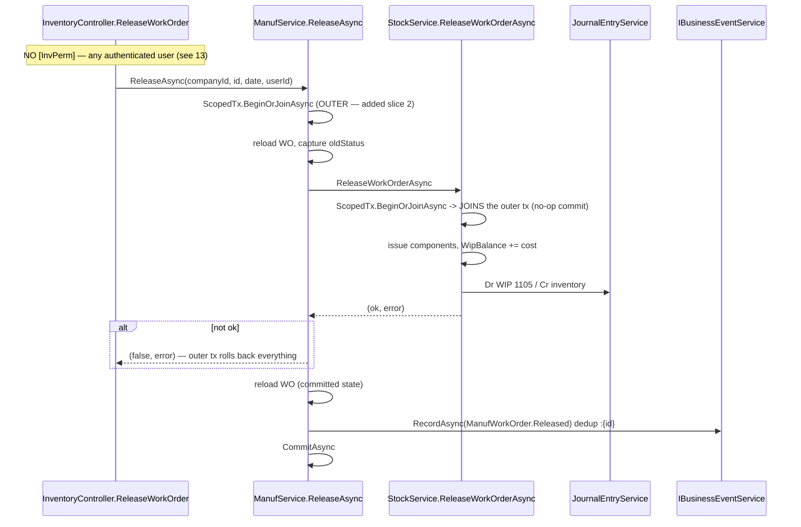
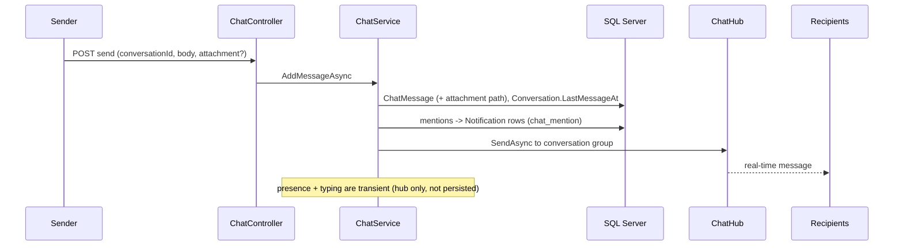
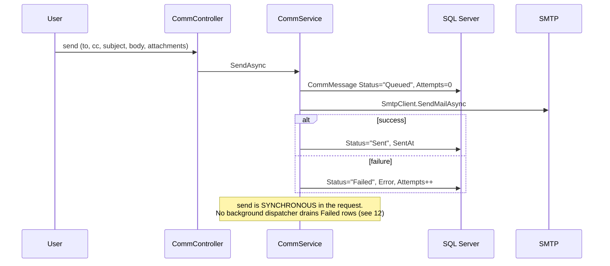

# 10 — Controller, Service and Transaction Map

## Scope
Per-controller composition and the transaction anatomy of every important write flow.

## Evidence
`evidence/Controller-Inventory.csv` (38 rows: base class, class attributes, constructor dependencies,
`direct_dbcontext`, `uses_session`, `uses_scopedtx`, `uses_notify`, `uses_businessevent`, size) ·
`evidence/Endpoint-Inventory.csv` (1002 rows) · `evidence/Service-Inventory.csv` (`scopedtx_sites`).

## Controller composition summary

| Controller | Actions | API | Direct DbContext | Session | ScopedTx | Notify | BusinessEvent |
|---|---|---|---|---|---|---|---|
| `DevSeedController` | ~250 | ✅ | ✅ | ✖ | ✅ | ✅ | ✅ |
| `InventoryController` | ~180 | ✖ | ✅ | ✅ | ✖ | ✖ | ✖ |
| `AccountingController` | 157 | ✖ | ✅ | ✖ | ✖ | ✖ | ✖ |
| `AdminController` (+3 partials) | ~120 | ✖ | ✅ | ✅ | ✖ | ✖ | ✖ |
| `CrmController` | 72 | ✖ | ✅ | ✅ | ✖ | ✖ | ✖ |
| `PosAppController` | ~50 | ✖ | ✅ | ✅ | ✖ | ✖ | ✖ |
| `TasksController` | 25 | ✖ | ✖ | ✅ | ✖ | ✖ | ✖ |
| `ApprovalsController` | **1** | ✖ | ✅ | ✖ | ✖ | ✖ | ✖ |
| `PlatformTimelineController` | 1 | ✖ | ✖ | ✖ | ✖ | ✖ | ✖ |
| 10 API controllers | 273 | ✅ | mostly ✅ | ✖ | some | some | ✖ |

Full matrix in the CSV. **14 of 38 controllers take `CrossDbContext` directly.**

**No controller opens a `ScopedTx`** except `DevSeedController` (test harness). Transaction ownership lives
entirely in `BL/` — this is correct and worth preserving.

## Transaction ownership register

| Service | `ScopedTx` sites | Owns what |
|---|---|---|
`StockService` | **15** | every stock movement + its GL; work-order release/complete/produce/cancel; transfers; counts; write-offs; assembly; landed cost |
`ReceivableService` | 6 | sales invoice create/edit, sales return create/edit, receipt, **customer create/save (added slice 2)** |
`PosOrderService` | 5 | order settle, void, refund, tip, shift close |
`PayableService` | 4 | purchase invoice create/edit, purchase return create/edit, payment |
`ManufService` | 6 | **added slice 2** — create, save header, set status, release, cancel, complete, produce (outer tx that `StockService` joins) |
`JournalEntryService` | 3 | create+post, post, **reverse** |
`CompanyService` | 2 | company setup |
`PosSetupService` | 1 | shift close sync |

## Important write flows

### Sales invoice creation



**Commit location:** after stock, after the event. **Post-commit work:** none in the service any more (the
notification moved to the outbox). **Failure handling:** any `return (false, ...)` before `CommitAsync` lets the
ambient transaction roll everything back; `ScopedTx.DisposeAsync` rolls back and clears the ChangeTracker on the
exception path.

### Purchase invoice creation
Identical shape: `PayableService.CreatePurchaseInvoiceAsync` → `ScopedTx` → invoice+lines (`Status="Posted"`) →
`JournalEntryService.CreateAndPostAsync` → `StockService.PostMovementAsync(Direction=+1, PostToGl=false)` per
stockable line → `RecordAsync(PurchaseInvoice.Created)` → `CommitAsync`. The legacy notification was removed.
Note `PostToGl=false` on receipt — the invoice's own JE already books inventory.

### Customer create / update



### Work order release / production / completion



`CompleteAsync` and `ProducePartialAsync` follow the same outer-transaction pattern; `ProducePartialAsync`
decides `Produced` vs `Completed` from the **status after the call**, not from the caller's `finalize` flag.
`CancelAsync` also covers `StockService`'s early-return path (nothing issued → no GL) which previously committed
with no transaction of its own.

### Journal reversal

```mermaid
sequenceDiagram
  participant Caller as ReceivableService / PayableService / UI
  participant JS as JournalEntryService.ReverseAsync
  participant DB as SQL Server
  Caller->>JS: ReverseAsync(entryId, userId, reason)
  JS->>JS: ScopedTx.BeginOrJoinAsync
  JS->>DB: load entry + lines; require Status == "Posted"
  JS->>DB: build mirror entry — Debit<->Credit swapped, dated TODAY,<br/>JournalType="Reversing", SourceType="Reversal", SourceId=originalId
  JS->>JS: PostInternalAsync(reversal)
  alt post fails
    JS->>JS: RollbackAsync
  end
  JS->>DB: original.Status="Reversed", ReversedByEntryId=reversal.ID
  JS->>JS: CommitAsync
```

`SourceType="Reversal"` is what lets the legacy timeline adapters count re-posts without double-counting
reversals. **No `BusinessEvent` is emitted on reversal** — a gap (see 19).

### BusinessEvent dispatch · notification projection · timeline retrieval
Sequences in **09-Platform-Kernel** §5, §7, §8.

### Existing approval flows
Sequences in **14-Approval-Workflow-Landscape**.

### Chat message delivery



### Email outbox delivery



### Calendar event creation
`CalendarController` → `CalendarService` → `CalendarEvent` + `CalendarEventAttendee` rows →
`NotifyAsync(calendar_event)` to attendees. No transaction (single `SaveChanges`), no `BusinessEvent`.

### File upload and retrieval
`FileManagerController` → `FileManagerService` → write bytes to `wwwroot/uploads/library/<company>/<guid>.ext`
→ `LibraryItem` row. **Retrieval is a plain static-file URL** — no controller, therefore no authorization
(see 13).

## Findings

| # | Finding | Evidence | Category |
|---|---|---|---|
| 1 | **Journal reversal emits no `BusinessEvent`** | `JournalEntryService.ReverseAsync` | Gap |
| 2 | **Email send is synchronous in the request**; `CommMessage.Attempts` exists but nothing retries | `CommService` + no dispatcher in `Program.cs` | Partial |
| 3 | Calendar, announcements, chat, library writes have **no transaction and no event** | single `SaveChanges` each | Gap |
| 4 | 14 controllers write via `CrossDbContext` directly, bypassing service invariants | `Controller-Inventory.csv` | Debt |
| 5 | `AdminController` is 4 partial files mixing HR, appraisals, recruitment, training | file list | Debt |
| 6 | `DevSeedController` (~12.7k lines) owns transactions and events — a test harness with production-shaped power | `[DevOnly]` mitigates | Risk |

## Gaps
- No event coverage for: journal reversal, receipts, payments, returns, POS orders, payroll, projects, tasks, CRM.
- No transaction on communication/calendar/library writes.

## Risks
- A write that bypasses `BL/` gets no transaction, no event and no notification, silently.
- `StockService`'s 15 transaction sites make it the highest-blast-radius file in the codebase.

## Dependencies
09, 12, 13, 19.

## Recommendations
1. Emit `JournalEntry.Reversed` — reversal is the most audit-relevant untracked action in the system.
2. Add a `CommMessage` outbox dispatcher (the `Attempts`/`Error`/`Status` columns already exist for it).
3. Treat "controller writes without a service" as a review gate.

---

## Stage 1 Hotfix A.1 — AccountingApiController (2026-08-04)

The controller-to-service map for `/api/acc` is unchanged in **shape** — the same eight services, the same methods,
the same transaction ownership — with three additions, none of which moves a transaction boundary:

1. **A guard runs first.** `IAccountingApiAuthorization.AuthorizeAsync(action, requestedCompanyId)` is the first
   statement of all 22 actions. It runs **before** any service call, so a refused request begins no `ScopedTx`, writes
   no row, posts no journal, raises no business event and sends no notification.
2. **The company handed to every service is the validated one**, never `dto.CompanyID` or `?companyId=`.
3. **The actor is passed** (`context.EmployeeId`) where the service signature accepts a `userId` — 8 of the 10
   mutating actions. `CreateCustomerAsync` and `CreateVendorAsync` take no `userId`; recorded as a follow-up rather
   than widening a service contract inside a security hotfix.

`Post` and `Reverse` gain an explicit ownership read (`JournalEntries.AnyAsync(e => e.ID == id && e.CompanyID == validated)`)
because their routes carry no company. Transaction ownership stays with the services (`JournalEntryService`,
`ReceivableService`, `PayableService`, `AccountingPostingService`); the controller starts none.

**No service body was modified by this hotfix.**
