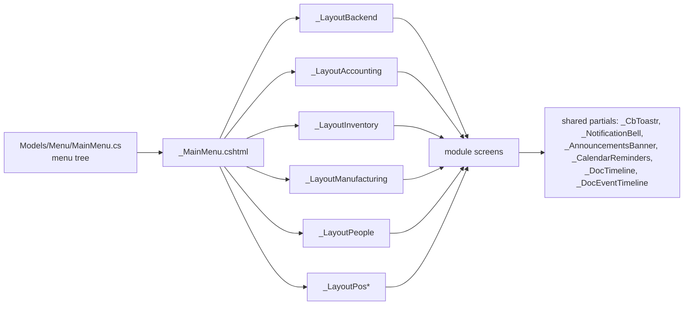

<!-- Generated from docs/architecture/evidence/*.csv by the architecture discovery pass. Counts are re-derivable by re-running the scan. -->

# 11 — Screen Map

## Scope
Every Razor view in the repository: pages, detail screens, dashboards, setup/administration screens, popups
rendered as partials, and shared components. **315 views total**, of which **51 are partials**.

## Evidence
`evidence/Screen-Inventory.csv` (complete, one row per `.cshtml`) · `Endpoint-Inventory.csv` for route matching.

## Method and its limits
A view is matched to a route by the MVC convention `Views/<Controller>/<Action>.cshtml`. Two consequences must
be read carefully:
- **18 views have no same-named action.** Most are rendered explicitly via `View("Name")` or
  `PartialView("Name")` from a differently-named action, so "no matching action" is *not* proof of being
  unreachable. Listed below as candidates requiring runtime confirmation, not as findings.
- **115 actions return a view/partial with no same-named file.** The overwhelming majority return
  `PartialView("_Rows")`-style shared partials. Also not a defect by itself.

Static analysis cannot prove unreachability. Both lists are marked **Partial** coverage in the status table.

## Screens by module

| Module | Screens (non-partial) |
|---|---|
| Accounting | 61 |
| Admin | 46 |
| CRM | 23 |
| Communication | 9 |
| HR | 12 |
| Inventory | 66 |
| POS | 25 |
| Projects | 16 |
| Shared | 1 |
| Tasks | 5 |

## Layouts (runtime shells)
Eleven layouts exist under `Views/Shared/`: `_Layout`, `_mainLayout`, `_LayoutBackend`, `_LayoutAccounting`,
`_LayoutInventory`, `_LayoutManufacturing`, `_LayoutPeople`, `_LayoutPos`, `_LayoutPosApp`, `_LayoutHyperPos`,
`_LayoutEmbed`. Each module screen selects one; this is the module-shell mechanism.

## Shared partial usage map

| Partial | Used by N views |
|---|---|
| `_CbToastr` | 5 |
| `_DocEventTimeline` | 4 |
| `_AnnouncementsBanner` | 4 |
| `_CalendarReminders` | 4 |
| `_MainMenu` | 4 |
| `_NotificationBell` | 4 |
| `_DocTimeline` | 3 |
| `_HrDocGallery` | 2 |
| `_Timeline` | 2 |
| `_CrmCustomFields` | 1 |

`_DocEventTimeline` (4 uses) and `_DocTimeline` (3 uses) are the object-collaboration components — see
07-Business-Object-Capability-Matrix for exactly which entities they are wired to.

## Screen navigation
Navigation is **data-driven from one place**: `Models/Menu/MainMenu.cs` builds the menu tree consumed by
`Views/Shared/_MainMenu.cshtml`, which every layout includes. A screen absent from `MainMenu.cs` is reachable
only by direct URL or from another screen's link.

## Views with no same-named action (candidates for orphan review)
- `CrossBuy/Views/Admin/ApplicationDetail.cshtml`
- `CrossBuy/Views/Admin/ApplicationForm.cshtml`
- `CrossBuy/Views/Admin/Applications.cshtml`
- `CrossBuy/Views/Admin/AppraisalScore.cshtml`
- `CrossBuy/Views/Admin/AppraisalTemplateEditor.cshtml`
- `CrossBuy/Views/Admin/AppraisalTemplates.cshtml`
- `CrossBuy/Views/Admin/Appraisals.cshtml`
- `CrossBuy/Views/Admin/CourseEnrollments.cshtml`
- `CrossBuy/Views/Admin/RequiredDocTypesList.cshtml`
- `CrossBuy/Views/Admin/TrainingCourseEditor.cshtml`
- `CrossBuy/Views/Admin/TrainingCourses.cshtml`
- `CrossBuy/Views/Inventory/CategoryForm.cshtml`
- `CrossBuy/Views/Inventory/DocumentDetails.cshtml`
- `CrossBuy/Views/Inventory/ItemForm.cshtml`
- `CrossBuy/Views/Hyper/PosLane.cshtml`
- `CrossBuy/Views/Hyper/PosLogin.cshtml`
- `CrossBuy/Views/Hyper/PosStart.cshtml`
- `CrossBuy/Views/Shared/Error.cshtml`

## Screens relying on authentication only
**193 routed screens** carry `[SessionValidation]` (or inherit it) but **no** module permission attribute.
Full list in `Screen-Inventory.csv` (filter `permission`/`inherited_permission` for absence of
`AccPerm`/`InvPerm`/`CrmPerm`). This is the dominant pattern, not the exception — see
13-Security-Authorization-Isolation.

## Localization / RTL
`uses_localizer` is true for the large majority of views (resx-driven per the project convention).
`dir_rtl` flags views containing RTL handling or an `isAr` culture branch. Both columns are in the CSV.

## Gaps
- No screen registry: nothing links a screen to its entity, permission and capabilities except this inventory.
- Duplicate-intent screens exist (e.g. `Views/Hyper/PosLane` + `Views/Pos` lanes; `_Layout` vs `_mainLayout`).
- Orphan-candidate views cannot be resolved statically.

## Risks
- Screens reachable by URL with only `[SessionValidation]` are gated by authentication, not authorization.
- Eleven layouts multiply the cost of any cross-cutting UI change (the bell needed 11 edits in Comm-Hub P1).

## Dependencies
04-Component-Architecture (partials), 13-Security (permission gaps), 07 (capability wiring).

## Recommendations
1. Add a screen->entity->permission registry so 07's capability matrix can be generated, not hand-maintained.
2. Resolve orphan candidates with a runtime route dump rather than statically.
3. Consider collapsing the layout set.
