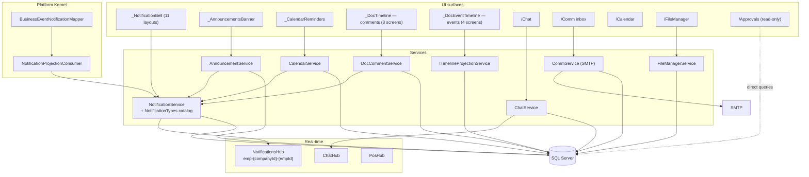
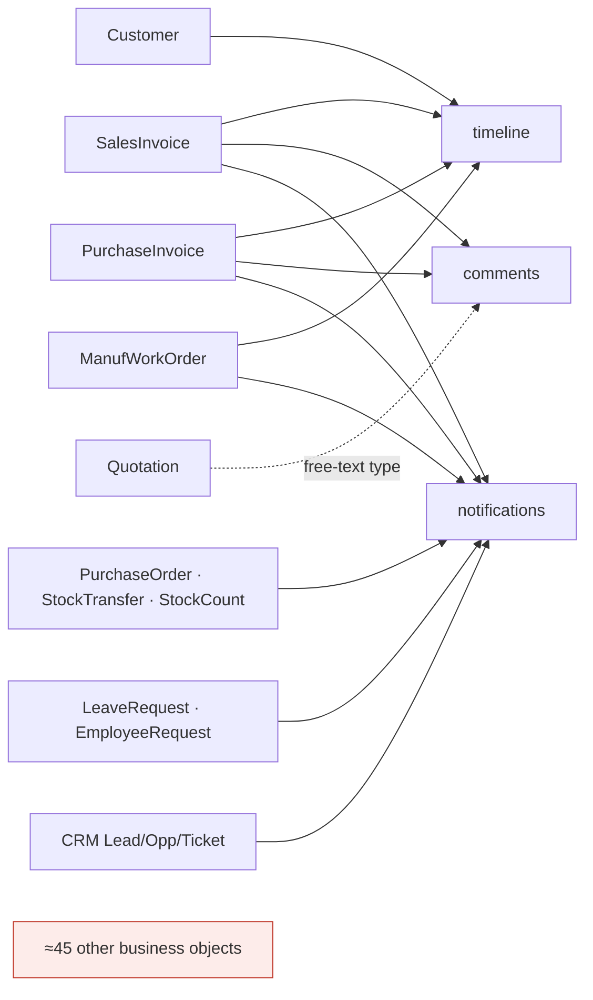

# 12 — Communication and Collaboration Map

## Scope
Every communication and collaboration feature, with an explicit verdict on whether it is connected to business
objects or standalone.

## Evidence
`BL/NotificationService.cs` · `BL/NotificationTypes.cs` · `BL/ChatService.cs` · `BL/CommService.cs` ·
`BL/AnnouncementService.cs` · `BL/DocCommentService.cs` · `BL/CalendarService.cs` ·
`BL/FileManagerService.cs` · `Hubs/{Notifications,Chat,Pos}Hub.cs` · `BL/Platform/NotificationProjectionConsumer.cs` ·
`Views/Shared/_NotificationBell.cshtml`, `_DocTimeline.cshtml`, `_DocEventTimeline.cshtml`,
`_AnnouncementsBanner.cshtml`, `_CalendarReminders.cshtml` · `Controllers/{Notifications,Chat,Comm,Announcements,Comments,Calendar,FileManager,Approvals}Controller.cs`.

## Feature register

| Feature | Status | UI | Service | Tables | Real-time | Company isolation | **Linked to business objects?** | BusinessEvent | Workflow |
|---|---|---|---|---|---|---|---|---|---|
| **Notifications** | **Implemented** | `_NotificationBell` (all 11 layouts) + `/Notifications` | `NotificationService` | `Notifications`, `NotificationMutes` | ✅ `NotificationsHub`, group `emp-{companyId}-{empId}` | ✅ group + `CompanyID` column | **✅ yes** — `EntityType`+`EntityId` (slice 2) + `Url` via registry | ✅ **consumer** | ✖ |
| **Internal chat (1:1 + group)** | **Implemented** | `/Chat` | `ChatService` | `Conversations`, `ConversationMembers`, `ChatMessages`, `ChatReactions` | ✅ `ChatHub` | ✅ `CompanyID` | ✖ **standalone** — no entity linkage | ✖ | ✖ |
| Channels | **Missing** | — | `Conversation.Kind` allows `Channel` | — | — | — | — | — | — |
| **Mentions** | **Partial** | chat + comments | `ChatService`, `DocCommentService` | mention ids passed in, **not stored** | ✅ notification | ✅ | ◐ only via the comment's entity | ✖ | ✖ |
| **Email (SMTP outbox)** | **Partial** | `/Comm` Metronic inbox | `CommService` | `CommMessages`, `CommAttachments` | ✖ | ✅ `CompanyID` | ✖ **standalone** — `CommMessage` has **no `EntityType`/`EntityId`** despite the design doc specifying them | ✖ | ✖ |
| **Announcements** | **Implemented** | `_AnnouncementsBanner` + `/Announcements` | `AnnouncementService` | `Announcements`, `AnnouncementReads` | ✖ (notification only) | ✅ | ✖ standalone | ✖ | ✖ |
| **Document comments** | **Implemented but 5% wired** | `_DocTimeline` on **3 screens** | `DocCommentService` | `DocComments` | ✖ | ✅ | **✅ yes** — `(EntityType, EntityId)`, but `EntityType` is **free text** (`Quotation`) | ✖ | ✖ |
| **Event timeline** | **Implemented, 4 objects** | `_DocEventTimeline` on **4 screens** | `ITimelineProjectionService` | `BusinessEvents` (+4 legacy adapters) | ✖ | ✅ + branch + visibility + permission | **✅ yes** — canonical registry codes only | ✅ **producer + consumer** | ✖ |
| **Calendar** | **Implemented** | `/Calendar` FullCalendar + `_CalendarReminders` | `CalendarService` | `CalendarEvents`, `CalendarEventAttendees` | ✖ | ✅ | ✖ **standalone** — no entity linkage | ✖ | ✖ |
| **File library** | **Implemented** | `/FileManager` (SharePoint-style tree) | `FileManagerService` | `LibraryItems` (`ParentId` tree) | ✖ | ✅ | ✖ **standalone** — company-wide tree, **not** object-attached | ✖ | ✖ |
| **Unified approvals inbox** | **Partial — read-only** | `/Approvals` | (none — controller queries directly) | read-model over 3 silos | ✖ | ◐ | ◐ reads silo tables | ✖ | see 14 |
| **Presence** | **Partial** | chat | `ChatHub` | **not persisted** (hub-only, by design) | ✅ | n/a | ✖ | ✖ | ✖ |
| **Typing indicators** | **Implemented** | chat | `ChatHub` | not persisted | ✅ | n/a | ✖ | ✖ | ✖ |
| **Read receipts / reactions / edit / delete** | **Implemented** | chat | `ChatService` | `ChatReactions`, member `LastReadMessageId`, soft-delete | ✅ | ✅ | ✖ | ✖ | ✖ |
| **Meetings** | **Missing** | — | — | `Activity.Type == "Meeting"` is a text label only | — | — | — | — | — |
| **Calls** | **Missing** | — | — | `Activity.Type == "Call"` label only | — | — | — | — | — |
| **Voice notes** | **Missing** | — | — | — | — | — | — | — | — |
| **Knowledge base / wiki** | **Missing** | — | — | — | — | — | — | — | — |
| SMS / WhatsApp / Push | **Missing** (explicit non-goal) | — | — | — | — | — | — | — | — |

## Standalone vs object-connected — the key verdict

| Connected to business objects | Standalone (no entity linkage) |
|---|---|
Notifications (`EntityType`+`EntityId`, slice 2) | Chat |
Document comments (`EntityType`+`EntityId`, free text) | Email / `CommMessage` |
Event timeline (canonical codes) | Announcements |
| | Calendar |
| | File library |

**Five of nine implemented features are standalone.** The Book-1 principle "collaboration by default on every
business object" is therefore **Partial at best**: three mechanisms are object-aware, and two of those cover
4–5 objects out of 58.

Notably, `CommMessage` was *designed* with `EntityType`/`EntityId`
(`docs/CrossBuy_Communication_Hub_Analysis.md` §4.4 lists them) but the **implemented entity has neither** —
a case where the design doc must not be read as the architecture.

## Component diagram

## Message delivery sequence
See 10 (chat) — `ChatService` persists then pushes to the conversation group; mentions become notifications.

## Email outbox sequence
See 10. **Key finding:** `CommMessage` has `Status`/`Attempts`/`Error` — the exact shape of an outbox — but
**no background dispatcher drains it**. Sending is synchronous inside the request; a `Failed` row stays failed
until a user resends manually. The design document specifies "retries via a hosted dispatcher on failure"; that
dispatcher **does not exist**.

## Notification projection sequence
See 09 §7. `NotificationProjection` is the only notification path with idempotency
(`evt:{EventUid}:{recipient}`) and recipient authorization.

## Calendar sequence
`CalendarController` → `CalendarService` → `CalendarEvent` + attendee rows → `NotifyAsync(calendar_event)`.
No transaction, no event, no external sync.

## Object collaboration capability map

## Gaps
- Chat, email, calendar and files have **no** business-object linkage.
- `CommMessage` lacks the `EntityType`/`EntityId` its own design specifies.
- No email outbox dispatcher despite outbox-shaped columns.
- Mentions are not persisted, so "where was I mentioned?" is unanswerable.
- No channels, meetings, calls, voice notes or knowledge features.
- `/Approvals` cannot act (see 14).

## Risks
| Risk | Severity |
|---|---|
| Failed emails are invisible and never retried | **High** — a customer invoice email can silently fail |
| Files are served as unguarded static URLs | **High** (see 13) |
| Free-text `DocComment.EntityType` will fork the vocabulary | Medium |
| Chat/calendar/email writes have no transaction | Low-Medium |

## Dependencies
09 (kernel), 13 (file authorization), 07 (capability coverage).

## Recommendations
1. **Add the `CommMessage` outbox dispatcher** — the columns exist; this is the cheapest reliability win in the
   communication layer, and the `BusinessEventDispatchWorker` is a working template.
2. Add `EntityType`/`EntityId` to `CommMessage` so "email about this invoice" becomes answerable.
3. Persist mentions.
4. Register `Quotation` so comments stop using a free-text type.

---

## Stage 1 Batch C — communication authorization (2026-08-04)

`CommunicationAccessService` (`Scope = Communication`): `read` · `send` · `create-group` · `manage-group` ·
`announcement-send` · `outbox-manage`. Full model: [ADR-029](../platform/ADR-029-Tasks-Communication-Permission-Models.md).

| Surface | Rule |
|---|---|
| Direct + group conversations | `ConversationMember` membership required — **belonging to the company is not enough**, and this holds under bootstrap-open too |
| Group management | `ConversationMember.Role = Owner`, or `CommunicationAdministrator` |
| Cross-company | rejected on the **conversation row**, before membership is consulted |
| Announcements | the existing `Scope = Company \| Branch` + `BranchID` audience; a branch-scoped publisher may publish only to its branch |
| **Email outbox (`CommMessage`)** | `CommMessage` has **no owner, sender or participant column at all**, so no membership rule is derivable. Company scope **plus** `outbox-manage`, and **never bootstrap-open** |
| Attachments | inherit conversation + company access |

**`ConversationMember` is unchanged** — it was already the right relationship, and `ChatService` already enforced it
internally. Batch C canonicalises the rule so the controller, the hub and future consumers answer from one place.

**SignalR hubs are NOT yet adopted.** `IsConversationParticipantAsync` is implemented and tested for exactly that
purpose, but no hub was modified — reported **Partial**, with the exact next action, in the delivery report §6.2.

**Not implemented:** moderation, external collaboration, customer portals.
