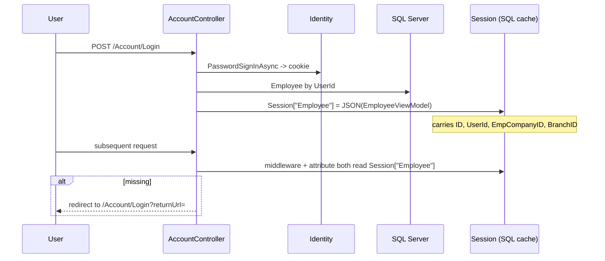
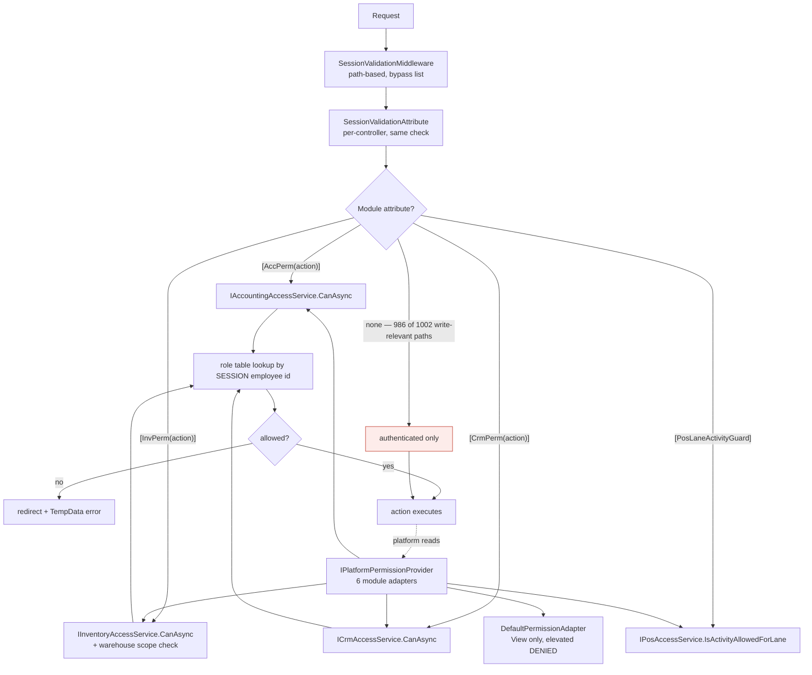
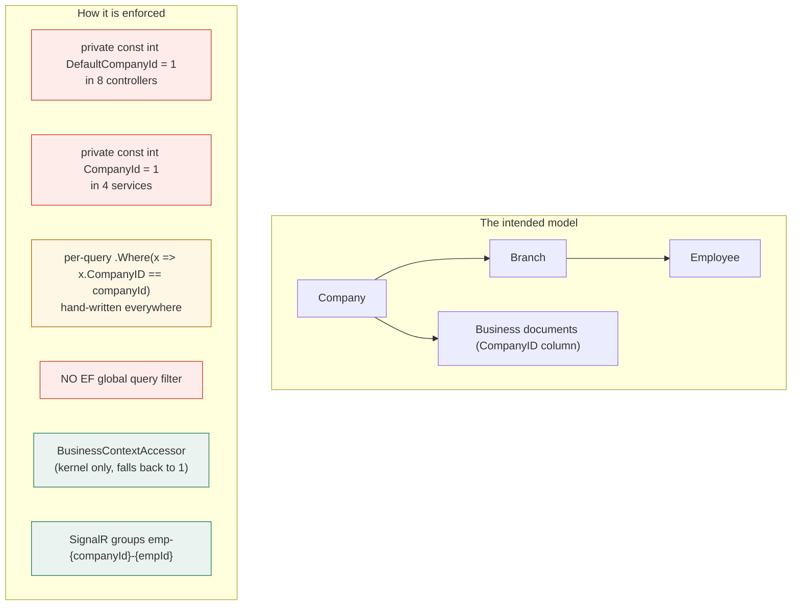

# 13 — Security, Authorization and Isolation

> WARNING - **CORRECTED. See [CORRECTION-001](CORRECTION-001-Manufacturing-Permission-Finding.md).** The
> manufacturing work-order permission finding published in the original discovery pass was **wrong** and has
> been withdrawn: all nine work-order write actions already carried `[InvPerm("doc")]` + anti-forgery. The
> permission-coverage numbers below are the regenerated, corrected figures.

## Scope
The complete security model: authentication, session, role resolution, the four access services, the platform
permission pipeline, isolation, and measured coverage gaps.

## Evidence
`Program.cs` (Identity, cookie, JwtBearer, session, DataProtection) · `Models/SessionValidationMiddleware.cs` ·
`Models/SessionValidationAttribute.cs` · `Models/AccPermAttribute.cs` · `Models/InvPermAttribute.cs` ·
`Models/CrmPermAttribute.cs` · `Models/PosLaneActivityGuardAttribute.cs` · `BL/*AccessService.cs` (4 files) ·
`BL/Platform/PlatformPermissionProvider.cs` · `Hubs/*.cs` · `evidence/Permission-Coverage.csv` (1002 rows).

## Authentication

| Scheme | Used by | Evidence |
|---|---|---|
| **ASP.NET Identity + cookie** | web UI | `AddIdentity<Users, IdentityRole>().AddEntityFrameworkStores<CrossDbContext>()` |
| **JWT bearer** | mobile / `Controllers/Api/*` | `AddJwtBearer` with `Jwt:Key/Issuer/Audience/ExpireHours` |
| **Session state** (SQL-backed) | the *real* gate for MVC | `Session["Employee"]` = serialized `EmployeeViewModel` |
| **`PosCtx` session key** | independent cashier app | `SessionValidationMiddleware` bypass + `PosAppController` |
| **`HyperCtx` session key** | hypermarket lane | same pattern |
| **Anonymous** | storefront `/home/store`, `/store*` | middleware `isStorefront` bypass |
| Certificate auth | **package referenced, no user-facing scheme wired** | `Authentication.Certificate` in csproj |

DataProtection keys are persisted machine-wide (ProgramData) so a rebuild does not invalidate sessions.

**User → employee resolution has two paths**: (a) the session blob, (b) `ClaimTypes.NameIdentifier` →
`IEmployeeService.GetEmployeeByUserIdAsync` → `Employee.EmpCompanyID`. `BusinessContextAccessor` unifies them;
the four access services use only (a).

## Authorization pipeline

## Access-service comparison matrix

| | Accounting | Inventory | CRM | POS |
|---|---|---|---|---|
| Interface | `IAccountingAccessService` | `IInventoryAccessService` | `ICrmAccessService` | `IPosAccessService` |
| Role table | `AccountingUserRoles` | `InventoryUserRoles` | `CrmUserRoles` | `BranchUserRoles` |
| Roles | ChiefAccountant, Accountant, Cashier, Auditor | InventoryManager, WarehouseKeeper, PurchasingOfficer, InventoryAuditor | SalesManager, SalesRep, Marketing, CrmViewer | pos-manager, pos-cashier, pos-waiter, pos-kitchen |
| Action vocabulary | `read` · `post` · `pay` · `manage` · `currency-override` | `read` · `doc` · `purchase` · `manage` | `read` · `edit` · `manage` | **none** — sync predicates `CanSell`/`IsManager`/`IsKitchen`/`IsWaiter`/`CanOrder` |
| Employee source | **`BusinessContext`** (Stage 1) | **`BusinessContext`** (Stage 1) | **`BusinessContext`** (Stage 1) | **`BusinessContext.UserId`** |
| Async? | ✅ | ✅ | ✅ | ✖ **sync**, roles passed in |
| Row-level scope | ✖ | ✅ `CanUseWarehouseAsync`, now reachable via `PermissionTarget.ForWarehouse` | ✅ `VisibleOwnerIdsAsync` / `TeamOwnerIdsAsync`, now via `PermissionTarget.ForOwner` | ✅ branch-bound, now via `PermissionTarget.BranchId` |
| **Open when unconfigured** | ✅ `AnyRoleConfiguredAsync()` false ⇒ **everything allowed** | ✅ same | ✅ same | ✖ no role ⇒ no access |
| Company | **`context.CompanyId`** (Stage 1) | **`context.CompanyId`** (Stage 1) | **`context.CompanyId`** (Stage 1) | `PosCompanyPolicy.CatalogCompanyId` = 1, **deliberate** (POS catalog lives under company 1 while branches sit under 65–79); `BranchCompanyId` reports the branch's real company |

**Four services, three action vocabularies, one sync outlier.** Still the most consequential inconsistency in the
security model — but as of **Stage 1 Batch A** all four are addressable through ONE contract,
`IModuleAccessService.CanAsync(BusinessContext, action, PermissionTarget?)`, and none of them reads the HTTP session
in its permission path. See [ADR-010](../platform/ADR-010-Session-Free-Permission-Evaluation.md). Unifying the
vocabularies is a separate decision: it would change permission semantics for 195 already-guarded actions.

### The bootstrap-open behaviour
Three of four services return `true` for **every** action when their role table is empty ("not configured yet →
open"). This is a deliberate anti-lockout measure and is commented as such — but it means **a fresh or
partially-configured install has no accounting, inventory or CRM authorization at all.**

**Stage 1 Batch A changed the SCOPE of that question, and it is a documented behaviour change:** it used to ask
"does company 1 have any roles configured?" for every caller. It now asks about the **caller''s own company**, which
is the only meaningful answer on a multi-company install — but it means a company-2 user is now subject to company
2''s configuration rather than company 1''s.

## Measured coverage

> **CORRECTED A THIRD TIME in Stage 1 Phase 1.** See
> [CORRECTION-003](CORRECTION-003-Permission-Attribute-Recognition.md): fully-qualified attribute names
> (`[CrossBuy.Models.AccPerm("post")]`) and two real guards (`PosLaneActivityGuard`, `DevOnly`) were invisible to the
> scanner, so **85 of 173 permission attributes — 49% — were not counted.** The unguarded mutating-action figure is
> **189**, not 306. Accounting carries **55** permission attributes and CRM **37**.
>
> Previously corrected in Stage 0 Batch B. See
> [CORRECTION-002](CORRECTION-002-Evidence-Scanner-Defects.md). The figures below are regenerated by the
> checked-in `CrossBuy/deploy/scan-architecture.ps1`, which fixes two further scanner defects: a four-file
> `partial` controller (`AdminController`) was only partly attributed, and API controllers were absent from the
> per-controller backlog table.

**Metric basis.** The original `writes` column was a body heuristic (`.Add(` anywhere) with false positives *and*
false negatives, and is no longer used as a security metric. The defensible basis is the **HTTP verb**: a mutating
verb is a fact about the endpoint, not a guess about its body.

| Metric | Count |
|---|---|
| Controller files / distinct controller classes | **42 / 39** |
| Total controller actions | **1054** |
| **Mutating actions (POST/PUT/DELETE/PATCH)** | **384** |
| - with an **action-level** module permission | **150 (39%)** |
| - with a module permission at **any** level (action or class) | **195 (51%)** |
| - **without** an action-level module permission | **234 (61%)** |
| - **without** a module permission at any level | **189 (49%)** |
| - with `[ValidateAntiForgeryToken]` | **325 (85%)** |
| MVC (non-API) mutating actions **without** anti-forgery | **38** |

Attribute inventory: `AccPerm` **55** · `InvPerm` **74** · `CrmPerm` **37** · class-level `PosLaneActivityGuard`
**2 (71 actions)** · class-level `PlatformOps` **2 (5 actions)** · class-level `DevOnly` **1 (224 actions)** ·
`SessionValidation` **153**.

**Both coverage bases are published deliberately.** Action-level counting is the right measure where only *some*
actions on a controller carry a permission (`AccountingController`, `CrmController`); any-level counting is right for
a controller gated as a whole. The single row of difference is
`BusinessEventMonitorController.Retry`, gated by `[PlatformOps]` on the class. Publishing one number would mean
silently choosing the flattering or the alarming one.

### Mutating actions without an action-level module permission, by controller

Ranked. **This is the Stage 1 security backlog.**

| Controller | Count | Note |
|---|---|---|
| `AccountingController` | **44** | many peers on the same controller *do* carry `[AccPerm("post")]` |
| `PosController` | **42** | some paths gated by `PosCtx` session + `[PosLaneActivityGuard]` instead |
| `AdminController` | **42** | no HR RBAC exists. Was reported as 24 — the four-file `partial` class hid 18. |
| `PosAppController` | **36** | independent cashier app, `PosCtx` session gate |
| `CrmController` | **32** | `[CrmPerm]` applied selectively |
| `ProjectController` | **30** | no Projects RBAC exists |
| `TasksController` | **13** | no Tasks RBAC exists |
| `AccountingApiController` | **10** | API surface, absent from the earlier table |

> **SECURED — Stage 1 Hotfix A.1 (2026-08-04).** All **10** mutating actions and all **12** reads on
> `AccountingApiController` now authorize server-side through `IAccountingApiAuthorization`, which asks the
> context-aware `AccountingAccessService`. Permissions are the MVC controller's own for the same operations —
> `post` for journals/invoices/customers/vendors, `pay` for receipts/payments, **`manage` (ChiefAccountant only)
> for `PayrollPost`**, `read` for the reads. Every `companyId` / `dto.CompanyID` is preserved as
> **compatibility-only**: validated against the resolved `BusinessContext` and rejected (403) on mismatch, never
> coerced. `Post`/`Reverse` carry no company, so journal ownership is checked explicitly and a foreign id answers
> exactly as an absent one. Bearer-only, so anti-forgery is deliberately not added. 79 tests. See
> [ADR-025](../platform/ADR-025-Accounting-API-Security-Policy.md).
>
> The permission backlog is therefore **183**, not 193 — see
> [Stage-005](maturity/Stage-005-Hotfix-A1-Result.md) §4 for the reconciliation.
| `ChatController`, `HyperPosController` | 8 each | |
| `PeopleController` | 5 | |
| `AiController`, `CommController`, `FileManagerController` | 4 each | |
| `AnnouncementsController`, `BrandController` | 3 each | |
| `AccountController`, `ServiceController`, `CalendarController`, `CommentsController`, `HrApiController`, `LeaveApiController`, `NotificationsApiController` | 2 each | |
| `AuthApiController`, `NotificationsController`, `InventoryController`, `BusinessEventMonitorController` | 1 each | `AuthApiController` is intentionally anonymous (login); `BusinessEventMonitorController` is class-gated by `[PlatformOps]` |

`DevSeedController` is excluded from this table: `[DevOnly]` returns 404 for `/api/dev/*` in production. **That
attribute is the only thing standing between a dev seeder and production data**, which is worth stating even though
it is out of scope here.

### The manufacturing case - WITHDRAWN and corrected

The original finding below claimed the work-order write actions were unguarded and called it the highest-severity
authorization issue in the system. **That was false.** All nine already carried `[InvPerm("doc")]` +
`[ValidateAntiForgeryToken]`; the discovery scanner could not read concatenated same-line attributes. Full root
cause in [CORRECTION-001](CORRECTION-001-Manufacturing-Permission-Finding.md).

What was genuinely missing was a **read** gate. Stage 0 added `[InvPerm("read")]` to `WorkOrders`,
`WorkOrdersData`, `WorkOrderItemPickData`, `NewWorkOrder` and `WorkOrderDetails`, plus server-aligned UI gating
(`ViewBag.CanDoc`). This is defense in depth - `CanAsync("read")` grants any authenticated user today - not an
emergency fix. Pinned by 13 tests in `Slice3ManufacturingSecurityTests.cs` asserting compiled metadata.

The **189** unprotected mutating actions are the **Stage 1 security backlog**, and **132 of them sit in three modules
that have no access service at all** — HR, Projects and Tasks/Communication. That is why remediation is sequenced as
**Stage 1 Batch C** (build the three missing services) then **Batch D** (risk-ranked per-endpoint remediation), not as
a bulk attribute pass: several endpoints are already gated by a different mechanism (POS session,
`PosLaneActivityGuard`, `DevOnly`) that a naive `[InvPerm]`/`[AccPerm]` would duplicate or contradict. See
[docs/platform/Stage-001-Roadmap.md](../platform/Stage-001-Roadmap.md).

| Module | Backlog | Access service today |
|---|---|---|
HR | **47** | none — Batch C |
POS | **42** | exists; these are setup writes outside the lane guard |
Projects | **30** | none — Batch C |
Communication | **28** | none — Batch C |
Identity | **14** | n/a (`AuthApiController.Login` is intentionally anonymous) |
Tasks | **13** | none — Batch C |
Other / AI / Retail / Inventory | **15** | mixed |

### Added in Stage 0 Batch B

`PlatformOpsAttribute` — the gate for platform-operations screens (currently the Business Event Monitor). It composes
the two strongest rights that already exist rather than inventing a fifth vocabulary: an Identity role in
`Admin`/`Administrator`/`SuperAdmin`/`PlatformOps`, **or** accounting `manage`. Elevation (cross-company viewing,
`Restricted`/`System` payloads, the max-attempts retry override) requires the **admin role specifically**.

It **inherits the bootstrap-open weakness** documented above: on an install with no accounting roles configured,
`AccountingAccessService.CanAsync("manage")` returns `true` and the gate is open to any authenticated employee. That is
recorded in the attribute's own summary comment, in
[ADR-009](../platform/ADR-009-Platform-Operations-Authorization.md), and here — not hidden.

### ~~Original (withdrawn) manufacturing finding~~
`Controllers/InventoryController.cs:1132/1140/1148` — `ReleaseWorkOrder`, `CancelWorkOrder`,
`CompleteWorkOrder` — carry **no `[InvPerm]`**. They are reachable by **any authenticated employee** and they
post stock movements and journal entries (WIP 1105 → applied 520108 → finished goods). `CreateWorkOrder` (1069)
and `SaveWorkOrder` (1124) are likewise unguarded.

**This is the highest-severity authorization finding in the system.** See 19 / 20.

### Screens relying only on authentication
**193 routed screens** carry `[SessionValidation]` (or inherit it) and no module permission. Complete list in
`Screen-Inventory.csv`.

## Services coupled to the HTTP session

| Service | Coupling | Consequence |
|---|---|---|
| `AccountingAccessService` | `_http.HttpContext?.Session.GetString("Employee")` | cannot authorize outside a request |
| `InventoryAccessService` | same | same |
| `CrmAccessService` | same | same |
| `TasksController.CurrentEmployeeId()` | same, in the controller | duplicated resolution |

**Consequence for the Platform Kernel:** `NotificationProjectionConsumer` runs in the dispatcher, which has **no
session**. Its per-recipient `IPlatformPermissionProvider` check therefore does not evaluate the specific
recipient — it evaluates "no session". The consumer's audience is drawn from the module's own role tables, so a
`ChiefAccountant` is authorized *by construction*, and the code comment plus ADR-006 state this openly. But it
must not be read as per-recipient enforcement. **This is the single change that unblocks AI Context** (which is
specified to require permission filtering before assembly).

## Background-worker authorization limitations
All five workers run with **no user, no session, no claims**. `BusinessContext.ForSystem(companyId)` sets
`IsSystem = true`, and `PlatformPermissionProvider` short-circuits a system context to `Allow`. That is correct
for the dispatcher (it is infrastructure) but means **workers are unconditionally authorized** — their safety
depends entirely on what they are coded to do, not on any gate.

## API authorization
273 API actions; **55 carry `[Authorize]`**. The rest rely on `[ApiController]` + JWT middleware being present,
or on `[DevOnly]`. `Controllers/Api/AuthApiController.cs` is intentionally anonymous (login). Detailed per-group
analysis in 16.

## SignalR authorization

| Hub | Auth | Groups | Company isolation |
|---|---|---|---|
| `NotificationsHub` | dual: cookie (web) + `access_token` query (mobile) | `emp-{companyId}-{empId}` | ✅ **group name carries the company** |
| `ChatHub` | dual | conversation groups | via `ConversationMember` |
| `PosHub` | dual | terminal/branch groups | via branch |

Notification groups being company-scoped is a real isolation control, added by the Comm-Hub P1 work.

## File authorization
Uploads land under `wwwroot/uploads/...` and are served as **static files**. `LibraryItem` and
`EmployeeDocument` rows are company/employee-scoped in the database, but the **file URLs are unguarded static
paths** — anyone who knows or guesses a path can fetch the bytes without passing any controller.
**Finding — security gap.** Mitigated only by GUID filenames (`/uploads/library/<company>/<guid>.ext`).

## Company / branch isolation

Branch isolation is thinner still: `Warehouse.BranchID`, `Employee.BranchID` and the POS branch context exist,
but there is **no branch selector** in the accounting/inventory UI, and `SalesInvoice`/`PurchaseInvoice` carry no
`BranchID` at all. `TimelineProjectionService` handles this correctly by filtering only when *both* sides have a
branch.

## Cross-company leakage risk report

| Vector | Evidence | Severity |
|---|---|---|
| Missing `CompanyID` predicate in any of ~1000 queries | no global filter; manual per-query | **Critical** |
| `DefaultCompanyId = 1` hard-coded in 8 controllers | grep | **Critical** for multi-company |
| `const int CompanyId = 1` in 4 access services + `InventoryApprovalService` | grep | **High** — authorization evaluated against the wrong company |
| Two workers hard-code company 1 | 15-Background-Workers | High |
| `LeaveRequest`, `FiscalPeriod` + 76 classes have no company column | 08 | High |
| Static file URLs unguarded | this doc | High |
| `Employee` search in `EntityRegistry` deliberately not company-scoped (TM-2 compat) | ADR-002 known limitation | Medium (documented) |

## Gaps
- No HR / Projects / Tasks / Manufacturing RBAC.
- No row-level (record ownership) authorization outside CRM.
- No authorization on static file paths.
- No global query filters.
- Two duplicated session gates.

## Risks
Ranked in 20-Architecture-Risks. The top three are: unguarded manufacturing GL/stock actions,
missing-`CompanyID`-predicate leakage, and unguarded static file paths.

## Dependencies
09 (kernel permission pipeline), 14 (approver authorization), 16 (API), 21 (stages 1–2).

## Recommendations
1. **Add `[InvPerm("doc")]`** (or a manufacturing equivalent) to the five work-order actions. Smallest,
   highest-value security fix available.
2. **Make the access services accept the employee id from `BusinessContext`** instead of reading the session.
   Unblocks per-recipient notification authorization and AI Context.
3. **Add EF global query filters** for `CompanyID`.
4. Serve uploads through an authorizing controller instead of static paths.
5. Re-examine "open when unconfigured" — at minimum log loudly when it triggers.

---

## Stage 1 Batch C — the three modules that had no access service (2026-08-04)

**Before:** `AdminController` (+3 partials, 42 mutating), `PeopleController` (5), `ProjectController` (30),
`TasksController` (13) and the Communication controllers (28) carried **ZERO authorization** — no permission
attribute, no `IsInRole`, no in-body check. The only guard was the global `SessionValidationMiddleware`, i.e.
authentication. Any signed-in employee could reach employee administration, salary policies, payroll paths,
appraisals, every project and every task.

**Now:** four session-free, context-aware access services on ONE shared role table.

| Module | Scope | Actions | Record-level anchor |
|---|---|---|---|
| HR | `Hr` | 11 | self · the company-intersected approver hierarchy |
| Projects | `Projects` | 8 | `ProjectMembers` (new — no employee↔project relationship existed) |
| Tasks | `Tasks` | 8 | `AssigneeEmployeeId` · `CreatedByEmployeeId` · linked entity · hierarchy |
| Communication | `Communication` | 6 | `ConversationMember` (canonicalising `ChatService`'s existing rule) |

**One shared table, `PlatformRoleAssignments`** — no `HrUserRoles`/`ProjectUserRoles`/`TaskUserRoles`/`CommUserRoles`.
Read only through `IPlatformRoleDirectory`. Accounting/Inventory/CRM tables are NOT migrated; **POS
(`BranchUserRoles`) is a documented permanent exception**. See [ADR-026](../platform/ADR-026-Shared-Platform-RBAC.md).

**A latent cross-company leak, closed for new code:** `Hierarchical` has no `CompanyID`, and both existing walks
(`CrmAccessService.TeamOwnerIdsAsync`, `LeaveWorkflowService`) return employees of other companies on a
multi-company install. `IOrgHierarchy` adds the intersection. **The two existing callers are NOT repointed** — Batch D.

**Enforcement is FOUR endpoints, not four modules.** 114 of 118 in-scope mutating actions remain in the backlog
(Batch D). Everything else is **bootstrap-open per company and per scope**, with three deliberate exceptions that are
never bootstrap-open: HR `confidential-view` and `payroll-manage`, and Communication `outbox-manage` and conversation
reads.

Backlog **183 → 183** — a coincidence: −2 (Batch C proofs) +2 (concurrent parallel-team actions). See the
[delivery report](../platform/Stage-001-Batch-C-Delivery-Report.md) §7.
