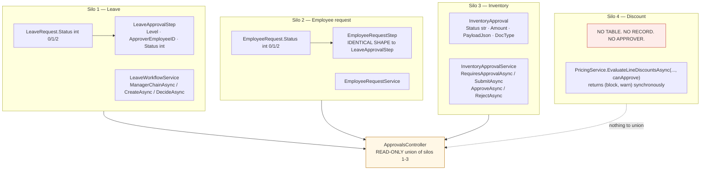
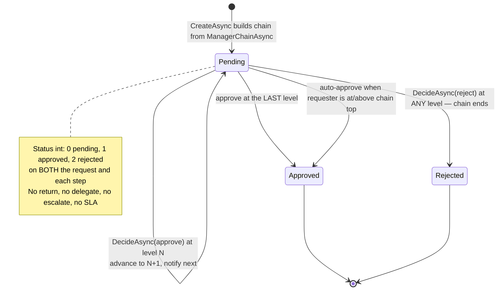
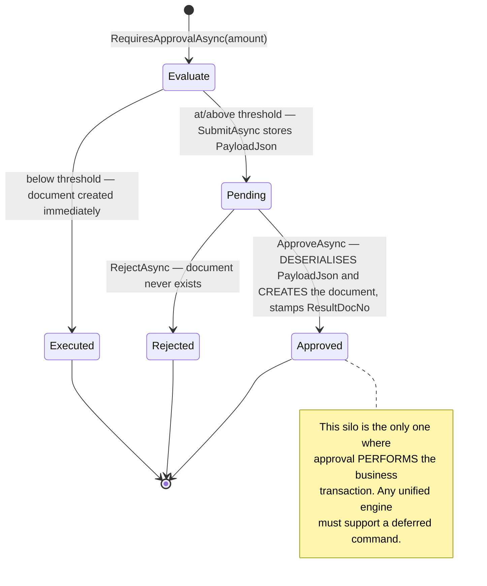
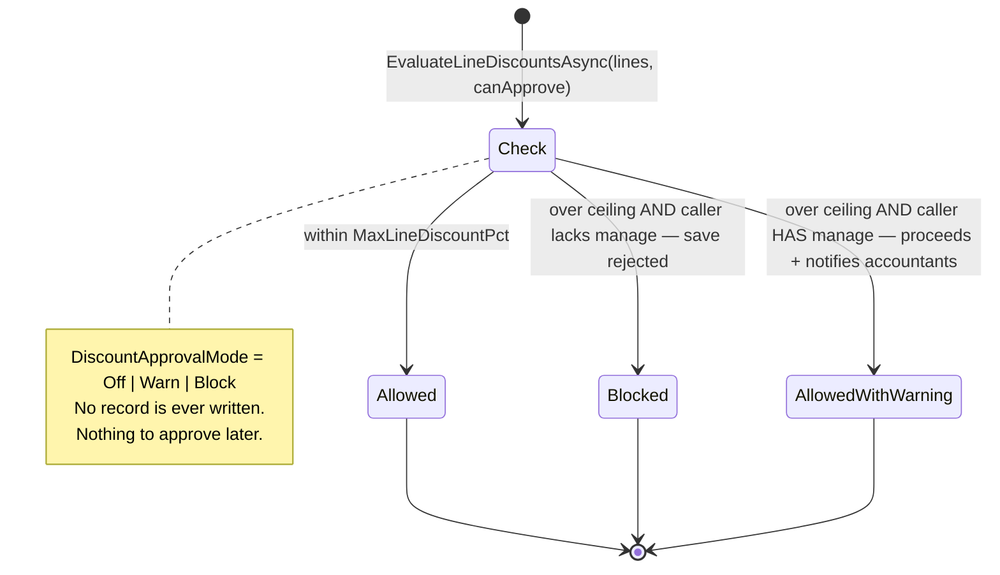
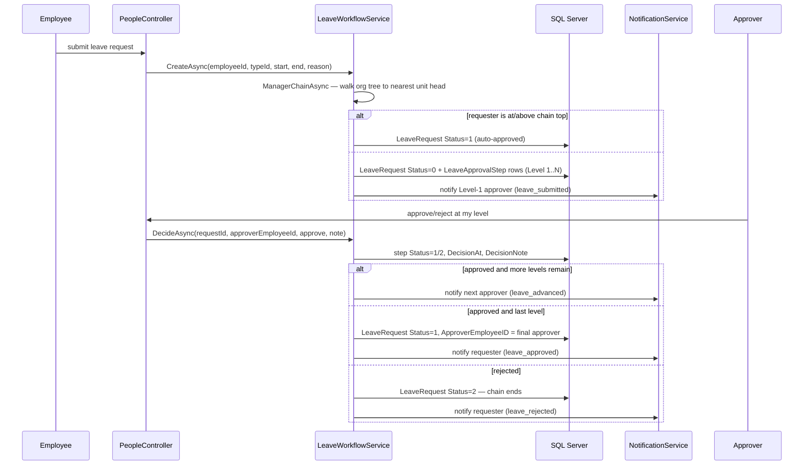

# 14 — Approval and Workflow Landscape

## Scope
Every approval mechanism that exists today. **This is the primary input to the Workflow Engine design sprint.**
No engine is designed or implemented here.

## Evidence
`Models/Context/Admin/LeaveApprovalStep.cs` · `Models/Context/Admin/LeaveRequest.cs` ·
`Models/Context/Admin/EmployeeRequest.cs` (incl. `EmployeeRequestStep`) ·
`Models/Context/Inventory/Inventory.cs:549` (`InventoryApproval`) · `BL/LeaveWorkflowService.cs` ·
`BL/EmployeeRequestService.cs` · `BL/InventoryApprovalService.cs` · `BL/PricingService.cs:336-355` ·
`Controllers/ApprovalsController.cs` · `BL/ApprovalInboxDto.cs` · `evidence/Approval-Silo-Matrix.csv`.

## Headline: there is no workflow engine. There are four silos.

## Silo comparison matrix

| Dimension | **1 — Leave** | **2 — Employee request** | **3 — Inventory** | **4 — Discount** |
|---|---|---|---|---|
| Business object | `LeaveRequest` | `EmployeeRequest` (Letter / Permission) | `PurchaseOrder`, `StockTransfer`, `StockCount`, `WriteOff` | a sales-document **line** |
| Storage | `LeaveRequests` + `LeaveApprovalSteps` | `EmployeeRequests` + `EmployeeRequestSteps` | `InventoryApprovals` (single row) | **none** |
| Status type | `int` 0/1/2 | `int` 0/1/2 | `string` Pending/Approved/Rejected | none (transient) |
| Flow shape | **sequential chain**, `Level` 1..N | **sequential chain**, `Level` 1..N | **single decision**, no chain | **synchronous gate**, no decision record |
| Approver resolution | `ManagerChainAsync` — direct manager up to the head of the nearest org unit, from the org tree | same manager-chain logic (duplicated) | **role-based**: any `InventoryUserRoles.Role == "InventoryManager"` | **role-based**, evaluated in-request: caller holds `manage` |
| Trigger | always on submit | always on submit | **threshold**: `RequiresApprovalAsync(amount)` vs `InventorySettings.MaxLineDiscountPct`-style setting | **threshold**: line discount % vs `InventorySettings.MaxLineDiscountPct`, mode from `DiscountApprovalMode` |
| Auto-approve | ✅ when requester is at/above the top of the chain | (same pattern) | ✖ | ✅ implicitly — `canApprove` turns a block into a warn |
| Entry point | `LeaveWorkflowService.CreateAsync` | `EmployeeRequestService` | `InventoryApprovalService.SubmitAsync` | `PricingService.EvaluateLineDiscountsAsync` |
| Decide API | `DecideAsync(requestId, approverEmployeeId, approve, note)` | service method | `ApproveAsync(id, approverEmp, note)` / `RejectAsync(...)` | none |
| **Executes the document on approval** | ✖ (just marks approved) | ✖ | ✅ **yes — `PayloadJson` is the deferred document, created on approve, `ResultDocNo` stamped** | ✖ |
| Reject | ✅ ends the chain | ✅ | ✅ | ✅ (blocks the save) |
| **Return / send-back** | ✖ | ✖ | ✖ | ✖ |
| **Delegation** | ✖ | ✖ | ✖ | ✖ |
| **Escalation** | ✖ | ✖ | ✖ | ✖ |
| **Due date / SLA** | ✖ | ✖ | ✖ | ✖ |
| Notifications | ✅ next approver notified | ✅ | ✅ `inventory_approval` (High priority) | ✅ warn notification to accountants |
| Comments | `DecisionNote` (one string per step) | `DecisionNote` | `DecisionNote` | ✖ |
| Attachments | ✖ | ◐ `Attachment` (`RequestID` column) | ✖ | ✖ |
| Audit history | ✅ step rows are the history | ✅ step rows | ◐ single decided-by/at | ✖ **none** |
| BusinessEvent integration | ✖ | ✖ | ✖ | ✖ |
| Company isolation | ✖ **`LeaveRequest` has no `CompanyID`** — reached via `Employee` | (see CSV) | ✅ `CompanyID`, but service hard-codes `private const int CompanyId = 1` | n/a |
| Reusability | none — leave-specific | none — request-specific | none — inventory-specific | none |
| Migration difficulty | **Medium** — clean chain model, but `int` status and no company column | **Low** — identical to silo 1, migrate both together | **High** — deferred-execution `PayloadJson` is a side effect the engine must own | **Low** — no data to migrate; it is a rule, not a workflow |

## State diagrams

### Silos 1 & 2 — sequential manager chain (identical)

### Silo 3 — inventory threshold approval with deferred execution

### Silo 4 — synchronous discount gate (no state)

## Approval sequence — silo 1 (the reference chain)

## Why `ApprovalsController` is read-only — exact answer

`Controllers/ApprovalsController.cs` has **one action: `Index()`**. It contains **no** `Approve`, `Reject` or
`Decide` action, and its own header comment states it "never writes". Each `ApprovalInboxRow` carries a
`Url` pointing back to the silo's **own screen** (`/People/Leaves`, `/People/Requests`, `/Inventory/Approvals`).

The reasons it cannot act, in order of difficulty:

1. **Three incompatible decision APIs.** `DecideAsync(requestId, approverEmployeeId, approve, note)` vs the
   employee-request service method vs `ApproveAsync(id, approverEmp, note)` / `RejectAsync(id, approverEmp, note)`.
   There is no common `IApprovable` or `IDecisionHandler` contract to dispatch to.
2. **Three different identity semantics for "the thing being approved."** A `LeaveApprovalStep` id, an
   `EmployeeRequestStep` id, and an `InventoryApproval` id are all `int` and mean different things. `ApprovalInboxRow`
   deliberately carries **no id at all** — only display fields and a URL — so the row cannot even name its target.
3. **Approving in silo 3 executes a business transaction.** `ApproveAsync` deserialises `PayloadJson` and creates
   a purchase order / transfer / count, posting stock and GL. A unified controller acting on that row would have
   to own a financial side effect, with a transaction, that the other two silos do not have.
4. **Three authorization models.** Leave/request approvers are resolved per-row from the org tree
   (`CurrentApproverEmployeeID == me`); inventory requires holding `InventoryUserRoles.Role == "InventoryManager"`
   and additionally excludes your own requests. The controller currently *reads* using exactly these three
   different predicates.
5. **Two status vocabularies** (`int` 0/1/2 vs `string`) with no shared mapping.

### What making it actionable requires (minimum)

| Requirement | Why |
|---|---|
| A shared decision contract, e.g. `IApprovalHandler { string Silo; Task<Result> DecideAsync(ApprovalRef, bool approve, string? note, BusinessContext) }` | to dispatch one UI action to three implementations |
| A stable `ApprovalRef` (silo + target id + step id) carried on the inbox row | rows currently carry no identity |
| A silo-specific authorization callback | the three predicates cannot be unified by role alone |
| Transaction ownership for silo 3 | approval performs a stock/GL transaction; the engine must own a `ScopedTx` |
| A status mapping layer | `int` 0/1/2 ↔ `string` Pending/Approved/Rejected |
| `BusinessEvent` emission on decide | no silo emits any event today, so approvals are invisible to the timeline |

## Unified-engine migration candidates, ranked

| Rank | Candidate | Rationale | Size | Risk |
|---|---|---|---|---|
| 1 | **Silos 1 + 2 together** | structurally identical (`LeaveApprovalStep` ≡ `EmployeeRequestStep`), same approver logic, no financial side effect. Migrating them proves the chain engine and removes a duplicated table in one step | **Medium** | **Low** |
| 2 | **Silo 4 (discount)** | nothing to migrate — it is a *rule*, not a workflow. Becomes the engine's first "policy gate" with no data risk | Small | Low |
| 3 | **Silo 3 (inventory)** | needs deferred-command support and transaction ownership; touches stock + GL | Large | **High** — do last |

**Recommended engine capability order** (driven by what the silos actually need, not by feature lists):
sequential chain → threshold trigger → role-based approver → org-tree approver → auto-approve →
**deferred command execution** → then the capabilities *no* silo has today (return/send-back, delegation,
escalation, SLA/due dates, parallel branches).

## Absent capabilities (all four silos)
**Return/send-back · delegation · escalation · due dates/SLA · parallel approval · attachments on the decision ·
approval comments beyond one note per step · BusinessEvent emission · a work inbox that can act.**
Parallel flows do not exist anywhere — every chain is strictly sequential.

## Gaps
- No engine, no shared contract, no shared table.
- No approval emits a `BusinessEvent`, so no approval appears on any object timeline.
- `LeaveRequest` has no `CompanyID`; `InventoryApprovalService` hard-codes company 1.
- `InventoryApproval.DocType` is free text (4 known values, no constraint).

## Risks
| Risk | Severity |
|---|---|
| Silo 3's `PayloadJson` deferred execution is a hidden command store with no schema versioning — an approval of an old payload after a code change may create a document with different semantics | **High** |
| Approvals are invisible to the audit timeline | High |
| Approving in silo 3 posts stock + GL from a background-ish path with no event record | High |
| Duplicated step tables will drift | Medium |
| `int` 0/1/2 status has no constraint and no enum | Medium |

## Dependencies
06 (four status shapes), 08 (approval ERD, missing FKs), 09 (events the engine should emit), 13 (approver
authorization), 21 (this is stage 3).

## Recommendations (design inputs, not implementation)
1. **Design the engine against silos 1+2 first**, then silo 4, then silo 3. Do not design for all four at once.
2. **Require `BusinessEvent` emission on every decision** from day one — that is what makes approvals appear on
   timelines and removes the need for a fifth audit mechanism.
3. **Treat silo 3's deferred command as a first-class engine concept** (a versioned command payload), not as an
   inventory quirk — otherwise the engine cannot absorb it and the silo survives forever.
4. **Add `CompanyID` to `LeaveRequest`** before migration; retrofitting isolation into the engine is harder.
5. **Decide the status normalisation** (06) before the engine, or the engine inherits four vocabularies.
