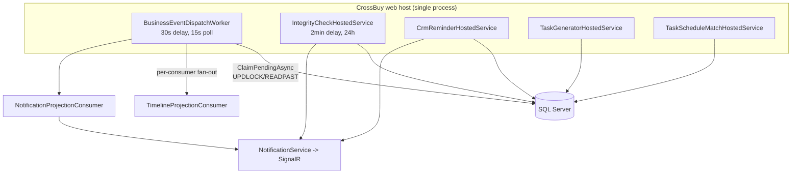

<!-- Generated from docs/architecture/evidence/*.csv by the architecture discovery pass. Counts are re-derivable by re-running the scan. -->

# 15 — Background Workers and Async Processing

## Scope
Every hosted service, timer and outbox processor in the application. **5 workers**, all registered in
`CrossBuy/Program.cs` via `AddHostedService<>`. There is **no external scheduler, queue broker or serverless
component** — all async processing is in-process.

## Evidence
`evidence/Worker-Inventory.csv` · `Program.cs` `AddHostedService` lines · each worker's `ExecuteAsync`.

## Topology

## Worker register

| Worker | Module | Schedule | Locking | Retry | Dead-letter |
|---|---|---|---|---|---|
| `BusinessEventDispatchWorker` | Platform | Seconds(30);Seconds(Math.Max(1, _options.PollSeconds) | ClaimPendingAsync | MaxAttempts | Failed status retained |
| `CrmReminderHostedService` | CRM | Minutes(1);Minutes(5) | (none) | (none) | (none) |
| `IntegrityCheckHostedService` | Inventory | Hours(24);Minutes(2) | (none) | (none) | (none) |
| `TaskGeneratorHostedService` | Tasks | Minutes(15);Minutes(2) | (none) | (none) | (none) |
| `TaskScheduleMatchHostedService` | Tasks | Minutes(15);Minutes(3) | (none) | (none) | (none) |

All five create a DI scope per pass (`IServiceScopeFactory.CreateScope`) because `CrossDbContext` is Scoped,
and all five honour `stoppingToken`.

## Worker-to-table matrix

| Worker | Tables / DbSets touched |
|---|---|
| `BusinessEventDispatchWorker` | BusinessEvents |
| `CrmReminderHostedService` | (via scoped services) |
| `IntegrityCheckHostedService` | (via scoped services) |
| `TaskGeneratorHostedService` | (via scoped services) |
| `TaskScheduleMatchHostedService` | (via scoped services) |

## Failure-risk report

| Risk | Workers affected | Evidence | Severity |
|---|---|---|---|
| **No distributed lock; a second app instance duplicates work** | `IntegrityCheckHostedService`, `CrmReminderHostedService`, `TaskGeneratorHostedService`, `TaskScheduleMatchHostedService` | none of them claims rows; they query and act | **High** if ever scaled out or run behind a web-farm/IIS with >1 worker process |
| **Hard-coded `CompanyId = 1`** | `IntegrityCheckHostedService` (`private const int CompanyId = 1`), `CrmReminderHostedService` | multi-company installs get single-company processing | **High** |
| No retry/dead-letter | all except `BusinessEventDispatchWorker` | only `try/catch` + `LogError`; a failed pass is simply skipped until the next tick | Medium |
| No metrics/health surface | all | `ILogger` only; no counters, no health check | Medium |
| Duplicate notification on retry | `CrmReminderHostedService` | relies on a `Reminded` flag, not a dedup key | Low-Medium |

`BusinessEventDispatchWorker` is the **only** worker with atomic claiming, bounded retry (`MaxAttempts`),
backoff, stale-claim reclaim and a durable failure record — see 09-Platform-Kernel.

## Retry and dead-letter coverage matrix

| Worker | Atomic claim | Bounded retry | Backoff | Stale reclaim | Failure retained |
|---|---|---|---|---|---|
| `BusinessEventDispatchWorker` | Yes (`UPDLOCK`/`READPAST`) | Yes (`MaxAttempts`) | Yes | Yes | Yes (`Failed` + `Error`) |
| `IntegrityCheckHostedService` | No | No | No | No | Run log row only |
| `CrmReminderHostedService` | No | No | No | No | No |
| `TaskGeneratorHostedService` | No | No | No | No | `TaskAutoLogs.RuleKey` dedup |
| `TaskScheduleMatchHostedService` | No | No | No | No | Suggestion rows |

## Configuration
Only `BusinessEventDispatchWorker` is configurable — `Platform:EventDispatch`
(`BatchSize`/`PollSeconds`/`MaxAttempts`/`RetryBackoffSeconds`/`StaleClaimMinutes`) bound via
`Configure<BusinessEventDispatchOptions>`. The other four have hard-coded intervals.

## Gaps
- No scale-out safety for four of five workers.
- No company iteration: two workers assume company 1.
- No health/metrics endpoint for worker liveness.

## Risks
Running the app on more than one node today would double-execute integrity checks, CRM reminders and task
generation. Only event dispatch is safe.

## Dependencies
09-Platform-Kernel (dispatch), 12-Communication (notification delivery), 18-Deployment (single-node assumption).

## Recommendations
1. Give the four legacy workers the same claim-by-status pattern the dispatcher already proves.
2. Replace `const int CompanyId = 1` with iteration over `Companies`.
3. Add a health check exposing last-run/last-success per worker.
