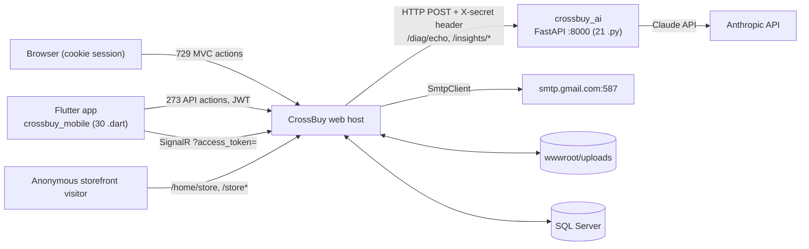

# 16 — API and Integration Map

## Scope
Every inbound and outbound interface: MVC endpoints, REST APIs, SignalR hubs, SMTP, the AI proxy, file I/O,
and the two out-of-solution sub-systems.

## Evidence
`evidence/Endpoint-Inventory.csv` (1002 actions, `is_api` flag, `route_attribute`, `http_method`,
`permission_attributes`) · `evidence/Permission-Coverage.csv` · `Controllers/Api/*` · `Hubs/*` ·
`BL/AiService.cs`, `BL/IAiService.cs`, `BL/AiInsightsService.cs` · `BL/CommService.cs` ·
`crossbuy_ai/` · `crossbuy_mobile/`.

## Surface totals

| Surface | Count | Auth |
|---|---|---|
| MVC actions (cookie + session) | **729** | `[SessionValidation]` dominant |
| API actions (`Controllers/Api/*`) | **273** | JWT; **55 carry `[Authorize]`** |
| SignalR hub methods | 3 hubs | cookie **or** `access_token` query |
| Outbound HTTP | 1 (AI service) | shared secret header |
| Outbound SMTP | 1 | SMTP auth from config |
| File I/O | `wwwroot/uploads/**` | **none on read (static)** |

## API controller register

| Controller | Purpose | Consumer | Auth |
|---|---|---|---|
`AuthApiController` | login → JWT | mobile | **anonymous** (by design) |
`MeApiController` | profile, my data | mobile | JWT |
`HrApiController` | leave, requests, attendance | mobile | JWT |
`NotificationsApiController` | list 50 / read / read-all | mobile + web | JWT |
`AiController` | proxy to the Python service | web + mobile | JWT |
`DevSeedController` | **test harness / seeding** (~250 actions) | dev only | `[DevOnly]` → **404 in production** |
+ 4 further API controllers | see `Controller-Inventory.csv` (`is_api = True`) | mobile | JWT |

## Integration context diagram

**Note the second hop:** `crossbuy_ai` calls the Claude API. From CrossBuy's perspective the dependency is the
Python service; the LLM dependency is transitive and CrossBuy holds no LLM credential.

## Outbound integration detail

| Aspect | AI service | SMTP |
|---|---|---|
Client | typed `HttpClient` (`AiService`) | `System.Net.Mail.SmtpClient` |
Auth | shared secret injected as a default header at registration | SMTP user/password from `Smtp:*` |
**Timeout** | **default (100s), not configured** | default |
**Retry** | **none** | **none** — `CommMessage.Attempts` exists but nothing increments it in the background |
**Circuit breaker** | **none** | none |
Error handling | returns `(status, rawJson)` — the caller passes it through | `Status="Failed"` + `Error` on the row |
Secret handling | `appsettings.json` (`AiService:Secret`) | `appsettings.json` (`Smtp:Password`) |

**Architectural guard worth recording:** `IAiService`'s contract states that .NET gathers data **under the
user's permissions before** calling Python, and that the AI "only proposes, never authorizes."
`AiInsightsService` honours this — it has exactly three company-scoped endpoints
(`ScanJournalAnomaliesAsync`, `ForecastCashflowAsync`, `AnalyzeInventoryAsync`) and passes gathered data. There
is no per-object AI context path, so the constraint has not yet been stressed.

## API coverage matrix

| Module | MVC actions | API actions | Notes |
|---|---|---|---|
Admin/HR | 296 | HrApi, MeApi | the largest surface |
Accounting | 157 | — | **no accounting API** — mobile cannot post documents |
Inventory | ~180 | — | **no inventory API** |
CRM | 72 | — | no CRM API |
Communication | 52 | NotificationsApi | notifications only |
POS | ~80 | — | POS uses its own session, not the API |
Platform | 1 | — | `PlatformTimelineController` is MVC-JSON, **not** under `Api/` |
Dev | — | ~250 | `DevSeedController` |

**Finding:** the API surface is **mobile-shaped, not module-shaped**. Accounting, Inventory, CRM and POS have no
API at all. There is no general-purpose REST layer.

## API inconsistency report

| # | Inconsistency | Evidence | Impact |
|---|---|---|---|
1 | **No versioning anywhere** | no `/v1/`, no version header, no `ApiVersion` attribute | breaking changes hit the mobile app directly |
2 | **Inconsistent response shapes** | MVC-JSON returns `Json(new { ok, error })`; APIs return `Ok(model)`; `AiController` passes through the upstream raw JSON body | clients need per-endpoint handling |
3 | **218 of 273 API actions have no `[Authorize]`** | `Permission-Coverage.csv` | rely on middleware + `[ApiController]`; any misconfiguration is silent |
4 | **APIs bypass services** | most API controllers take `CrossDbContext` directly | no transaction, no event, no notification |
5 | **`PlatformTimelineController` is not under `Api/`** but returns JSON only | file location | inconsistent classification |
6 | **Swagger is referenced but the API is undocumented in practice** | `Swashbuckle` 6.6.2 in csproj | no XML comments, no schemas |
7 | **`DevSeedController` is an API controller with ~250 actions incl. 176 writes** | `[DevOnly]` mitigates | a single attribute stands between it and production |
8 | Error format differs between MVC and API | `TempData["AccErr"]` vs HTTP status | — |

## External dependency matrix

| Dependency | Type | Criticality | Failure mode today | Mitigation |
|---|---|---|---|---|
SQL Server | data | **Critical** | app unusable | none in-app (no retry policy configured on the EF connection) |
SMTP | outbound | Medium | email marked `Failed`, **never retried** | manual resend |
`crossbuy_ai` | outbound | Low | AI screens error; core ERP unaffected | none (no timeout/breaker) |
Local disk | storage | High | uploads fail | none |
Claude API (transitive) | outbound | Low | AI insights degrade | owned by the Python service |

## SignalR

| Hub | Route | Auth | Groups |
|---|---|---|---|
`NotificationsHub` | `/hubs/notifications` | cookie **or** `access_token` query (mobile) | `emp-{companyId}-{empId}` |
`ChatHub` | `/hubs/chat` | same dual scheme | conversation groups |
`PosHub` | `/hubs/pos` | same | terminal/branch groups |

Dual auth is deliberate (web cookie + Flutter JWT). Group naming carries company for notifications — a genuine
isolation control.

## Webhooks
**None.** No inbound webhook endpoint and no outbound webhook dispatcher exist.

## Gaps
- No API versioning, no consistent envelope, no OpenAPI documentation in practice.
- No API for accounting/inventory/CRM/POS.
- No timeout, retry or circuit breaker on either outbound integration.
- No webhooks.

## Risks
| Risk | Severity |
|---|---|
`DevSeedController` reachable if `[DevOnly]` is ever misconfigured | **High** |
No SMTP retry — silent email loss | **High** |
No versioning — mobile breaks on any contract change | Medium |
APIs bypassing services — writes with no event/transaction | Medium |
No AI timeout — a hung Python service ties up request threads for 100s | Medium |

## Dependencies
13 (auth), 12 (email outbox), 09 (events APIs bypass).

## Recommendations
1. Add an explicit timeout + retry policy to the `AiService` typed client.
2. Add the `CommMessage` outbox dispatcher (see 12).
3. Introduce `/api/v1/` and one response envelope before the API surface grows.
4. Route API writes through `BL/` so they inherit transactions and events.

---

## Stage 1 Hotfix A.1 — Accounting API security posture (2026-08-04)

`AccountingApiController` (`/api/acc`, 22 actions: 10 mutating, 12 reads) was authenticated but **not authorized**,
and took its company from the request with `= 1` as the default. It is now the reference for how an API surface in
this project is secured. Full policy: [ADR-025](../platform/ADR-025-Accounting-API-Security-Policy.md).

| Property | Posture |
|---|---|
| Authentication | `[Authorize(AuthenticationSchemes = JwtBearerDefaults...)]` — **bearer only**; a cookie does not satisfy it |
| Token validation | issuer ✔ audience ✔ lifetime ✔ signing key ✔, `ClockSkew = TimeSpan.Zero` (`Program.cs:326-340`) |
| Token claims | `sub`, `NameIdentifier`, `employeeId`, `name`, `jti` — **no role claims** |
| Authorization | in-body via `IAccountingApiAuthorization` → the context-aware `AccountingAccessService`. Unknown action denies; missing context denies |
| Company | from the resolved `BusinessContext`. `companyId` / `dto.CompanyID` are **compatibility-only**: validated, rejected on mismatch (403), never coerced. Defaults changed `1` → `0` |
| Cross-company | **not supported on this surface** — no role claim is issued, so no bypass can be held; an ambient bypass does not make a tampered company acceptable |
| Anti-forgery | deliberately **absent** — bearer-only means no ambient credential for CSRF to abuse; a cookie-backed token would break every mobile client. Asserted by a test |
| Errors | project-standard `{ success, message }`, status **403** for denial. No role, company, employee, exception text or stack trace. Detail goes to the log |
| Actor | `context.EmployeeId` is now passed to the services (was `null`), so API-created journals carry `CreatedBy`/`PostedBy` |
| Cancellation | every action takes and forwards a `CancellationToken` |

**Contract compatibility:** request and response shapes are unchanged; every `companyId` parameter is preserved. The
only behavioural changes are (a) denial now returns 403 where an unauthorized request previously succeeded, and (b) a
token whose employee belongs to company 2 that was silently writing into company 1 is now correctly scoped to
company 2 — a data-integrity fix, called out rather than buried.

**Not remediated here:** every other API controller. `AuthApiController.Login` remains legitimately anonymous.
