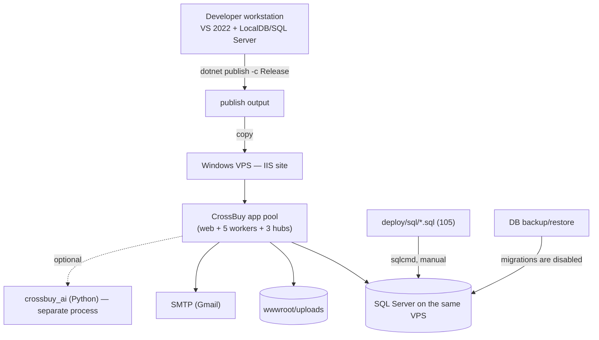
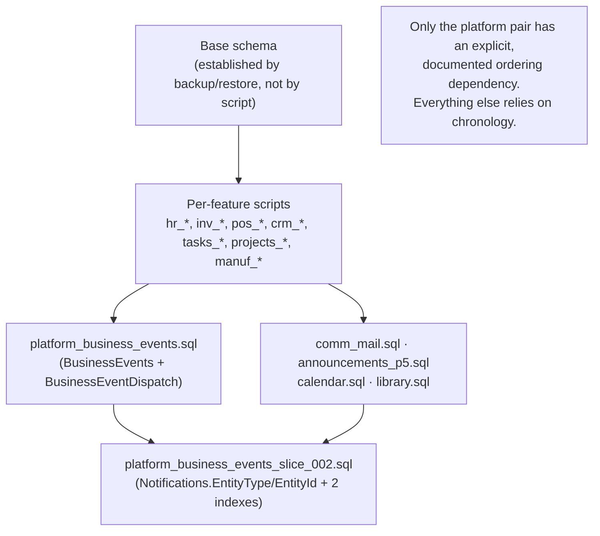

# 18 — Deployment and Operations Map

## Scope
Build, environment configuration, SQL deployment, runtime hosting, observability, rollback and test-environment
safety.

## Evidence
`CrossBuy.sln` · `CrossBuy/CrossBuy.csproj` · `appsettings*.json` · `docs/DEPLOYMENT.md` ·
`evidence/SQL-Script-Inventory.csv` (105 scripts) · `CrossBuy/deploy/sql/*` + `deploy/sql/*` ·
`Program.cs` (DataProtection, session, `[DevOnly]`) · `dotnet-tools.json` · 4 `.ps1` files.

## Build

| Step | Detail |
|---|---|
Solution | `CrossBuy.sln` — 2 projects |
Publish | `dotnet publish -c Release` per `docs/DEPLOYMENT.md` |
Target | `net8.0`, `Microsoft.NET.Sdk.Web` |
Razor | `AddRazorRuntimeCompilation()` **only in Development**; production uses precompiled views |
Test | `dotnet test CrossBuy.Tests\CrossBuy.Tests.csproj` |
**Known build friction** | VS/IIS Express hold locks on `bin\Debug` and `bin\Release`; the documented workaround is a separate configuration (`-c TestRun`) |
CI/CD | **none found** — no workflow, pipeline or build script in the repository |

## Deployment topology (per `docs/DEPLOYMENT.md`)

**Single-worker-process control — ENFORCED as of Stage 0 Batch B.** The six hosted services run inside the web app
pool, and four of them have no atomic claim. `Runtime:RequireSingleWorkerProcess` (default **true**) now makes exactly
one process the worker primary, enforced by a SQL Server **session** application lock held for the process lifetime;
all **6 of 6** workers wait on the gate. IIS should still be configured with **Maximum Worker Processes = 1** — a web
garden now yields standbys that serve HTTP and do no background work, which is a wasted process rather than a
duplication bug. Overlapped recycle is now safe. See
[ADR-013](../platform/ADR-013-Single-Worker-Process.md) and
[Single-Worker-Process.md](../deployment/Single-Worker-Process.md).

## SQL deployment

> **CORRECTED in Stage 0 Batch B** — see [CORRECTION-002](CORRECTION-002-Evidence-Scanner-Defects.md). The "9 without
> guards" verdict was a scanner defect. `SQL-Script-Inventory.csv` is now a **projection of
> `deploy/sql/manifest.json`**, so the SQL verdict has exactly one derivation.

| Fact | Value |
|---|---|
Scripts | **110** (`CrossBuy/deploy/sql`: 50, `deploy/sql`: 55, `deploy/sql/fresh`: 4, plus `crossbuy_ai/sql` and a root `script.sql`) |
Safe to re-apply | **109 of 110.** 88 `guarded`, 7 `guarded-by-predicate` (read and judged, evidence recorded), 14 `no-mutation`, **0 unread** |
Not deployable | **1** — `script.sql`, an unversioned scratch file at the repository root, excluded **by name** |
Excluded from routine deploys | **3** — `script.sql`, `00_backup_dev_db.sql` (dev helper), `10_purge_for_production.sql` (**destructive**) |
Ordering | **`deploy/sql/manifest.json`** — dependency `rank`, ascending. Generated by `CrossBuy/deploy/scan-sql-manifest.ps1` |
Name collisions | **4 file names exist in both trees with DIFFERENT content** (`pos_setup.sql`, `pos_quickmenu.sql`, `pos_hold_recall.sql`, `pos_order_guests.sql`) — always use the full repo-relative path |
Applied-state tracking | **`dbo.PlatformSchemaHistory`** (append-only, SHA-256 per apply) + `vw_PlatformSchemaCurrent` + `CrossBuy/deploy/report-schema-history.ps1`, classifying every script `applied`/`changed`/`failed`/`pending`/`missing` |
Runbook | **[docs/deployment/SQL-Deployment-Runbook.md](../deployment/SQL-Deployment-Runbook.md)** — pre-flight with stop conditions, apply order, baseline procedure, 7 smoke tests, rollback |
Live state of CrossBuyDB2 | slice 1 **applied** (externally, no record); slice 2, slice 3 and `platform_schema_history.sql` **not applied**. Verified by reading; **nothing was executed against it** |
Migrations | disabled; `Migrations/` is empty; DB moves between environments by **backup/restore** |
Destructive statements | flagged per script in the CSV (`has_destructive`) — review before any bulk run |
Arabic seed data | requires UTF-8 **with BOM** and `sqlcmd -f 65001` |
Invocation | `sqlcmd -S . -d CrossBuyDB2 -E -C -i deploy/sql/<file>.sql` (`-E` and `-U/-P` are mutually exclusive) |

### SQL script dependency map

**The only explicitly ordered dependency in the entire set is slice 1 → slice 2 of the platform scripts.** Every
other script's prerequisites are implicit in when it was written.

### Current deployment state — action required
`platform_business_events.sql` and `platform_business_events_slice_002.sql` have **not been executed** against
`CrossBuyDB2`. Until they are:
- creating a sales invoice, purchase invoice, customer or work order will **fail** (`RecordAsync` is inside the
  business transaction with no swallowing catch → `Invalid object name 'BusinessEvents'`);
- the timeline widget degrades gracefully ("could not load"), but the write paths do not.

**SQL must be deployed before the code.**

## Environment configuration matrix

| Setting | Dev | Production | Source | Secret? |
|---|---|---|---|---|
`ConnectionStrings:DefaultConnection` | `Server=.;Database=CrossBuyDB2;Trusted_Connection=True` | VPS SQL Server | `appsettings*.json` | yes |
`Jwt:Key` | dev placeholder | must be rotated | `appsettings.json` | **yes — plaintext** |
`Jwt:Issuer/Audience/ExpireHours` | CrossBuy / CrossBuyMobile / 168 | same | config | no |
`Smtp:Host/Port/User/Password/From/EnableSsl` | Gmail test account | per environment | `appsettings.json` | **yes — plaintext password** |
`AiService:BaseUrl` | `http://localhost:8000` | per environment | config | no |
`AiService:Secret` | dev placeholder | must be rotated | `appsettings.json` | **yes — plaintext** |
`Platform:EventDispatch:*` | defaults | tunable | config, bound via `Configure<T>` | no |
Culture | `ar` default, `en`/`fr` supported | same | `Program.cs` | no |
DataProtection keys | machine-wide ProgramData | same | filesystem | yes (key material) |
Session | SQL Server distributed cache | same | `Caching.SqlServer` | no |

`appsettings.json` is **gitignored** (`.gitignore:20`), so values are per-environment — but three secrets live in
it as plaintext. `docs/DEPLOYMENT.md` states the convention is environment variables; **that convention is not
implemented in code** (no `AddEnvironmentVariables` override, no secret-store provider).

## Observability

| Concern | State |
|---|---|
Logging | `ILogger` only. Workers log errors; the kernel logs debug/warning. No structured sink, no correlation-id enrichment (despite `BusinessEvent.CorrelationId` existing) |
**Health checks** | **none** — no `/health`, no readiness/liveness |
**Metrics** | **none** |
Distributed tracing | none |
Error pages | `Views/Shared/Error.cshtml` + `HomeController.Error` |
Diagnostics | `AspNetCore.Diagnostics.EntityFrameworkCore` referenced (dev DB error page) |
Audit trail | `BusinessEvents` for 4 objects; `CreatedAt/By` elsewhere; `IntegrityCheckRuns` for reconciliation |
Operational visibility into the outbox | `BusinessEventDispatch.Status`/`Error` is queryable — the best operational surface in the system, but there is **no screen for it** |

## Backup assumptions
`docs/DEPLOYMENT.md` specifies DB backup/restore as the schema-movement mechanism. No automated backup schedule,
retention policy or restore drill is defined in the repository. **`wwwroot/uploads` is not covered by any
documented backup** — file loss would orphan every `LibraryItem`, `EmployeeDocument` and attachment row.

## Test-environment safety
The one enforced protection in the repository: the SQL Server integration fixture **creates its own scratch
database and refuses** `CrossBuyDB` / `CrossBuyDB2` / `CrossBuy` (`SqlServerFixture.ForbiddenCatalogs`).
`[DevOnly]` 404s `/api/dev/*` in production. Beyond those two, the dev `*-test` endpoints write to whatever
database they are pointed at.

## Rollback procedures

| Change type | Rollback |
|---|---|
Application code | redeploy the previous publish output |
Platform Kernel slice 2 | 4 documented code steps (`docs/platform/Slice-002-Kernel-Expansion.md` §7). **Critical ordering:** removing `NotificationProjection` requires restoring the two legacy `NotifyRoleAsync` calls or those notifications stop |
Platform Kernel slice 1 | documented in `PKS-001`; schema rollback optional (`DROP TABLE BusinessEventDispatch; DROP TABLE BusinessEvents;` — child first) |
Additive SQL | generally none needed (nullable columns, new indexes) |
Other SQL | **no documented rollback for the other 103 scripts** |
Database | restore from backup |

## Operational risk list

| # | Risk | Severity | Mitigation today |
|---|---|---|---|
~~1~~ | ~~**No applied-scripts tracking**~~ — **CLOSED (Batch B)**: manifest + `PlatformSchemaHistory` + report command | Closed | see [ADR-012](../platform/ADR-012-Deployment-Manifest-And-Schema-History.md) |
~~2~~ | ~~**Scale-out silently breaks 4 workers**~~ — **MITIGATED (Batch B)**: single-worker lease, 6/6 workers gated, role logged and shown in the monitor. **Residual:** the four are still not idempotent if run twice in sequence | Low | see [ADR-013](../platform/ADR-013-Single-Worker-Process.md) |
3 | **Secrets in plaintext config** (`Jwt:Key`, `Smtp:Password`, `AiService:Secret`) | **High** | gitignored |
4 | **No health checks** — a dead worker is invisible | High → **Medium** | `GET /BusinessEventMonitor/Runtime` reports instance, role and safety mode; the monitor shows the queue and a runtime banner. Not yet a probe endpoint, and no worker last-success timestamp |
5 | **`wwwroot/uploads` has no documented backup** | High | none |
~~6~~ | ~~**9 SQL scripts without idempotency guards**~~ — **WITHDRAWN, the finding was false**; 0 deployable scripts are unsafe to re-apply | Closed | [CORRECTION-002](CORRECTION-002-Evidence-Scanner-Defects.md) |
7 | No CI — build/test regressions are found manually | Medium | 230 tests exist and are stable, but nothing runs them automatically |
8 | **Slice 2 and slice 3 SQL not deployed while their code is live** | **High until resolved** | write paths fail loudly, not silently. Slice 1 **is** applied, so the reversal path works. Approved for controlled manual deploy — [runbook](../deployment/SQL-Deployment-Runbook.md) |
9 | Session depends on the SQL cache table; DB blip logs everyone out | Medium | machine-wide DataProtection keys keep cookies valid |
10 | **`UpdatedAt` is stamped client-side and compared against `SYSUTCDATETIME()`** in claim eligibility | Medium | the 120 s production backoff absorbs normal skew; found via a flaky test, recorded in 17 |

## Gaps
- No CI/CD, no metrics, no file backup policy.
- No health-probe endpoint and no worker last-success timestamp (the diagnostics JSON is behind `[PlatformOps]`).
- The two `deploy/sql` folders are still not consolidated, and 4 names collide across them with different content.

## Dependencies
08 (schema), 15 (workers), 13 (secrets), 09 (kernel deployment order).

## Recommendations
1. **Deploy `platform_business_events_slice_002.sql` and `comm_outbox_slice_003.sql`** to CrossBuyDB2 after a
   verified backup, following the [runbook](../deployment/SQL-Deployment-Runbook.md), then `-Baseline` slice 1 and
   `-Record` each apply.
2. **Consolidate the two `deploy/sql` folders** and resolve the 4 name collisions (the manifest now names them).
3. Move the three secrets to environment variables and add `AddEnvironmentVariables()` explicitly.
4. Add a health-probe endpoint and a worker last-success timestamp.
5. Add `wwwroot/uploads` to the backup policy.
6. Run the 230-test suite in CI.
