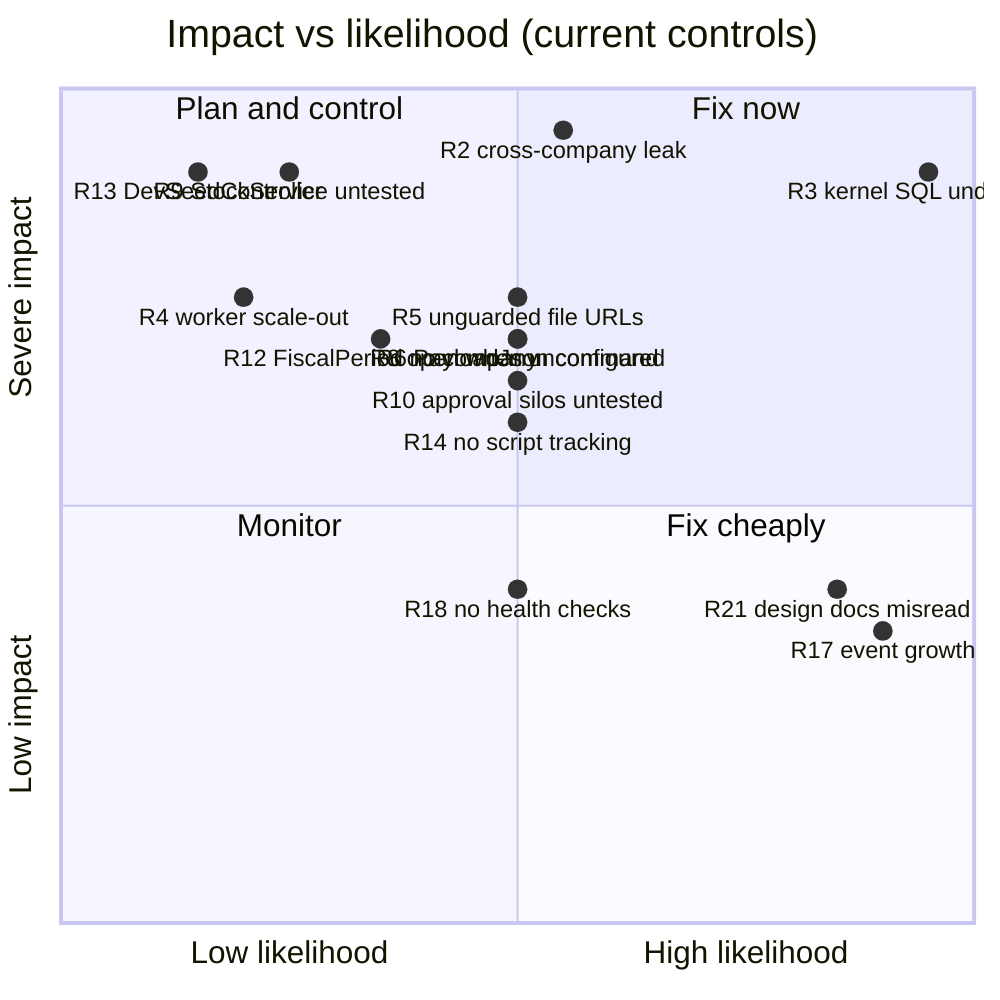

# 20 — Architecture Risks

> WARNING - **CORRECTED. See [CORRECTION-001](CORRECTION-001-Manufacturing-Permission-Finding.md).** The
> manufacturing work-order permission finding published in the original discovery pass was **wrong** and has
> been withdrawn: all nine work-order write actions already carried `[InvPerm("doc")]` + anti-forgery. The
> permission-coverage numbers below are the regenerated, corrected figures.

## Scope
Risk register derived from discovery. Ranked by exposure = impact × likelihood-given-current-controls.

## Evidence
Every row cites the document and code location that established it.

## Top risks

| # | Risk | Impact | Likelihood | Exposure | Evidence | Existing control | Required control |
|---|---|---|---|---|---|---|---|
~~**R1**~~ | ~~Any authenticated employee can release/complete/cancel a work order~~ — **WITHDRAWN. THE FINDING WAS FALSE**: all nine work-order write actions already carried `[InvPerm("doc")]` + anti-forgery. Root cause was a defect in the discovery scanner, not in the application | none | none | **Withdrawn** | [CORRECTION-001](CORRECTION-001-Manufacturing-Permission-Finding.md); 13 tests asserting compiled metadata | `[InvPerm("doc")]` (pre-existing) + `[InvPerm("read")]` added in Stage 0 | none — closed |
**R2** | **Cross-company data leakage** through a query missing its `CompanyID` predicate | Severe (tenant breach) | Medium today (single company in practice), **certain** if multi-company is enabled | **Critical** | no `HasQueryFilter`; `DefaultCompanyId = 1` in 8 controllers; 08, 13 | manual per-query discipline | EF global query filters |
**R3** | **Kernel SQL undeployed while kernel code is merged** — invoice/customer/work-order creation fails | Severe (core flows down) | **Certain** on next deploy without the scripts | **Critical** | 18; `RecordAsync` refuses without its tables | fails loudly, not silently | run both scripts first |
~~**R4**~~ | ~~**Scale-out or a web-garden silently double-executes 4 workers**~~ — **MITIGATED in Stage 0 Batch B.** `Runtime:RequireSingleWorkerProcess` (default **true**) makes exactly one process the worker primary, enforced by a SQL Server **session** application lock held for the process lifetime; **6 of 6** workers wait on the gate, and the role is logged at startup and shown on the Business Event Monitor. **Residual:** the control removes the *concurrent* case; it does **not** make the four non-atomic workers idempotent if run twice in sequence (Stage 1). Fail-open on an unevaluable lease is deliberate and alarmed — see the ADR | Low | **Low** | **Reduced to Low** | 15; [ADR-013](../platform/ADR-013-Single-Worker-Process.md); 18 tests | worker gate + app lock (implemented) | per-worker idempotency (Stage 1) |
**R5** | **Uploaded HR documents and attachments are readable by URL** | High (personal data) | Medium — needs the path, but paths are predictable in shape | **High** | 12, 13 — static-file serving | GUID filenames | authorizing file controller |
**R6** | **Silo 3 approves by executing a stored `PayloadJson` command** with no schema version | High (a document created with stale semantics after a code change) | Medium | **High** | 14; `InventoryApproval.PayloadJson` | none | version the payload, or execute-forward only |
~~**R7**~~ | ~~Failed emails are never retried and no one is told~~ — **CLOSED in Stage 0 Batch A**: `CommMessageDispatcherHostedService` drains Queued/Failed/stale-Claimed with atomic claiming, bounded retry, backoff, and Error-level logging of permanent failures | High | **Closed** | **Closed** | `BL/Comm/*`; 22 tests | outbox dispatcher (implemented) | none — closed |
**R8** | **Three access services grant everything when their role table is empty** | High (a fresh or half-configured install has no authorization) | Medium | **High** | `AnyRoleConfiguredAsync()` in 3 services | deliberate anti-lockout, commented | log loudly; require explicit bootstrap |
**R9** | **`StockService` is the highest blast-radius file in the system** — 15 transaction sites, sole stock+GL writer, used by Inventory, Manufacturing, POS, Projects, Tasks; **no unit tests** | Severe if broken | Low (stable, integrity-checked) | **High** | 05, 17 | `inv-test-integrity` reconciliation | unit tests around costing |
**R10** | **Approval silos have zero tests and are the next migration target** | High (silent behaviour change during migration) | Medium | **High** | 17, 14 | none | tests before the engine |
R11 | Secrets in plaintext `appsettings.json` (`Jwt:Key`, `Smtp:Password`, `AiService:Secret`) | High | Low (gitignored) | Medium-High | 18 | gitignore | env vars / secret store |
R12 | `FiscalPeriod` has no company column — period open/close may be global | High (a close in one company affects another) | Low-Medium | Medium-High | 08 | none | add the column or prove globality |
R13 | `DevSeedController` (~250 actions, 176 unguarded writes) is one attribute away from production | Severe | Low | Medium-High | 16 | `[DevOnly]` → 404 | move to a test project |
~~R14~~ | ~~No applied-scripts tracking across 105 scripts in 2 folders~~ — **CLOSED in Stage 0 Batch B**: `deploy/sql/manifest.json` (110 scripts with rank, SHA-256, encoding, per-batch idempotency verdict, **0 unread**, and the 4 cross-tree name collisions surfaced) + `PlatformSchemaHistory` with `applied`/`changed`/`failed`/`pending`/`missing` reporting. The earlier "96/105 idempotent" was itself wrong — **0** deployable scripts are unsafe to re-apply | Low | **Closed** | **Closed** | [ADR-012](../platform/ADR-012-Deployment-Manifest-And-Schema-History.md); [CORRECTION-002](CORRECTION-002-Evidence-Scanner-Defects.md) | manifest + schema history (implemented) | consolidate the two folders |
R15 | Duplicated session gate with divergent bypass lists | Medium | Medium | Medium | 03, 13 | none | collapse to one |
R16 | Approvals are invisible to every timeline (no silo emits an event) | Medium (audit incompleteness) | **Certain** | Medium | 14 | **partially closed in Stage 0**: journal reversal now emits `JournalEntry.Reversed`, so the most audit-relevant operation is visible. The four approval silos still emit nothing | emit events on decision |
R17 | `BusinessEvents` grows unbounded, no archival | Medium | Certain over time | Medium | 09 | 64 KB payload cap; filtered dispatch index keeps the *queue* small | archival job |
R18 | No health checks — a dead worker is invisible | Medium | Medium | Medium | 18 | none | health endpoint |
R19 | `wwwroot/uploads` has no documented backup — file loss orphans every file row | High | Low | Medium | 18 | none | backup policy |
R20 | No AI client timeout — a hung Python service ties up request threads ~100s | Medium | Medium | Medium | 16 | none | timeout + breaker |
R21 | Design documents specify features that were not built (`CommMessage.EntityType/EntityId`, SMTP retry) — reading them as architecture misleads | Medium | **High** — it already happened during discovery | Medium | 12, 19-I1 | this document set | mark design docs as design |
R22 | `JournalEntry.SourceType` free text, 52 values, backbone of legacy reconstruction | Medium | Medium | Low-Medium | 08 | convention | freeze vocabulary |
R23 | Per-recipient notification authorization is structural, not effective (session-bound access services) | Medium | Certain | Low-Medium (audience is role-derived, so authorized by construction) | 09, 13, ADR-006 | audience = module role table | `BusinessContext`-based resolution |
R24 | No row-level authorization outside CRM | Medium | Medium | Low-Medium | 13 | — | per-entity ownership rules |
R25 | Soft-deleted rows leak without a query filter | Low-Medium | Medium | Low-Medium | 08 | per-query discipline | global filter |

## Risk heat map

## Coupling risks discovered

| Coupling | Evidence | Why it matters |
|---|---|---|
`StockService` ← Inventory, Manufacturing, POS, Projects, Tasks | 15 tx sites | one change touches five modules' financial correctness |
`JournalEntryService` ← every value-bearing module | 52 `SourceType` values | the single journal writer |
Manufacturing → Inventory (RBAC, controller, service) | WO actions live in `InventoryController`; `ManufacturingPermissionAdapter` delegates to `IInventoryAccessService` | manufacturing cannot get its own policy without touching inventory |
Access services → HTTP session | 3 of 4 | blocks all background authorization, AI Context and per-recipient checks |
`ApprovalsController` → 3 silo table shapes | direct queries, no service | any silo change breaks the inbox |
Kernel producers → `ScopedTx` ambient transaction | by design | correct, but means a producer outside a transaction throws |

## Duplicated abstractions
`LeaveApprovalStep` ≡ `EmployeeRequestStep` · two session gates · three timeline components · four access-service
vocabularies · three file mechanisms · two `deploy/sql` folders · two base layouts. Full list in 04.

## Session dependencies
`AccountingAccessService`, `InventoryAccessService`, `CrmAccessService`, `TasksController.CurrentEmployeeId()` —
all read `Session["Employee"]` directly. This is the root of R23 and the hard prerequisite for the AI Context
platform.

## Missing transaction boundaries
Communication writes (chat, calendar, announcements, library, email), CRM writes, HR writes and every
controller-level direct-`DbContext` write have **no** transaction. Three were fixed in kernel slice 2
(`CreateCustomerAsync`, `SaveCustomerAsync`, `ManufService.CreateAsync`/`SaveHeaderAsync`); the rest remain.

## Missing company isolation
78 entity classes without a company column (08). The material ones: `FiscalPeriod`, `LeaveRequest`,
`LeaveApprovalStep`, `EmployeeRequestStep`, HR policy tables, `Hierarchical` (the org tree).

## Missing permission enforcement

**Corrected in Batch B** — see [CORRECTION-002](CORRECTION-002-Evidence-Scanner-Defects.md). The old figures
("254 of 270 write actions") used a body heuristic that measured nothing useful, and the intermediate figure (267 of
362) understated the count.

**306 of 381 mutating actions carry no action-level module permission (80%).** 305 carry none at any level. Worst:
`AccountingController` 44, `PosController` 42, `AdminController` 42, `PosAppController` 36, `CrmController` 32,
`ProjectController` 30. This is the **Stage 1 security backlog**; R1 is withdrawn and is no longer its worst instance.

## Missing tests
Everything except the Platform Kernel and Stage 0's own work (230 tests, all platform-layer). Highest-priority
absences unchanged: approval silos, company isolation, permission enforcement, `StockService` costing.
`JournalEntryService.ReverseAsync` now has 8 tests around its **event emission** — its accounting behaviour is still
untested.

## Dependencies
19 (gap register), 21 (sequencing).

## Recommendations — the five things worth doing before anything else

Re-ordered after Stage 0. R1 is withdrawn; R7 and R14 are closed; R4 is mitigated.

1. **R3** — deploy `platform_business_events_slice_002.sql` and `comm_outbox_slice_003.sql` to CrossBuyDB2
   (minutes, after a verified backup — [runbook](../deployment/SQL-Deployment-Runbook.md)). Slice 1 is already
   applied, so the reversal path works; slices 2 and 3 are what unblock entity-addressed notifications and the email
   dispatcher in production.
2. **R2/B1** — EF global query filters for `CompanyID` (days; additive). The single highest-leverage change in the
   register: it raises both Security and ERP Business Coverage in the maturity model, and it is a prerequisite for
   honest multi-tenancy.
3. **B2** — remove `DefaultCompanyId = 1` from 8 controllers and `CompanyId = 1` from 4 access services. Same
   dependency chain as R2.
4. **R5** — serve uploaded files through an authorizing controller (HR documents are currently readable by URL).
5. **R10** — write approval-silo tests **before** the engine design sprint (weeks).

---

## Stage 1 Hotfix A.1 — risk register update (2026-08-04)

**Closed:** the unauthorized-financial-API risk — 10 `AccountingApiController` mutating actions reachable by any valid
mobile token, with the target company taken from the request. Authorized, company-validated, 79 tests.
See [ADR-025](../platform/ADR-025-Accounting-API-Security-Policy.md).

**Recorded, still open:**

| Risk | Detail |
|---|---|
| **183-action permission backlog** | Unchanged as a set. 192 of the 183 are authenticated-but-unauthorized (any signed-in employee); one is anonymous by design. Batch C then Batch D. |
| **Hard-coded company outside the API** | `AccountingController` (MVC) still uses `DefaultCompanyId`; `PosCompanyPolicy.CatalogCompanyId = 1` remains a declared exception. This is the single item blocking maturity dimension 2 from reaching level 80. |
| **No actor on master-data creation** | `IReceivableService.CreateCustomerAsync` / `IPayableService.CreateVendorAsync` accept no `userId`, so customer and vendor creation cannot be attributed. |
| **`AccPermAttribute` is unusable for APIs** | It denies with a 302 to an HTML page. Any future API controller that reaches for it gets a redirect a client will read as success. The guard pattern in ADR-025 is the answer; the attribute should eventually return a 403 for API requests. |
| **In-body authorization is invisible to attribute scanners** | Now measured (`in_body_authorization`), but it means a security claim about this controller depends on a scanner pattern rather than an attribute. Pinned by `Stage1PermissionBacklogTests`. |

---

## Stage 1 Batch C — risk register update (2026-08-04)

**Closed:** the *"three modules with no authorization at all"* risk — any signed-in employee reaching employee
administration, payroll paths, every project and every task. Foundations now exist; enforcement is four endpoints
(see Current Gaps).

**New risks introduced by this batch, stated plainly:**

| Risk | Detail |
|---|---|
| **One table is now the single authorization source for four modules** | A defect in `IPlatformRoleDirectory` is a defect everywhere. Mitigated: one query, heaviest test coverage in the batch, and startup validation that fails boot on an unknown or duplicate scope. |
| **`Scope` is a string** | A typo would match no rows. Mitigated: values come from `EntityRegistry.PermissionScopes`, the directory **throws** on an unknown scope rather than answering "nothing granted", and startup validation rejects it. |
| **`PrincipalType` is unused** | Carries only `'Employee'`. The deliberate cost of not retrofitting it when portals land. |
| **Bootstrap-open can be mistaken for a working policy** | Mitigated: logged at Information on every evaluation, and three tiers are excluded from it entirely. |
| **`ValidFrom`/`ValidTo` may be read as delegation** | It is temporal *validity* only — no delegated-from/to, reason, approver or revocation trail. Stated in ADR-026 §6. |

**Carried, unchanged:**

| Risk | Detail |
|---|---|
| **`Hierarchical` has no `CompanyID`** | `IOrgHierarchy` fixes it for new code; the two existing walks are not repointed (Batch D). |
| **`TaskItem.CompanyId` casing** | Differs from every other entity. A copied predicate will not compile; a test asserts the property name. |
| **`CommMessage` has no owner column** | The email outbox can only ever be company + an administrative right. |

### Stage 1 Batch C addendum — two startup defects (2026-08-04)

Both were in Batch C's own code, both invisible to 112 unit tests, both caught only by building the DI container:

1. **`PermissionScopeStartupValidator` (singleton) consumed scoped `IEnumerable<IModuleAccessService>`** — the
   application could not start. Fixed with `IServiceScopeFactory`. The class that broke the project's own
   "never capture a scoped service in a singleton" rule was the one written to enforce discipline.
2. **`ProjectsAccessService` took `IEnumerable<IModuleAccessService>` while being registered as one** — a circular
   dependency that would have failed startup next. Fixed by injecting the concrete `AccountingAccessService`.

**Generalisable risk, now mitigated:** a DI graph is not verified by unit tests that construct services by hand.
`Stage1DiWiringTests` now builds the full graph with `ValidateOnBuild` + `ValidateScopes`. **Any new hosted service
or any service that injects `IEnumerable<IModuleAccessService>` must be added to that test.**
