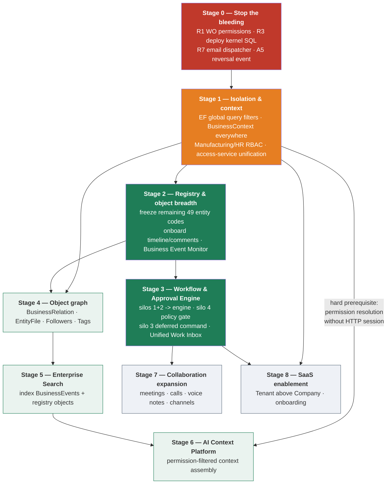

# 21 — Modernization Roadmap

## Scope
Dependency-ordered stages, not dates. Sizes are relative (**S** ≤ days · **M** ≤ weeks · **L** ≤ months ·
**P** = program). Every item traces to a gap in 19 or a risk in 20.

## Principle
Stage N+1 must not begin until stage N's prerequisites exist. The ordering below is derived from actual code
dependencies — most notably that **`BusinessContext`-based permission resolution blocks both the AI Context
platform and effective notification authorization**, and that **status normalisation blocks the Workflow
Engine**.

## Dependency graph

---

## Stage 0 — Stop the bleeding
*No prerequisites. Do these before any new development.*

| Item | Gap/Risk | Size | Why now |
|---|---|---|---|
~~Add permission attributes to the 5 work-order actions~~ — **WITHDRAWN, they already had them.** Stage 0 added the missing `[InvPerm("read")]` on the five READ actions + server-aligned UI gating instead | [CORRECTION-001](CORRECTION-001-Manufacturing-Permission-Finding.md) | **S** | **DONE** — defense in depth, not an emergency write fix |
Deploy `platform_business_events.sql` + `_slice_002.sql` | A2 / **R3** | **S** | merged code fails without them |
`CommMessage` outbox dispatcher | A3 / **R7** | **S** | **DONE (Batch A)** — `CommMessageDispatcherHostedService` + `SqlCommMessageDispatchStore`, 22 tests |
Emit `JournalEntry.Reversed` | A5 | **S** | **DONE (Batch A)** — in-transaction, `Confidential`, dedup-keyed, 8 tests |
Register `Quotation` in `IEntityRegistry` + validate DocComment types on write | A6 | **S** | **DONE (Batch A)** — 11 tests; no alias mapping needed |
Iterate companies in the hard-coded workers | A7 | **S** | **DONE (Batch A)** — **four** workers, not two; shared `IWorkerCompanyScope` + `WorkerCompanyRunner`, 10 tests |
~~Add idempotency guards to the 9 unguarded scripts~~ — **WITHDRAWN, the finding was false.** Zero deployable scripts are unsafe to re-apply | [CORRECTION-002](CORRECTION-002-Evidence-Scanner-Defects.md) | **S** | **DONE (Batch B)** — verdict re-derived by `scan-sql-manifest.ps1`; 0 unread |
~~Document the single-worker-process constraint~~ | 19-I2 / R4 | **S** | **DONE (Batch B) — and ENFORCED, not merely documented.** `Runtime:RequireSingleWorkerProcess` + a SQL Server session app lock; 6/6 workers gated; 18 tests |
Business Event Monitor + guarded per-consumer retry | 19-I3 / kernel observability | **S** | **DONE (Batch B)** — 39 tests; [ADR-008](../platform/ADR-008-Operator-Dispatch-Retry.md), [ADR-009](../platform/ADR-009-Platform-Operations-Authorization.md) |
`deploy/sql/manifest.json` + `PlatformSchemaHistory` + runbook | B5 / **R14** | **S** | **DONE (Batch B)** — [ADR-012](../platform/ADR-012-Deployment-Manifest-And-Schema-History.md) |
Checked-in evidence scanners | CORRECTION-001/002 root cause | **S** | **DONE (Batch B)** — [ADR-016](../platform/ADR-016-Reproducible-Architecture-Evidence.md) |
Platform Maturity Model + baseline | measurement discipline | **S** | **DONE (Batch B)** — [Platform-Maturity-Model.md](Platform-Maturity-Model.md); baseline 44.00 → **50.20** |

**Stage 0 status: COMPLETE** (Batch A + Batch B). The one item still open is not code:
**deploy `platform_business_events_slice_002.sql` and `comm_outbox_slice_003.sql` to CrossBuyDB2**, which is a manual,
approved, backup-first operation under the [runbook](../deployment/SQL-Deployment-Runbook.md).

---

## Stage 1 — Isolation and context *(the true foundation)*
*Requires Stage 0. Blocks Stages 3, 6, 8.*

| Item | Gap/Risk | Size | Note |
|---|---|---|---|
**EF global query filters** for `CompanyID` and `DeletedAt` | B1 / **R2** | **M** | additive; the highest-value data-integrity change available |
**`BusinessContext`-based permission resolution** — access services take the employee from `BusinessContext`, not the session | B3 / **R23** | **M** | **hard prerequisite for Stage 6**; also makes notification recipient checks effective |
**Manufacturing RBAC** (`ManufacturingUserRole` + attribute) | E5 | **M** | Stage 0 patched the symptom; this fixes the cause. Only `ManufacturingPermissionAdapter` changes |
**HR / Projects / Tasks RBAC** | E5 | **M** | removes `DefaultPermissionAdapter` from the critical path |
Replace `DefaultCompanyId = 1` / `CompanyId = 1` with the accessor | B2 | **M** | 8 controllers + 5 services |
`FiscalPeriod` company column | G2 / R12 | **S** | or prove globality |
`CompanyID` on `LeaveRequest` | G3 | **S** | **do before Stage 3** — retrofitting isolation into the engine is harder |
FKs on 4 role tables + approver columns | B12 / G6 | **S** | — |
Serve uploads through an authorizing controller | A4 / **R5** | **M** | — |
Move 3 secrets to env vars | E6 / R11 | **S** | — |
Health checks incl. worker last-success | R18 | **S** | — |
**Tests:** company isolation, permission enforcement | 17 | **M** | the two rules with no test anywhere outside the kernel |

---

## Stage 2 — Registry and object breadth
*Requires Stage 1 (so onboarded objects inherit real authorization).*

| Item | Gap | Size |
|---|---|---|
Freeze canonical codes for the remaining **49** business objects (names only, no behaviour) | 06 | **M** |
Onboard timeline + comments to the next tier of objects (returns, receipts, payments, orders, POS orders, projects, tasks, CRM) | D1, D2 | **L** |
**Business Event Monitor** screen over `BusinessEventDispatch` | C9 | **S** — highest operational value per effort in the whole roadmap |
`BusinessEvents` archival/retention job | C14 / R17 | **M** |
Event producers for the untracked flows (receipts, payments, returns, POS, payroll, projects, tasks, CRM) | 10 | **L** |
Entity Registry Explorer | C10 | **S** |
Freeze `JournalEntry.SourceType` vocabulary | B11 / R22 | **M** |

---

## Stage 3 — Workflow and Approval Engine
*Requires Stage 1 (approver authorization, company isolation on `LeaveRequest`) and Stage 2 (registry codes,
event producers). **Requires the status-normalisation decision from 06.***

| Sub-stage | Content | Size | Risk |
|---|---|---|---|
**3a — pre-work** | approval-silo tests (**R10**); status-normalisation decision (four shapes: `string`, `int` 0/1/2, `bool IsActive`, `Stage`) | **M** | do not skip — this is the safety net for the migration |
**3b — engine core** | sequential chain · threshold trigger · role-based approver · org-tree approver · auto-approve. **Emit a `BusinessEvent` on every decision** from day one | **L** | Medium |
**3c — migrate silos 1+2** | `LeaveRequest` + `EmployeeRequest`; retires the duplicated step table (B6) | **M** | **Low** — structurally identical, no financial side effect |
**3d — silo 4 as a policy gate** | discount ceiling; nothing to migrate | **S** | Low |
**3e — deferred commands, then silo 3** | versioned command payload (**R6**), transaction ownership, then inventory approvals | **L** | **High — do last** |
**3f — Unified Work Inbox** | make `/Approvals` actionable: shared decision contract, stable `ApprovalRef`, silo authorization callback, status mapping | **M** | Medium |
**New capabilities** (no silo has them today) | return/send-back · delegation · escalation · due dates/SLA · parallel branches | **L** | Medium |

---

## Stage 4 — Object graph
*Requires Stages 1–2.*

| Item | Gap | Size | Order rationale |
|---|---|---|---|
**`EntityFile(EntityType, EntityId)`** | C4 | **M** | **first** — three unrelated file mechanisms already prove demand, and it retires A4's blast radius |
**`BusinessRelation`** | C3 | **M** | replaces 3 string mechanisms (`TaskItem` link, `Activity` link, `SourceType`+`SourceId`) |
**Followers / Observers** | C5 | S–M | needs events to be useful |
**Tags** | C6 | **S** | lowest value; was dropped between Book 1 v1.1 and v2.0 |

---

## Stage 5 — Enterprise Search
*Requires Stage 2 (registry breadth) and Stage 4 (relations make results navigable).*
Index **Business Event projections + registry objects**, resolving search providers through `IEntityRegistry`.
**Size: L.** Do not build a second index feed — the event stream is the feed.

---

## Stage 6 — AI Context Platform
*Requires Stage 1 (**non-session permission resolution — hard blocker**) and Stage 5.*
Pipeline: user → permission filter → visibility filter → business context → event projection → documents → model
→ response filter. **Size: L.**

Two facts make this stage cheaper than it looks and dangerous if rushed: `IAiService`'s contract already states
that .NET applies permissions **before** calling Python, and `TimelineProjectionService` already implements
permission + visibility filtering. But **today's per-recipient checks are session-bound and therefore not
effective in a background context** — building AI context on that would create the exact leak ADR-004 exists to
prevent.

---

## Stage 7 — Collaboration expansion
*Requires Stage 3 (so meetings can carry approvals/tasks).*
Meetings · calls · voice notes · chat channels · persisted mentions. **Size: L each; treat as separate scopes**
(Book 1 Rev 2.0 already separates them).

---

## Stage 8 — SaaS enablement
*Requires Stage 1 (isolation must be mechanical, not manual) and Stage 3.*
`Tenant` above `Company`, onboarding, per-tenant configuration. **Size: P.**
`BusinessContext.TenantId` already exists and is always null — the contract is ready, the feature is not.
**Deliberately last:** doing it before Stage 1 would mean retrofitting isolation into every table built in
Stages 2–7.

---

## Explicit positioning of the items named in the brief

| Item | Stage | Size | Blocked by |
|---|---|---|---|
Manufacturing authorization | **0** (read gate, DONE) + **1** (real RBAC) | S / M | nothing. Note: the Stage 0 item was defense in depth — the write path was already protected (CORRECTION-001) |
BusinessContext-based permission resolution | **1** | M | nothing |
Unified Workflow and Approval Engine | **3** | L–P | Stage 1, Stage 2, status decision |
Unified Work Inbox | **3f** | M | engine core + shared decision contract |
Business Event Monitor | **2** | **S** | nothing — could be pulled into Stage 0 |
Entity Registry Explorer | **2** | S | nothing |
Entity Relations | **4** | M | registry breadth |
Followers | **4** | S–M | events |
Entity Files | **4** (first item) | M | Stage 1 file authorization |
Tags | **4** (last item) | S | registry |
Enterprise Search | **5** | L | Stages 2, 4 |
AI Context Platform | **6** | L | **Stage 1 permission resolution** |
Meetings / collaboration expansion | **7** | L each | Stage 3 |
SaaS enablement | **8** | P | Stages 1, 3 |

## Recommended next slice

**Stage 0 is complete.** The next slice is **Stage 1's two blockers**: EF global query filters for `CompanyID`, and
`BusinessContext`-based permission resolution that does not depend on the HTTP session. They are the prerequisites for
half the remaining roadmap, and in maturity terms they are the only change that raises **two** dimensions at once
(Security *and* ERP Business Coverage) — see
[Platform-Maturity-Baseline.md](Platform-Maturity-Baseline.md).

**The Stage 1 security backlog is 306 mutating actions, not 267** ([CORRECTION-002](CORRECTION-002-Evidence-Scanner-Defects.md)).
Do the two blockers first: with query filters and a real `BusinessContext` in place, adding permission attributes
becomes mechanical rather than a per-endpoint judgement about which of four vocabularies applies.

**Do not start the Workflow Engine yet.** 14 establishes that the landscape is understood, but three
prerequisites are missing: approval-silo tests, the status-normalisation decision, and `CompanyID` on
`LeaveRequest`. Starting without them means the engine inherits four status vocabularies and an untested
migration.

---

## Stage 9 — Architecture Validation Framework  *(PLANNED — NOT IMPLEMENTED)*

**Status: Planned. Nothing in this section exists.** Added by Stage 1 Hotfix A.1 / A8 so it is an authoritative
planned platform capability rather than an idea that has to be re-argued. **No maturity points are awarded for it**;
roadmap documentation moves no score.

**Why it is a real capability and not tooling polish.** Stage 0 and Stage 1 produced four corrections
(CORRECTION-001 … 004), and every one was a *measurement* defect: a scanner that skipped inline attributes, one that
discarded fully-qualified names, one that credited a lane guard which checks no role. Each was found by hand, late.
The evidence files are already the basis for security claims, so the scanners need to be verified artefacts rather
than trusted scripts.

Scope, when it is built:

| Check | What it would reconcile |
|---|---|
| Endpoint inventory reconciliation | source ↔ scanner ↔ grep ↔ inventory must agree on the action list (done by hand for Hotfix A.1) |
| Permission coverage reconciliation | attribute / in-body / backlog split, with no attribute credited that checks no role |
| Company-isolation coverage | which entities are filtered and guarded, and which are neither |
| Raw SQL risk scanning | every raw call site carries a company predicate or a recorded verdict |
| Worker-scope validation | every per-company worker binds a scope |
| EF filter safety | no scoped instance captured in a model expression; filters route through the executing context |
| Build-configuration validation | every custom configuration declares its compilation symbols |
| Architecture dependency checks | layering, and no new coupling into the two sanctioned writers |
| UI-standard compliance | the `docs/design/Platform-Screen-Checklist.md` items that can be checked statically |
| Maturity evidence validation | every published number is re-derivable from a committed evidence file |
| Scanner cross-reconciliation | two independent implementations must agree, or the difference is explained |

**Not built now, deliberately.** Three of these checks already exist as *tests* rather than a framework
(`Stage1RawSqlSafetyTests`, `Stage1PermissionBacklogTests`, `Stage1QueryFilterTests`), which is the cheap 80%. A
framework is worth building when the checks outgrow the test project — not before.

---

## Stage 10 — Enterprise Financial Intelligence Platform  *(PLANNED / FUTURE — NOT IMPLEMENTED)*

**Status: Planned. None of the following exists in the codebase today.** Recorded by Stage 1 Hotfix A.1 / A9 so the
Living Architecture carries the intended destination. **No maturity points are awarded**, and no partial credit is
taken for any item below.

What exists today, for contrast: `IReceivableService` / `IPayableService` (invoices, receipts, payments, aging),
`IGeneralLedgerService` (trial balance, account statements), `IFinancialStatementService` (income statement, balance
sheet, cash flow), `IAccountingPostingService` (the payroll bridge), and `ClosingService` (year-end). Everything named
below is beyond that surface.

| Area | Planned capabilities |
|---|---|
| Order to Cash | end-to-end quote → invoice → cash orchestration and status |
| Collections Center | worklists, dunning, prioritisation by risk and value |
| Credit Management | limits, scoring, exposure, blocking rules |
| Promise to Pay | commitments, follow-up, kept/broken tracking |
| Dispute & deduction management | claim intake, root-cause coding, resolution workflow |
| Cash application | remittance matching, partials, on-account handling |
| Treasury | positions, funding, in-house banking |
| Cash forecasting | short and medium horizon, scenario-based |
| Bank management | mandates, statements, payment files |
| Reconciliation Center | bank, intercompany and sub-ledger reconciliation in one place |
| Financial Close | task orchestration, checklists, sign-off, close calendar |
| Intercompany reconciliation | matching and elimination across companies |
| CFO Dashboard | consolidated financial and liquidity view |
| Customer Financial Workspace | one customer, one financial picture |
| AI Finance Copilot | natural-language analysis over governed financial data |
| Working-capital intelligence | drivers, leakage, opportunity sizing |
| DSO / DPO / CCC analytics | trended, segmented, benchmarked |
| Risk & liquidity forecasting | probability-weighted collections and cash risk |
| Explainable recommendations | every recommendation traceable to the entries behind it |

**Two constraints attach to this stage now, so they are not rediscovered later:**

1. **It inherits the Accounting visual identity** established in `docs/design/CrossBuy-Platform-UI-Standard.md` — a
   CFO workspace must look like part of the Accounting suite, not a separate product.
2. **It is company-isolation-critical.** Intercompany reconciliation and consolidated dashboards are *by definition*
   cross-company reads, so every one of them must go through the authorized, audited bypass (ADR-023) — never through
   a widened filter, a raw query or an `IgnoreQueryFilters`. Designing this stage before Stage 1's isolation was
   enforced would have produced exactly the cross-company reads Batch B spent its effort removing.

---

## Stage 11 — Authorization platform capabilities  *(PLANNED — NOT IMPLEMENTED)*

Added by Stage 1 Batch C so the shared RBAC foundation's intended extensions are authoritative rather than
re-argued. **No maturity points are awarded for any of it.** The Batch C schema does not prevent any of them.

| Capability | Status | Note |
|---|---|---|
| **Role Templates** (Finance, HR, Project Management, Restaurant, Hospital, Hotel, industry packs) | Planned | A template expands into `PlatformRoleAssignments` rows. No table needed unless templates must be stored. |
| **Role Groups** | Planned | Administration and presentation only; **no runtime authorization effect** unless expanded into assignments. |
| **Delegation Framework** | Planned | `ValidFrom`/`ValidTo` give temporal validity ONLY. A delegation record needs `DelegatedFromPrincipal`, `DelegatedToPrincipal`, `Reason`, `ApprovedBy`, start/end, revocation, audit and workflow integration. **Batch C must not be read as delegation.** |
| **Field-level permissions** | Planned | The multi-level model is Module → Entity → Record → **Field** → Action. Batch C implements module, action and record. Field security needs serialization, UI masking, API response shaping, Search and AI decisions first — **no speculative field columns were added**. Confidential HR/payroll data receives explicit service-level protection now. |
| **Non-employee principals** (CustomerContact, VendorContact, PartnerContact, ServiceAccount, IntegrationClient) | Planned | Structurally ready via `PrincipalType`; **only `Employee` is supported at runtime**, and an unsupported kind is not returned by the directory. No portals, no contact tables. |
| **Tenant above Company** | Planned | `CompanyID` remains the enforced isolation key; `BusinessContext.TenantId` is reserved and always null. No Tenant table. |
| **Legacy role-table fold-in** (Accounting, Inventory, CRM) | Planned | Dual-read, verify, stop reading, drop. Out of scope for Batch C. |
| **POS (`BranchUserRoles`) fold-in** | **Not planned** | A documented **permanent exception** unless a dedicated POS architecture review proves otherwise (ADR-026 §4). |

### Approved consumer principles — recorded, not built

1. **Workflow** assigns responsibility by role/scope, never by permanently hard-coded employee ids.
2. **AI Context** uses `BusinessContext`, `IPlatformPermissionProvider` and `AccessScope`.
3. **Reports** use `AccessScope` + company isolation rather than copying authorization predicates.
4. **Search** trims at query time.
5. **Unified Work Inbox** uses set-based `AccessScope` filtering — one predicate, not one permission call per row.
6. **Notifications** use the same permission provider.
7. **No future consumer may bypass the authorization platform.**

`AccessScope`/`AccessBreadth`/`ResolveScopeAsync` ship in Batch C as the contract these depend on, with the real
Tasks implementation. **None of the consumers above is built.**
