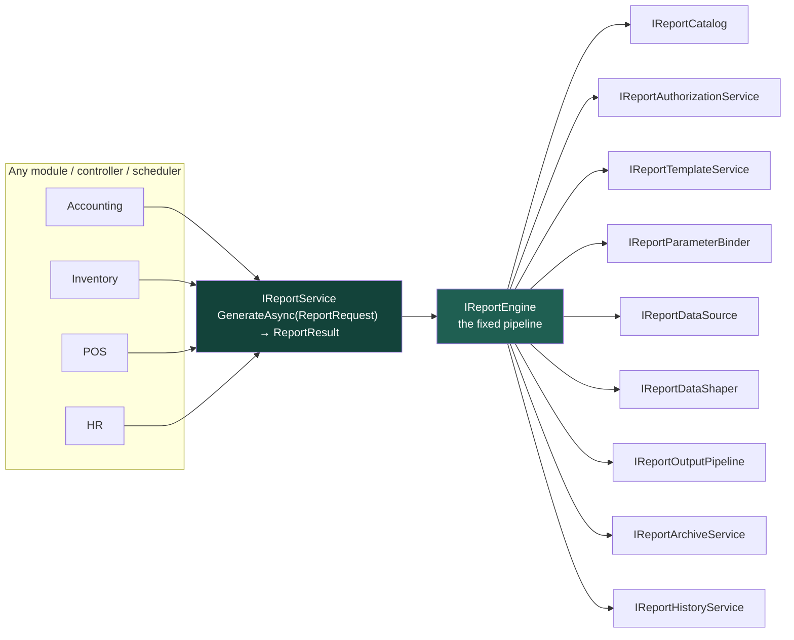
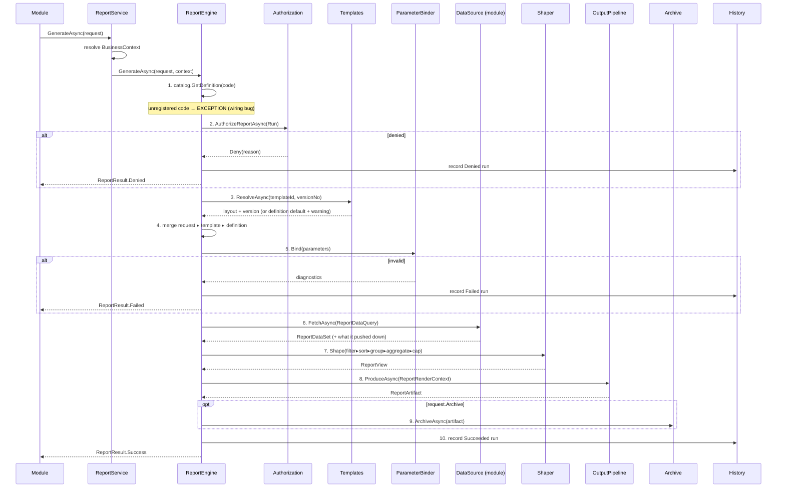
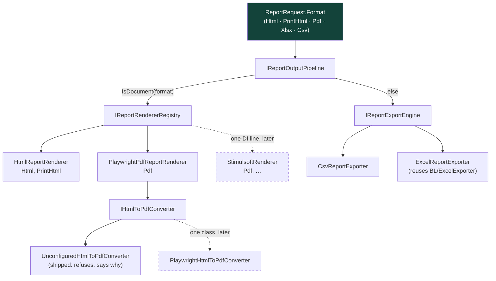
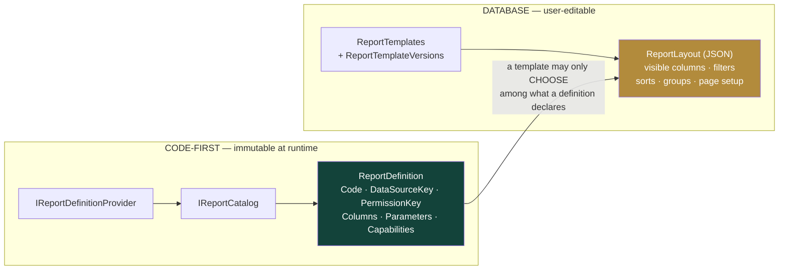
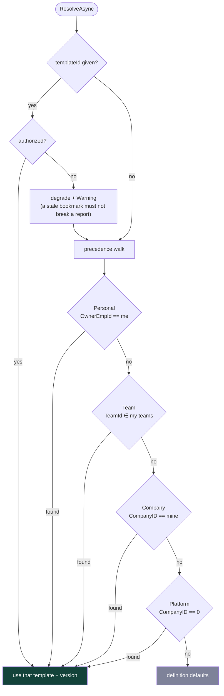
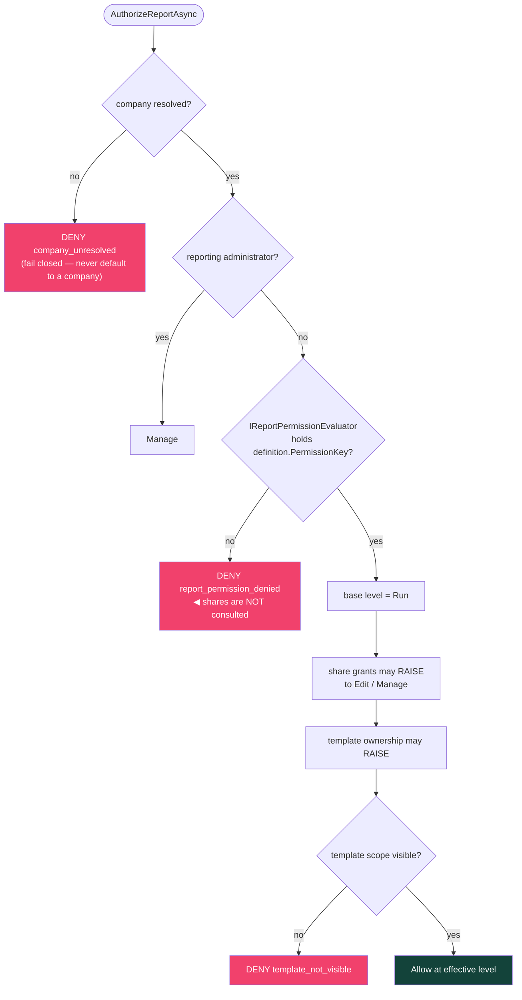
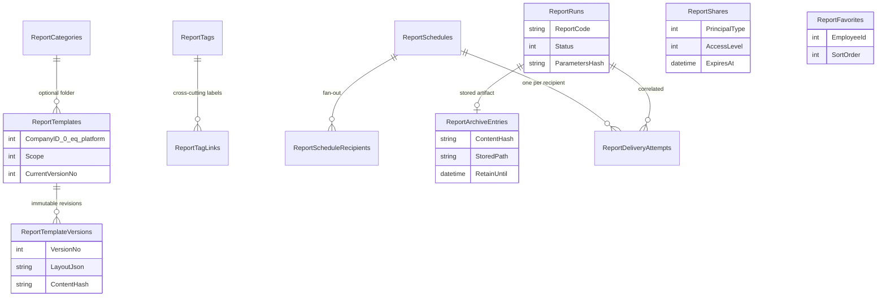

# ADR-037 — Reporting Platform Architecture

**Product:** CrossBusiness Platform
**Renumbered:** was `ADR-030` until 2026-08-05. ADR-030 collided with the Communication Platform's contiguous block ADR-030…036, which was authored in the same shared `docs/platform` folder. The owner decision was that Reporting moves, because this is one document with a handful of inbound references while Communication's is a seven-ADR block cross-referenced from CPS-001 and from each other. See `Stage-Reporting-ADR-Renumbering-Evidence.md`.
**Track:** SECOND TAB (parallel work) — independent of Stage 2A
**Status:** Proposed — **architecture complete, awaiting review**
**Scope of this slice:** architecture and infrastructure only. No UI. No production module modified.

---

## 1. Context and mandate

The product has reporting scattered across screens: each module builds its own tables, its own Excel export, its
own print view. There is no catalogue, no saved layout, no history of who ran what, no archive, no scheduling, and
no single place where a report's permission is decided.

This slice builds the **platform** those reports will later sit on. The mandate was explicit:

> Every module must call only `ReportService.Generate()`.
> The system must not know which renderer is used.
> Design the architecture so that renderers are pluggable.
> Do **not** integrate with Stimulsoft yet.

And the constraints were explicit: do not modify authorization, access services, bootstrap policies, batches,
security, CRM/Inventory/Accounting permissions, database security, or existing production logic; no UI; no
production controller changes; no dependency on Stage 2A.

**What was delivered:** 26 source files under `CrossBuy/BL/Reporting/`, 8 entity files under
`CrossBuy/Models/Context/Reporting/`, one idempotent SQL file, 179 unit tests (all passing), and this document
plus the component specification (`RPS-001`).

**What was deliberately NOT delivered** is listed in §10 — it is a short, explicit list, not an accident.

---

## 2. The one public door



A caller knows exactly three types: `ReportRequest`, `ReportResult`, and `IReportService`. Everything else is
internal machinery reachable only through that call.

**What a caller structurally cannot do:**

| Cannot | Because |
| --- | --- |
| Name a renderer or engine | `ReportRequest.Format` is an output **format**, not an engine |
| Name a company | Isolation comes from the resolved `BusinessContext`; there is no `CompanyId` on the request |
| Reach a data source, template row or archive file | None is exposed on the façade |
| Skip authorization | Step 2 of the pipeline, before any data is read |
| Skip the history record | Step 10, written on **every** path including denial |

`ReportPrintService` is not an exception: it calls `IReportService.GenerateAsync` like everyone else. It has no
private path to a renderer.

---

## 3. The pipeline

Ten steps, in this order and no other.



### 3.1 Merge precedence — and its one exception

**request ▸ template ▸ definition.** A request wins over a saved layout, which wins over the definition's defaults.

**Except filters, which are ADDITIVE.** Template filters *and* request filters both apply. Overriding would let a
request *drop* a filter the saved layout imposed, which **widens** the result set. Narrowing is always safe;
widening never is. The same asymmetry appears twice more:

| Situation | Sort / grouping | Filter |
| --- | --- | --- |
| References a column the definition does not declare | dropped, **Warning** | **Error — the run fails** |
| References an internal column | dropped, **Warning** | **Error — the run fails** |

Dropping a sort is cosmetic. Dropping a filter shows a user more data than the layout asked for.

### 3.2 The row cap can only ever be lowered

`min(definition.MaxRows, engine default, request.MaxRows)`, and a preview uses `Capabilities.PreviewRows`. A
request that could *raise* the ceiling would make the ceiling advisory. Truncation is always declared — on the run
summary, as a Warning diagnostic, and printed on the rendered page.

---

## 4. Renderer pluggability



A renderer receives a `ReportView` — already filtered, sorted, grouped and totalled — plus presentation context,
and returns bytes. It cannot see a `ReportRequest`, a parameter dictionary, a `DbContext`, a data source or a
permission. **That containment is what makes swapping engines a registration change rather than a refactor: there
is nothing else for a renderer to depend on.**

The registry is **last-registration-wins**, and that is the substitution mechanism:

```csharp
services.AddCrossBusinessReporting();
services.AddSingleton<IReportRenderer, StimulsoftReportRenderer>();  // ← replaces Pdf, product-wide
```

Proven by `ReportingDiWiringTests.Registering_a_replacement_renderer_after_the_platform_substitutes_it` and
`ReportingOutputTests.Registering_another_renderer_for_a_format_replaces_it_with_no_caller_change`.

### 4.1 Renderer vs exporter — a load-bearing distinction

| | Renderer | Exporter |
| --- | --- | --- |
| Produces | a **document** (paged, styled, grouped, banded) | a **data file** (flat, one header + detail rows) |
| Meant to be | read | processed |
| Values written as | display strings (`"1,234.56"`) | machine values (the `decimal` 1234.56) |
| Grouping | bands + subtotals | **not represented** — group keys are ordinary columns |

Confusing the two is the single most common reporting defect: `"1,234.56"` in a spreadsheet cell is *text*, and a
user who sums the column gets zero. `ReportValues.ForExport` exists so an exporter cannot accidentally take the
display path.

### 4.2 PDF is architecturally complete and functionally unbound

`Microsoft.Playwright` is **not** referenced by `CrossBuy.csproj` and this slice does not add it — the csproj is a
file the parallel team is also changing, and a Playwright reference is not additive (NuGet package **plus** a
`playwright install` browser download in every environment that renders a PDF). Adding that as a side effect of an
architecture slice would turn an architecture review into a deployment change.

So the renderer owns every *reporting* decision — page geometry, margins, RTL, the running footer with page
numbers, print CSS, and reusing the exact `PrintHtml` the print path uses — and only the browser call sits behind
`IHtmlToPdfConverter`. Requesting `Pdf` today produces a clean `ReportRendererUnavailableException` carrying an
**actionable** reason ("add a Microsoft.Playwright reference, implement IHtmlToPdfConverter, run
`playwright install chromium`; until then use PrintHtml"). Never a corrupt file, never a silent fallback to HTML.
`IReportOutputPipeline.AvailableFormats` omits `Pdf`, so a UI shows **no PDF button** rather than a button that
errors.

The concrete ~20-line Playwright binding is written out in the comment on `IHtmlToPdfConverter`.

---

## 5. Metadata: code-first definitions, database-backed templates



**Why definitions are code-first and not a table.** A definition carries the report's `DataSourceKey` and
`PermissionKey`. If definitions lived in the database, editing a row would repoint a report at a different data
source or a weaker permission — a privilege escalation performed with an `UPDATE` statement. Templates are the
database-backed, user-editable half, and a layout carries **only** presentation and query intent. So the worst a
malicious or corrupt layout can do is ask for columns or filters the definition does not declare, which the shaper
rejects.

The catalog validates **in its constructor**, so a malformed definition fails at DI-graph construction rather than
on a user's first click. The most important of those checks:

> `PermissionKey` is **required**. Use `ReportPermissions.Public` explicitly if a report is genuinely
> unrestricted — **omission must never be able to mean unrestricted.**

---

## 6. The four template scopes are ONE mechanism

Components 29–32 (Personal / Team / Company / Platform templates) are not four features. A template carries a
`Scope`, and resolution walks the scopes in precedence order. The enum's **numeric values are the precedence**.



Within a scope: the one marked default, else the most recently updated, else highest id — **deterministic**, so two
requests never resolve different layouts.

* A **Platform** template (`CompanyID = 0`) is runnable by all and editable by nobody — *including* a tenant
  administrator. "Editing" one is a **fork** into a Company/Personal template, and a fork goes through the ordinary
  `SaveAsync` so it gets every validation a hand-made template gets.
* Another employee's **Personal** template is never resolved for me, and naming it explicitly is refused.
* A tenant cannot **create** a Platform template — that would let one company publish a layout every other company
  resolves.

### 6.1 Versioning is immutability

An archived PDF records `(TemplateId, VersionNo)`, so that version must never change or the artifact stops being
reproducible.

* Editing **appends** a version. Saving an identical layout creates **no** new version (idempotent save — a UI that
  autosaves would otherwise grow a version per keystroke).
* Rollback **moves the pointer** and appends nothing. History is not rewritten.
* Deleting a template is a **soft delete**, because archive rows reference it.

Same instinct as the ledger rule this codebase already lives by: history stays whole.

---

## 7. The permissions model

**The whole model in one sentence:**

> A module permission **gates** a report. A share can only **raise** what that gate already allowed.
> A share can never open a gate that is shut.



The early return at `PERM` **is** the ordering rule. Without it, "share a report" becomes a way to hand someone
data their module permissions deny — a back door built out of a convenience feature.

Also enforced: nobody can grant more than they hold; sharing requires `Manage`; re-granting **updates** the one row
rather than stacking grants; expiry is evaluated **at read time**, never by a sweeper (an expiry that depends on a
background job keeps working when the job stops).

### 7.1 This slice does not touch authorization — by design and by brief

The brief forbids it, and the dependency would be wrong anyway: reporting must not become a second place where
module authorization is decided. So there is **one seam**, `IReportPermissionEvaluator`, and the shipped
implementation (`RoleMapReportPermissionEvaluator`) is self-contained and **fails closed**:

```csharp
if (RoleMap.TryGetValue(permissionKey, out var roles)) return caller holds any of roles;
return AllowUnmappedPermissions;   // false — an unmapped key is DENIED
```

`AllowUnmappedPermissions` exists only so that choice is visible in configuration review rather than buried in
code. Flipping it to `true` would make "forgot to configure it" mean "everyone can see it" — the failure mode the
whole model is arranged to prevent.

**Replacing this evaluator with one backed by the platform permission provider is the first integration task after
this slice is reviewed.** It is one class and one DI line; nothing else changes.

Two other read-only seams exist for the same reason:
`IReportTeamResolver` (reads `Employee.DepartmentID`) and `IReportSchedulePrincipalFactory` (reads the employee's
Identity roles). Both only **read**; the evaluator still makes every decision.

---

## 8. Scheduling and delivery

```mermaid
graph LR
    SC["ReportSchedules<br/>(model + validation)"] --> CALC["IReportScheduleCalculator<br/>pure next-run arithmetic"]
    CALC --> DUE["GetDueAsync(companyId, asOf)"]
    DUE --> RUN[IReportScheduleRunner]

    RUN --> PRIN["IReportSchedulePrincipalFactory<br/>the OWNER's rights"]
    PRIN --> ENG[IReportEngine]
    ENG --> ARC["archive (always)"]
    ARC --> DEL[IReportDeliveryService]
    DEL --> CH[IReportDeliveryChannel]
    CH --> EM[EmailReportDeliveryChannel]
    EM --> MS[IReportMailSender]
    MS --> NL["NullReportMailSender<br/>records SKIPPED, not Sent"]
    MS -.->|"one class, later"| SMTP["SMTP / Comm outbox"]

    HS["hosted service"] -.->|"NOT registered<br/>in this slice"| RUN

    style HS stroke-dasharray: 5 5,fill:#fff5f8
    style SMTP stroke-dasharray: 5 5
    style NL fill:#b28b3c,color:#fff
```



**No hosted service is registered.** Three reasons, all load-bearing:

1. ADR-013 constrains this deployment to a single worker process. Adding a second background loop is a
   platform-level decision with an owner, not a side effect of a reporting slice.
2. A hosted service is a **singleton** and may never inject a scoped service — CLAUDE.md records that Batch C's own
   `PermissionScopeStartupValidator` broke exactly this and stopped the app from starting. The runner is **scoped**,
   so the eventual worker must take `IServiceScopeFactory` and create a scope per due schedule, and it must be added
   to `Stage1DiWiringTests` in the same change.
3. Turning on an unattended process that generates and emails documents before the permission and delivery layers
   have been reviewed would be exactly the wrong order.

`RunDueAsync` is callable — by a test, by an operator action, and later by one small hosted service — so the
architecture is *provably* complete without anything firing on its own.
`ReportingScheduleTests.No_hosted_service_drives_scheduling_in_this_slice` asserts the omission structurally, so
adding one is a conscious change that must be justified.

**Recurrence is an enum, not a cron string.** A cron field looks more powerful but is unvalidatable at save time,
untranslatable in a UI, and invites `* * * * *`. `Interval | Hourly | Daily | Weekly | Monthly` cover every
recurrence a finance/ops report needs, and each one is checkable when the row is written. Notable rules, all tested:
day 31 is **clamped** per month (a month-end report must run every month, not eight times a year); weekly "today,
time passed" moves a **full week**; `Interval` is measured from the **last run**, never from a fixed origin (or a
resumed schedule would fire a backlog); an unknown time zone falls back to server local **with a warning**, never an
exception.

**Delivery: "Skipped" is not "Sent".** No mail transport is bound (see §10), so every attempt is recorded as
`Skipped` **with its reason**. An operator can see that N reports were generated and 0 delivered. A null-object
mailer that reported success would produce an audit trail that lies. A malformed address fails **that recipient
only** — one bad mailbox must not cancel a distribution list.

**Why not the parallel team's Comm outbox?** CLAUDE.md records the standing decision for parallel tracks: do not
bind to their queue and dispatcher while their work is uncommitted, because their change or rollback would then
reach our path. `comm_outbox_slice_003.sql` / `CommMessages` dispatch is exactly such a queue. Binding it later is
one class and one DI line.

---

## 9. Data model



Twelve tables, all company-scoped, in `deploy/sql/reporting_platform.sql` — **idempotent, additive, no EF
migration** (the `Migrations/` folder is a dead snapshot in this repository). SQL before code.

`CompanyID = 0` on `ReportTemplates` and `ReportCategories` marks a **platform** row belonging to no tenant. It is
not a null-substitute; every read is `CompanyID == ctx.CompanyId || CompanyID == 0`, never unfiltered.

**None of these is a financial or stock table.** `JournalEntryService` remains the only GL writer and `StockService`
the only stock writer; the reporting platform writes only these twelve tables and every data source is read-only.

**Two append-only tables carry the audit story.** `ReportRuns` has no `DeletedAt` — the record that a report was
produced is never deleted; the *bytes* expire via `ReportArchiveEntries.RetainUntil`. A **denied** run is recorded
too: a history containing only successes would be a success log wearing an audit log's name.

**The archive is content-addressed** by SHA-256, so re-archiving identical bytes writes one file and two rows —
an honest record of two requests over one artifact. Bytes are written **before** the row (a failed row leaves a
harmless orphan file; the reverse would leave a row pointing at nothing), via a temp-name-then-move so a reader can
never see a half-written PDF. `StoredPath` comes out of the database and is therefore **not a trusted path**: the
store refuses anything that resolves outside the archive root.

---

## 10. What is deliberately NOT in this slice

Every item here is a decision with a reason, not an omission. Each is one class and one DI line away.

| # | Not done | Why | To enable |
| --- | --- | --- | --- |
| 1 | **Playwright PDF binding** | Needs a NuGet reference in a csproj the parallel team is editing, plus a browser download per environment. Not additive. | Implement `IHtmlToPdfConverter` (worked example is in the file), register it, `playwright install chromium` |
| 2 | **Mail transport** | Binding to the parallel team's uncommitted Comm outbox would put their rollback on our path (CLAUDE.md standing decision) | Implement `IReportMailSender`, register in place of `NullReportMailSender` |
| 3 | **Hosted scheduler** | ADR-013 single-worker constraint; a singleton hosted service must not inject the scoped runner; unattended emailing before review is the wrong order | One `BackgroundService` taking `IServiceScopeFactory`, added to `Stage1DiWiringTests` |
| 4 | **Real permission provider** | The brief forbids touching authorization / Stage 2A | Implement `IReportPermissionEvaluator` over `IPlatformPermissionProvider` |
| 5 | **Module data sources** | A data source is exactly where reporting would start reading Accounting/Inventory — i.e. modifying production scope | One `IReportDefinitionProvider` + one `IReportDataSource` per module |
| 6 | **Any UI** | Explicitly out of scope | — |
| 7 | **Retention sweeper wiring** | `SweepExpiredAsync` exists and is tested, but writing a deleter before the archive has content is how retention bugs ship | Call it from an operator action or the future worker |
| 8 | **XLSX direction + outline grouping** | `BL/ExcelExporter` writes an RTL sheet unconditionally; fixing it means changing a shared production file | Add a direction parameter to `ExcelExporter` (a separate, coordinated change) |
| 9 | **Logo embedding** | A report logo must be a `data:` URI (a headless PDF browser may have no route back to the app); turning a stored path into bytes on every render needs caching | A caching `IReportBrandingProvider` |
| 10 | **Business events for report runs** | CLAUDE.md standing decision (HM-5): do not raise platform events from a parallel track until the kernel's event work stabilises in git. A report run is not a financial transition either. | `ReportHistoryService.RecordAsync` is the single producer if reporting is ever onboarded |

**One asymmetry worth flagging explicitly.** `ReportHistoryService.RecordAsync` contains the *only* deliberate
swallowing catch in this platform, and it is the opposite of the kernel's `RecordAsync` rule (in-transaction, before
commit, no swallow). The difference is the point: a business **event** is part of the financial transaction it
belongs to, while a report run is an observation *about* a read-only operation. Reporting writes no financial data
and takes part in no financial transaction, so it has nothing to be atomic with — and an unapplied `deploy/sql`
must not turn every working report into a 500.
Proven by `ReportingEngineTests.A_report_still_renders_when_the_history_table_is_missing`.

---

## 11. Lifetimes

| Lifetime | Services | Why it is safe |
| --- | --- | --- |
| **Singleton** | clock, options, catalog + definition providers, parameter binder, shaper, schedule calculator, renderers, exporters, registries, output pipeline, archive store, print transport, mail sender | Each injects **nothing scoped** and holds no per-request state. CLAUDE.md's rule: a process-lifetime object capturing a scoped service serves every later request from the **first** request's state |
| **Scoped** | engine, façade, authorization, permission evaluator, team resolver, templates, library, history, archive service, branding, schedules, principal factory, runner, delivery, print service, every data source | Touch `CrossDbContext` or `BusinessContext` |
| **Hosted** | *none* | §8 |

`IReportDefinitionProvider` carries an explicit purity contract — no `DbContext`, no `HttpContext`, no I/O, same
definitions for the life of the process — because that contract is what makes the singleton catalog safe. A report
whose *availability* depends on data is still declared there and filtered at **authorization** time, which is scoped
and may read anything.

`Program.cs` gains **one line**: `builder.Services.AddCrossBusinessReporting(…)`. That is deliberate — `Program.cs`
is a file the parallel team is also editing, and a 40-line block there would collide on every merge.

---

## 12. Numbers are never changed by the reporting platform

**Rule:** the platform formats what a data source computed. It never rounds, re-rounds or recomputes.

Rounding is a business decision owned by `ICurrencyRounding` at the point the number is computed. A report that
re-rounded would print totals that disagree with the ledger it came from. So:

* `ReportValues.Format` applies the column's declared display scale and returns a **string**;
* `ReportValues.ForExport` returns the **full underlying decimal** — no scale loss, so fils survive an export;
* `Percent` is a percentage already (12.5 means 12.5%) and is formatted with a `%` suffix, never with `"P"`, which
  would multiply by 100 and print 1250%.

Asserted by `ReportingParameterEngineTests.Formatting_never_changes_the_underlying_value`.

---

## 13. Security properties, each with a test

| Property | Enforced in | Test |
| --- | --- | --- |
| A caller-supplied `CompanyId` is dropped, not coerced | `ReportParameterBinder` | `A_caller_supplied_CompanyId_is_dropped_with_a_warning_and_the_context_wins` |
| Every parameter set carries a company, always | `ReportParameterBinder` | `CompanyId_EmployeeId_and_Now_are_always_present_even_when_undeclared` |
| A template cannot bake a system parameter | `ReportTemplateService` | `A_layout_may_not_bake_a_system_supplied_parameter` |
| No field reaches a comparison unless the definition declares it | `ReportDataShaper` | `A_filter_on_an_undeclared_column_FAILS_the_run…` |
| An internal column never renders or exports | `ReportDataShaper`, renderers | `An_internal_column_never_reaches_the_rendered_output…` |
| An internal column cannot be filtered (inference leak) | `ReportDataShaper` | `A_filter_on_an_internal_column_fails_rather_than_being_quietly_ignored` |
| An empty `IN` list matches nothing | `ReportDataShaper` | `An_empty_IN_list_matches_nothing_rather_than_everything` |
| Every rendered value is HTML-escaped | `HtmlReportRenderer` | `Every_interpolated_value_is_html_escaped` |
| CSV formula injection is neutralised | `CsvReportExporter` | `Csv_neutralises_formula_injection` |
| A share cannot open a shut gate | `ReportAuthorizationService` | `A_share_cannot_grant_access_the_module_permission_denies` |
| Nobody grants more than they hold | `ReportLibraryService` | `Nobody_can_grant_more_than_they_hold` |
| An archive entry dies with the permission | `ReportArchiveService` | `An_archive_entry_is_not_readable_once_the_report_permission_is_revoked` |
| A leaver's schedules stop | `IdentityReportSchedulePrincipalFactory` | `A_leaver_stops_their_schedules_and_the_refusal_is_recorded` |
| `StoredPath` is not a trusted path | `FileSystemReportArchiveStore` | path containment guard (throws) |
| Unmapped permission ⇒ denied | `RoleMapReportPermissionEvaluator` | `An_unmapped_permission_key_is_DENIED…` |

---

## 14. Test evidence

**179 reporting tests, all passing.**

| File | Tests | Covers |
| --- | --- | --- |
| `ReportingCatalogTests` | 15 | frozen codes, duplicate detection, constructor validation, browse |
| `ReportingParameterEngineTests` | 21 | isolation, required/defaults, relative date tokens, conversion, culture, formatting |
| `ReportingShaperTests` | 19 | the filter/sort asymmetry, internal columns, grouping, aggregation, truncation |
| `ReportingOutputTests` | 19 | pluggability, substitution, HTML/RTL/XSS, CSV BOM + injection + RFC 4180, XLSX |
| `ReportingEngineTests` | 21 | pipeline, denial recording, row caps, preview, archive, isolation, history |
| `ReportingTemplateScopeTests` | 25 | four-scope precedence, fork, versioning, sharing, ownership, favourites, tags |
| `ReportingScheduleTests` | 25 | next-run arithmetic, validation, runner end-to-end, delivery outcomes |
| `ReportingDiWiringTests` | 9 | the **real** container with `ValidateOnBuild` + `ValidateScopes` |

Two files exist for the DI question on purpose. `ReportingTestHost` wires by hand (right for behaviour, useless for
wiring); `ReportingDiWiringTests` builds the real container — because CLAUDE.md records that *"a DI graph is not
verified by unit tests that construct services by hand: 112 green tests coexisted with an application that could
not boot."*

### 14.1 Two defects the tests caught before review

1. **`CsvReportExporter` wrote no BOM.** `new UTF8Encoding(true).GetBytes(...)` does **not** emit a preamble — that
   flag only affects writers that ask the encoding for one. The file looked correct in every text editor and would
   have turned every Arabic label into mojibake the moment Excel opened it. Now written explicitly.
2. **`ReportDataShaper` allowed filtering on an internal column.** `Internal` was checked for *display* but not for
   *filters*, and filtering a hidden column leaks it by inference (filter `Cost > 100`, see which rows survive).
   Now refused.

### 14.2 Build and suite state — declared honestly

* Reporting code: **0 errors, 0 new warnings.**
* Reporting tests: **179 / 179 passing.**
* Full suite: **958 passed, 8 failed, 183 skipped.**

The 8 failures are **pre-existing and not attributable to this slice**, and that was verified rather than assumed:
`AccountingAccessService` (a parallel-team–modified file) now requires `IBootstrapAccessPolicyReader`, which those
tests' hand-built containers do not register. **The same 8 tests fail identically with the entire reporting slice
excluded from the build**, and none of them references the reporting namespace.

Separately, the parallel team's untracked `CrossBuy/BL/Communication/` broke the shared tree partway through this
work (`CommCommentService.cs` references `ICommAttachmentService`, which is defined nowhere). The session's baseline
build was clean. Compilation and test runs for this slice were therefore performed with that untracked directory
excluded **via a command-line MSBuild injection only** — no file of theirs was edited, moved or committed. This is
the same class of event as HM-D52 and is recorded here for the owner.

---

## 15. Adding a report — the whole integration surface

```csharp
// 1. Declare it (pure, singleton — no DbContext, no HttpContext, no I/O).
public sealed class AccountingReportDefinitions : IReportDefinitionProvider
{
    public string ProviderName => "Accounting";

    public IEnumerable<ReportDefinition> GetDefinitions() => new[]
    {
        new ReportDefinition
        {
            Code          = "Accounting.TrialBalance",
            Module        = "Accounting",
            TitleAr       = "ميزان المراجعة",
            TitleEn       = "Trial balance",
            DataSourceKey = "Accounting.TrialBalance",
            PermissionKey = "accounting.reports.view",     // REQUIRED — omission is refused
            CategoryKey   = "accounting.financial-statements",
            Columns       = /* … */,
            Parameters    = /* … */,
        },
    };
}

// 2. Feed it (read-only, AsNoTracking, filter on query.Context.CompanyId).
public sealed class TrialBalanceDataSource : IReportDataSource
{
    public string Key => "Accounting.TrialBalance";

    public async Task<ReportDataSet> FetchAsync(ReportDataQuery q, CancellationToken ct = default) { /* … */ }
}

// 3. Register, after AddCrossBusinessReporting().
services.AddSingleton<IReportDefinitionProvider, AccountingReportDefinitions>();
services.AddScoped<IReportDataSource, TrialBalanceDataSource>();
services.Configure<…>(/* map "accounting.reports.view" to roles, or bind the real evaluator */);
```

That is all. The module never touches the catalog, the engine, a renderer, an exporter, the archive or the
scheduler — and it gets HTML, print, CSV, XLSX, templates in four scopes, favourites, tags, sharing, history,
archiving and scheduling for free. Asserted by
`ReportingDiWiringTests.A_module_adds_a_report_by_registering_a_provider_and_a_data_source_and_nothing_else`.

---

## 16. Deployment

1. Apply `deploy/sql/reporting_platform.sql` with `sqlcmd -I` (QUOTED_IDENTIFIER ON, so the filtered indexes
   build). Idempotent — re-runnable any number of times. It prints a 12-row presence table at the end.
2. Deploy the build. **SQL before code**: report *rendering* degrades gracefully if only the SQL is missing (history
   swallows and logs), but templates, schedules, favourites, sharing and the archive require the tables.
3. Optionally call `IReportLibraryService.SyncPlatformCategoriesAsync()` once to materialise platform categories
   from the catalog. Idempotent and additive; there is no hand-maintained seed list that could disagree with the
   catalog.
4. Map report permission keys (`AddCrossBusinessReporting(r => r.MapPermission(...))`) or bind the real evaluator.
   **Until a key is mapped, its reports are denied** — intentionally.

No EF migration is generated or should be. Nothing is backfilled. No existing row is touched.

---

## 17. Review checklist

- [ ] §4.2 — is leaving PDF unbound, with an actionable refusal, the right call for this slice?
- [ ] §7.1 — is the fail-closed role-map evaluator acceptable as an interim, and is binding the real permission
      provider the agreed first follow-up?
- [ ] §8 — is *not* registering a hosted scheduler correct, and who owns adding it under ADR-013?
- [ ] §10 #2 — should delivery bind to the Comm outbox once the parallel team's work is committed, or to SMTP?
- [ ] §10 #8 — who owns the `ExcelExporter` direction parameter (it is a shared production file)?
- [ ] §9 — is `CompanyID = 0` acceptable as the platform-row marker, or should platform rows live in their own table?
- [ ] §14.2 — the parallel team's untracked `BL/Communication/` currently breaks the shared tree; the owner needs
      to raise this with them (Known Conflict 1 / HM-D52).
- [ ] Naming: the code, docs and SQL say **CrossBusiness Platform**; the assembly and namespaces remain `CrossBuy`.
      Confirm that split is intended for now.

---

## 18. Related documents

* `docs/platform/RPS-001-Reporting-Platform-Specification.md` — the 32 requested components mapped to files, with
  each contract's surface.
* `docs/platform/ADR-002-Entity-Registry.md` — the frozen-vocabulary discipline `IReportCatalog` mirrors.
* `docs/platform/ADR-013-Single-Worker-Process.md` — why no hosted service is registered here.
* `docs/platform/ADR-023/024` — company isolation; the fail-closed rules this platform inherits.
* `docs/design/Accounting-Visual-Identity-Reference.md` — the ledger-green/gold identity the renderers default to.
