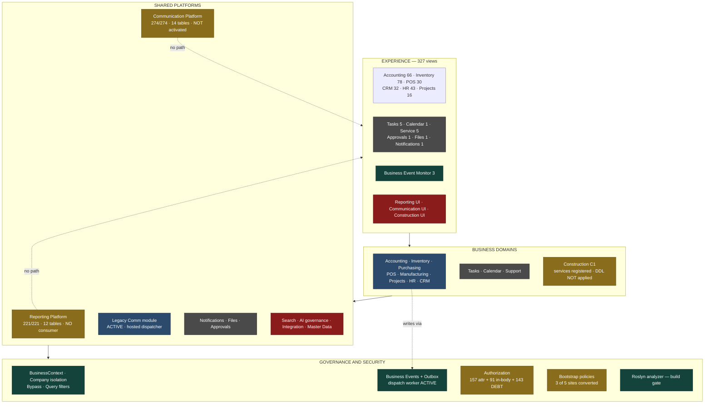
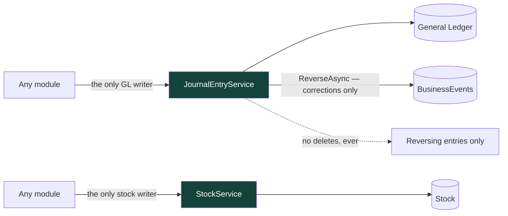
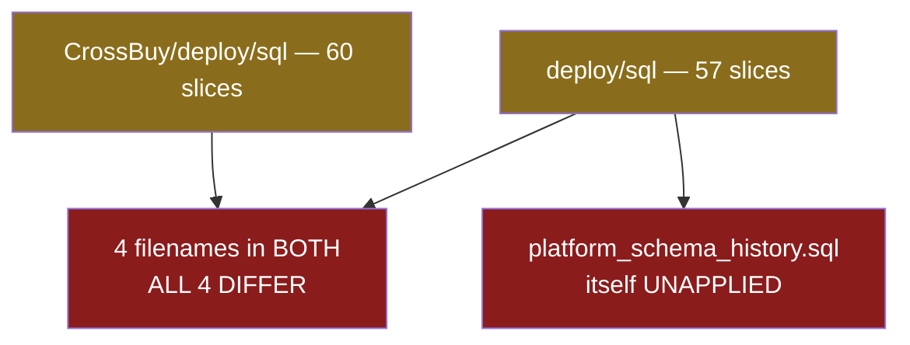

# CrossBusiness Platform — Roadmap v2 — 05 Current-State Architecture

**What exists on disk today, drawn honestly — including the parts that are wired but unreachable.**

---

## 1. Shape

A single ASP.NET Core 8 MVC monolith (`CrossBuy.csproj`) with 33 MVC controllers, 11 API controllers, 327 Razor views, 121 top-level BL services, 245 `DbSet` declarations and 8 registered hosted services. Three satellite projects: the Roslyn analyzer, its tests, and the application test suite. Two external workspaces: a Flutter mobile client and a Python AI workspace.

It is a modular monolith in practice — modules are folders and service boundaries, not assemblies. Nothing prevents a cross-module call except convention and the access services.

## 2. Current-state diagram

Legend — green: verified · amber: built but not reachable or carrying a known gap · blue: legacy working · grey: exists but weak · red: does not exist.

## 3. The two dotted lines are the point

`S1 -.->|no path| EXP` and `S2 -.->|no path| EXP`. Reporting and Communication are complete, tested platforms with **no route to a user**. They are drawn inside the architecture because their code and schema are real; the dotted edges record that no screen reaches them.

## 4. Layer-by-layer state

| Layer | State | Evidence |
|---|---|---|
| Experience | **Uneven.** Accounting/Inventory/POS mature; Tasks/Calendar/Support/Files/Approvals are single-view stubs; three platforms have no UI at all | 327 views measured by folder |
| Business domains | **Mostly LegacyExisting.** Working, not re-verified, carrying most of the 143 debt | Module assessments |
| Shared platforms | **Split.** Two foundations complete-but-dark; four capabilities do not exist | 221/221, 274/274, zero for Search/MDM/Integration/AI governance |
| Governance | **Strongest layer.** Context, isolation, events and the analyzer are verified and enforcing | B6 closure, 1502/0/0 |

The inversion is worth stating plainly: **the platform is strongest at the bottom and weakest at the top.** Governance is verified; the user-facing layer is where the gaps are.

## 5. Write discipline (unchanged and holding)

Two writers, corrections by reversal, never by deletion. `ReverseAsync` calls `RecordAsync` in-transaction with no swallow — so **every correction path in the product depends on the `BusinessEvents` table existing**. Normal posting does not.

## 6. Deployment reality

There is no reliable answer today to "which slices are applied to this database", because the table designed to answer it was never applied. This is RSK-01 and RSK-02, and it is why R1 exists.

## 7. Background processing

Eight registered hosted services: `RuntimeStartupLogger`, `PermissionScopeStartupValidator`, `BusinessEventDispatchWorker`, `CommMessageDispatcherHostedService` (legacy Comm), `IntegrityCheckHostedService`, `CrmReminderHostedService`, `TaskGeneratorHostedService`, `TaskScheduleMatchHostedService`.

Two of those eight belong to a module **no tab owns** (Tasks). None reaches a document writer, which is what keeps the `BusinessContext` requirement from being a production hazard today — but any new background writer would throw immediately.

## 8. What the current state is good at, and what it is not

**Good at:** transactional correctness, company isolation, an enforced authorization classification, event-sourced history, a broad and genuinely working set of business modules.

**Not good at:** turning platform investment into user capability; keeping one deployable schema; assigning ownership; giving operators any tooling at all.
