# CrossBusiness Platform — Roadmap v2 — 06 Target Architecture

**Four layers. Every box carries a status, so the diagram cannot be read as a claim.**

---

## 1. Target diagram

```mermaid
graph TB
  subgraph L1["LAYER 1 — EXPERIENCE"]
    A1["CrossBusiness Workspace<br/>FIRST PRODUCT - D-41"]:::plan
    A2["Module Workspaces"]:::part
    A3["Mobile Workspace"]:::part
    A4["Customer / Partner Portals"]:::part
    A5["Dashboards"]:::part
    A6["Report Center"]:::plan
    A7["Report Studio"]:::plan
    A8["Notifications and Mentions Centre"]:::plan
    A9["Calendar and My Work"]:::plan
    A10["Administration Consoles"]:::mixed
  end
  subgraph L2["LAYER 2 — BUSINESS DOMAINS"]
    B1["Accounting"]:::legacy
    B2["Inventory / WMS"]:::legacy
    B3["Purchasing"]:::legacy
    B4["CRM"]:::block
    B5["POS"]:::legacy
    B6["Manufacturing"]:::legacy
    B7["Projects"]:::legacy
    B8["Construction and Contracting"]:::found
    B9["HR"]:::legacy
    B10["Tasks"]:::part
    B11["Calendar"]:::part
    B12["Support"]:::part
    B13["Customer Experience"]:::plan
    B14["Industry Packs"]:::plan
  end
  subgraph L3["LAYER 3 — SHARED BUSINESS PLATFORMS"]
    C1["Reporting Platform"]:::found
    C2["Communication and Collaboration"]:::found
    C3["Workflow and Approvals"]:::part
    C4["Files and Documents"]:::part
    C5["Notification Engine"]:::legacy
    C6["Search"]:::none
    C7["AI Platform"]:::block
    C8["Integration Hub"]:::none
    C9["Audit and Compliance"]:::part
    C10["Master Data"]:::none
    C11["Configuration and Feature Flags"]:::legacy
  end
  subgraph L4["LAYER 4 — GOVERNANCE AND SECURITY"]
    D1["Identity"]:::legacy
    D2["Business Context"]:::done
    D3["Company / Branch / Project isolation"]:::done
    D4["Authorization"]:::mixed
    D5["Bootstrap Policies"]:::mixed
    D6["Business Events / Outbox"]:::done
    D7["Observability"]:::part
    D8["Background processing"]:::done
    D9["Backup and disaster recovery"]:::none
  end
  L1 --> L2 --> L3 --> L4
  classDef done fill:#13433a,color:#fff,stroke:#0d2f28;
  classDef found fill:#1d6b5a,color:#fff,stroke:#134539;
  classDef legacy fill:#2c4a6b,color:#fff,stroke:#1d3348;
  classDef part fill:#4a4a4a,color:#fff,stroke:#333;
  classDef mixed fill:#8a6d1c,color:#fff,stroke:#5c4812;
  classDef block fill:#8a1c1c,color:#fff,stroke:#5c1212;
  classDef plan fill:#6b5a8a,color:#fff,stroke:#453a5c;
  classDef none fill:#333,color:#aaa,stroke:#222,stroke-dasharray: 4 3;
```

**Identity: CrossBusiness Blue (D-36 APPROVED).** The palette below encodes STATUS, not brand.

**Legend.** Dark green = verified · green = foundation complete, no UI · blue = legacy working · grey = partial · amber = mixed/remediation · red = blocked by decision · purple = planned · dashed = does not exist.

## 2. Layer status

| Layer | Verified | Foundation-complete | Partial / legacy | Planned | Blocked | Does not exist |
|---|---|---|---|---|---|---|
| **L1 Experience** | Business Event Monitor | — | Module workspaces, mobile, portals, dashboards | Workspace, Report Center, Studio, Mentions, My Work | — | — |
| **L2 Domains** | Hyper lane | Construction C1 | Accounting, Inventory, Purchasing, POS, Manufacturing, Projects, HR, Tasks, Calendar, Support | Customer Experience, Industry Packs | CRM (D-03/D-04) | — |
| **L3 Shared** | — | Reporting, Communication | Workflow, Files, Notifications, Audit, Config | — | AI governance (D-27) | Search, Integration, Master Data |
| **L4 Governance** | Context, isolation, events, background processing | — | Identity, observability | — | — | Backup/DR |

**L4 is the only layer with more verified than missing.** That is the inheritance from Stage 1 and 2A, and it is what makes everything above it safe to build.

## 3. Design principles for the target

1. **One front door.** The CrossBusiness Workspace is the landing surface; module workspaces are destinations, not entry points.
2. **The Workspace owns no business data and adds no permissions.** It orchestrates approved service contracts; every read delegates to the owning module access service (D-41, RSK-23).
3. **Shared platforms are consumed, never forked.** A module gets reporting by registering a dataset and comments by implementing `ICommEntitySurface` — not by writing its own.
4. **Authorization is a layer, not a decoration.** Every new endpoint is attribute- or in-body-secured at the moment it is written; the analyzer enforces this and the debt only shrinks.
5. **One schema, one applied-slice record.** After R1 `CrossBuy/deploy/sql` is the canonical authored root (D-38), `manifest.json` is the authored registry and `PlatformSchemaHistory` the applied registry (D-40).
6. **Two writers stay two writers.** No new service posts a journal entry or a stock movement, whatever layer it sits in.
7. **Reverse, never delete.** History stays whole across every domain, including new ones.
8. **Fail closed.** An unresolved company scope reads nothing and writes nothing. This is why the CRM `return true` matters so much: it is the one place the platform currently fails *open*.
9. **A capability is not delivered until a user can reach it.** The catalog separates `ProductionActivation` and `UIStatus` from `CurrentStatus` precisely so this cannot be fudged again.

## 4. Target integration contracts

| Contract | Mechanism | Status |
|---|---|---|
| A module becomes reportable | Register a dataset in `ReportDatasetRegistry` | Available, unused by production modules |
| A module becomes commentable | Implement `ICommEntitySurface`, register `CommEntityRef` | Available, unused — Tasks and Support pending |
| A module raises history | `RecordAsync` in the ambient transaction, code in `EntityRegistry` | Available and used by Accounting, Inventory, Manufacturing |
| A module becomes searchable | Not yet defined | Does not exist — D-28 |
| A module appears in the Workspace | Expose a read contract on its access service | Does not exist — R3 |
| A module becomes authorizable | Implement `IModuleAccessService` | Used by 7 modules; Support has none |
| A module becomes schedulable | Not yet defined | Reporting scheduler deferred — D-11 |

The pattern is consistent and worth keeping: **a module opts into a platform by implementing one contract**, not by the platform knowing about the module.

## 5. What the target deliberately does not include

* No microservice split. The modular monolith is working; the problems are ownership and integration discipline, not process boundaries.
* No second UI framework. Metronic 8 with CrossBusiness Blue, RTL/LTR parity, `@Localizer` and ar/en/fr resx.
* No event-sourcing of business state. Events are history and integration, not the system of record.
* No offline selling.
* No replacement of working legacy modules for their own sake — they get authorization, reporting and collaboration, not a rewrite.
