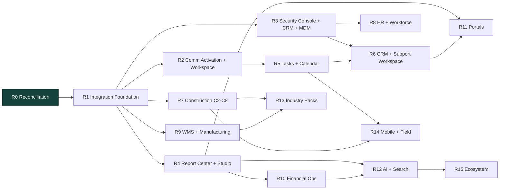
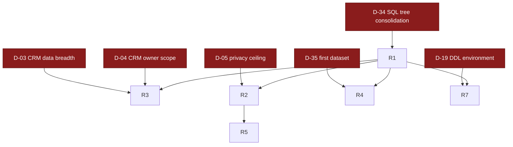

# CrossBusiness Platform — Roadmap v2 — 08 Dependency Map

Machine-readable: `roadmap-v2-dependencies.csv`.

---

## 1. Phase dependency graph

## 2. Decision blockers on the critical path

## 3. Edge list

| DependencyId | From | To | Type | Reason |
|---|---|---|---|---|
| DEP-01 | R1 | R0 | Sequential | Cannot govern the repository before agreeing what it contains. |
| DEP-02 | R2 | R1 | Sequential | No schema is activated until there is an authoritative applied record. |
| DEP-03 | R3 | R2 | Sequential | The workspace surfaces platforms that must first be reachable. |
| DEP-04 | R4 | R2 | Sequential | Report Center needs the reporting foundation activated. |
| DEP-05 | R4 | R3 | Capability | Saved and recent reports surface inside the workspace. |
| DEP-06 | R5 | R3 | Capability | Task and calendar views are workspace surfaces. |
| DEP-07 | R5 | R2 | Capability | Task comments and timeline require Communication activation. |
| DEP-08 | R6 | R1 | Sequential | CRM conversion and the console need a stable integration branch. |
| DEP-09 | R7 | R2 | Sequential | C2+ requires the C1 schema applied and measured. |
| DEP-10 | R8 | R6 | Capability | HR debt retirement follows the security console. |
| DEP-11 | R9 | R1 | Sequential | WMS slices need the canonical SQL root. |
| DEP-12 | R10 | R4 | Capability | Financial statements should be served by the reporting platform. |
| DEP-13 | R11 | R4 | Capability | Portals need report and document surfaces. |
| DEP-14 | R11 | R6 | Capability | Portal customers need the converted CRM and Support model. |
| DEP-15 | R12 | R10 | Data | AI needs a governed and audited data surface. |
| DEP-16 | R12 | R4 | Data | Search and AI consume the dataset layer. |
| DEP-17 | R13 | R7 | Capability | Contracting pack needs construction. |
| DEP-18 | R13 | R9 | Capability | Retail pack needs WMS advancement. |
| DEP-19 | R14 | R5 | Capability | Mobile work surface mirrors My Work. |
| DEP-20 | R14 | R7 | Capability | Site capture is a construction requirement. |
| DEP-21 | R15 | R12 | Capability | Public API follows the automation surface. |
| DEP-22 | R1 | D-38 | Decision | Canonical SQL root must be chosen before consolidation. |
| DEP-23 | R1 | D-40 | Decision | PlatformSchemaHistory design gates the applied record. |
| DEP-24 | R2 | D-05 | Decision | Communication activation needs the privacy ceiling. |
| DEP-25 | R2 | D-19 | Decision | Construction C1 schema needs an approved environment. |
| DEP-26 | R4 | D-35 | Decision | Report Center needs its pilot dataset - APPROVED. |
| DEP-27 | R5 | D-32 | Decision | Task ownership - APPROVED. |
| DEP-28 | R5 | D-33 | Decision | Calendar ownership - APPROVED. |
| DEP-29 | R6 | D-03 | Decision | CRM conversion blocked on customer-data breadth. |
| DEP-30 | R6 | D-04 | Decision | CRM conversion blocked on visible-owner scope. |
| DEP-31 | R11 | D-13 | Decision | Portals need the external principal model. |

## 4. Capability dependency clusters

| Cluster | Root | Dependent capabilities |
|---|---|---|
| Business context | PLT-01 | Every module access service, every company-scoped read |
| Business events | PLT-02 | PLT-04, PLT-05, SEC-05, reversal on every correction path |
| Entity registry | PLT-03 | COM-05, PLT-05, SRC-01 |
| Comm activation | COM-08 | COM-09, COM-06, SUP-02, TSK-05, REP-05 |
| Reporting datasets | REP-01 | REP-02..REP-09, ACC-07, AI-01, SRC-01 |
| Construction C1 rollout | CON-04 | CON-05, AUD-01, SCR-38, SCR-39 |
| Bootstrap policy | SEC-02 | SEC-03, SEC-04, SEC-08 |
