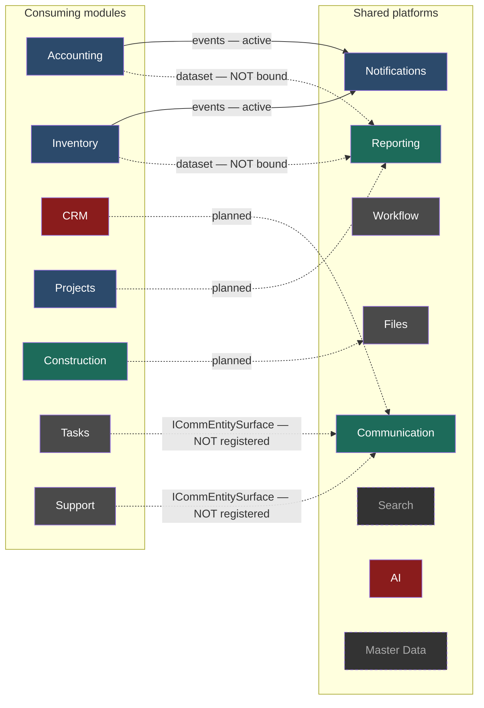
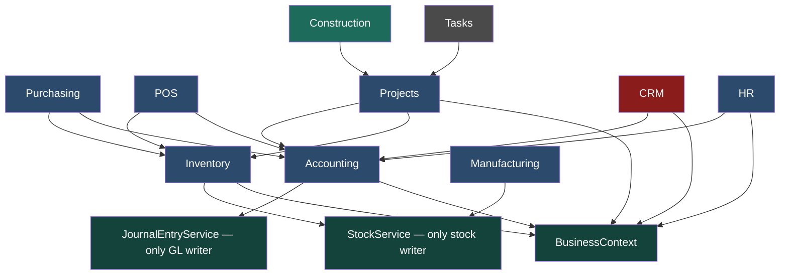
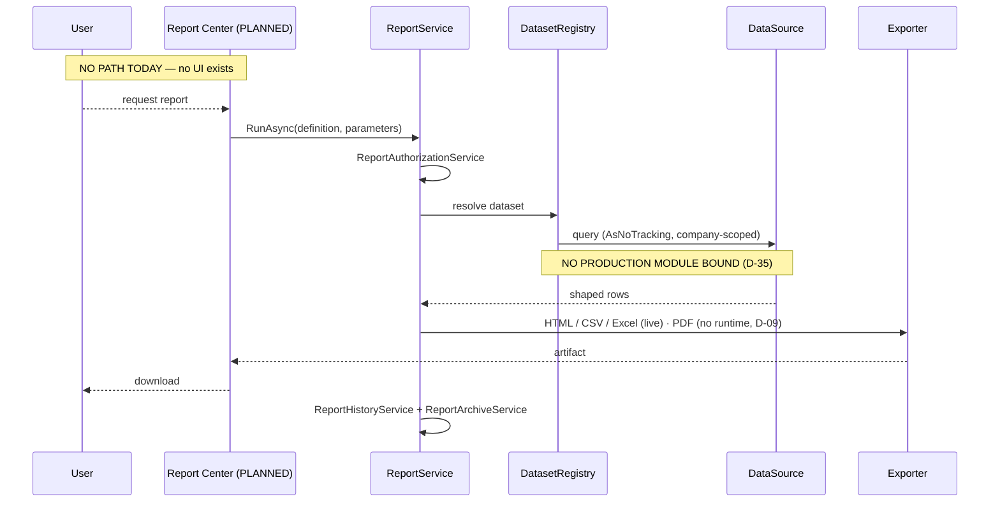
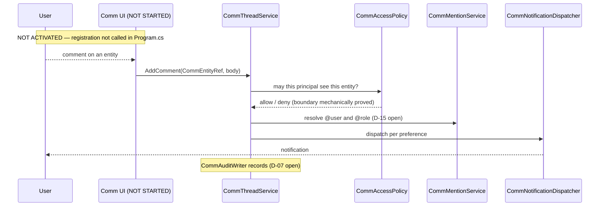
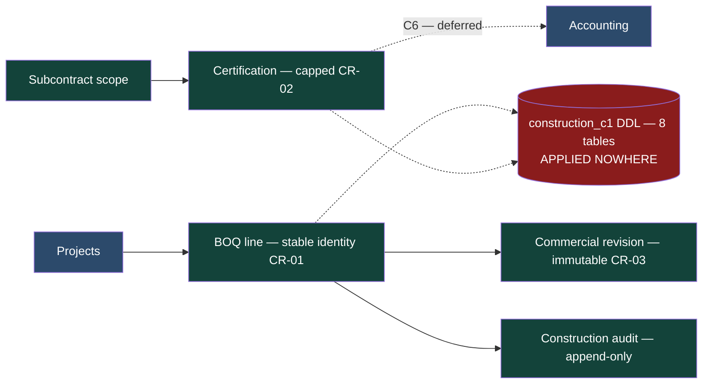
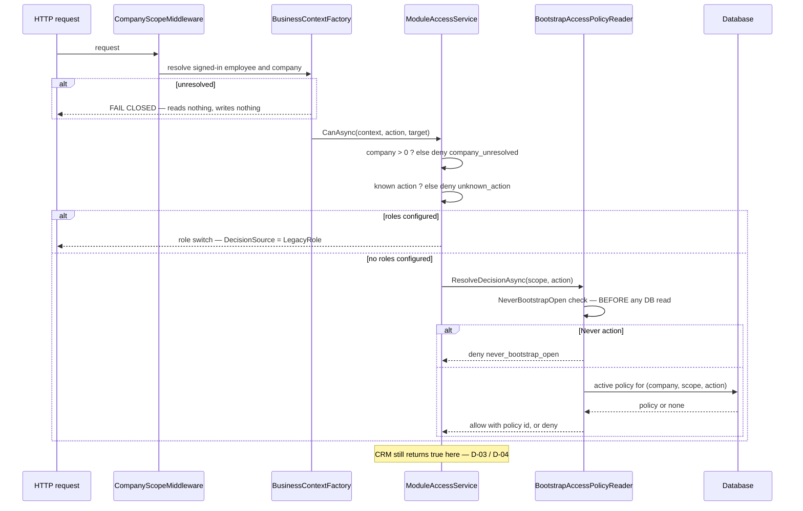
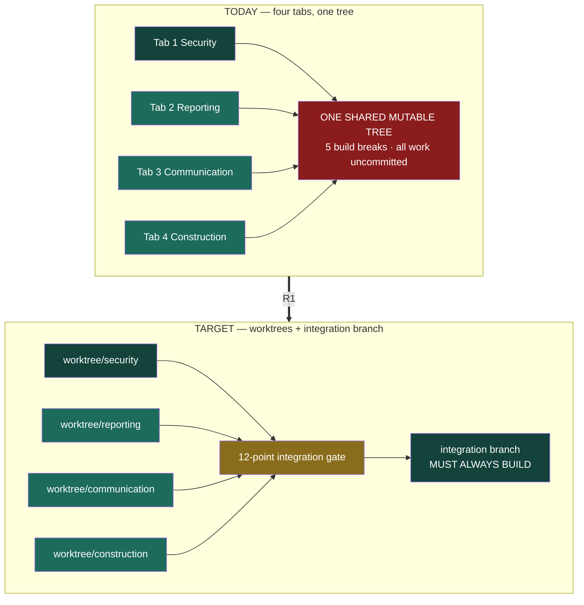

# CrossBusiness Platform — Roadmap v2 — 13 Architecture Diagrams

**Ten editable Mermaid sources.** Every diagram distinguishes current from future; no box asserts a capability the capability catalog does not support.

Shared class definitions used throughout:

```
classDef done   fill:#13433a,color:#fff,stroke:#0d2f28;   %% verified
classDef found  fill:#1d6b5a,color:#fff,stroke:#134539;   %% foundation, no UI
classDef legacy fill:#2c4a6b,color:#fff,stroke:#1d3348;   %% legacy working
classDef part   fill:#4a4a4a,color:#fff,stroke:#333;      %% partial
classDef mixed  fill:#8a6d1c,color:#fff,stroke:#5c4812;   %% remediation
classDef block  fill:#8a1c1c,color:#fff,stroke:#5c1212;   %% blocked
classDef plan   fill:#6b5a8a,color:#fff,stroke:#453a5c;   %% planned
classDef none   fill:#333,color:#aaa,stroke-dasharray: 4 3; %% absent
```

---

## 1 · Current-State Architecture

See `Roadmap-V2-05-Current-State-Architecture.md` §2 — the authoritative source. Reproduced there rather than duplicated here so the two cannot drift.

## 2 · Target Architecture

See `Roadmap-V2-06-Target-Architecture.md` §1.

## 3 · Shared Platform Relationships



**Solid = live today. Dotted = contract exists, not consumed.** Every dotted line into Reporting and Communication is the same finding stated seven ways: the platforms are built and nothing uses them.

## 4 · Module Dependency Map



`Projects.billing → Accounting.post` is the dependency worth noting: being a projects administrator confers no right over the ledger, and B6 made that transitive closure hold on unconfigured companies too.

## 5 · Reporting Flow



## 6 · Communication Flow



## 7 · Construction Integration Flow



The red node is the whole risk: services are registered in `Program.cs` while their tables exist in no database (RSK-11).

## 8 · Security and Business Context Flow



## 9 · Roadmap Phase Dependency Map

See `Roadmap-V2-08-Dependency-Map.md` §1 and §2.

## 10 · Product Integration Map


