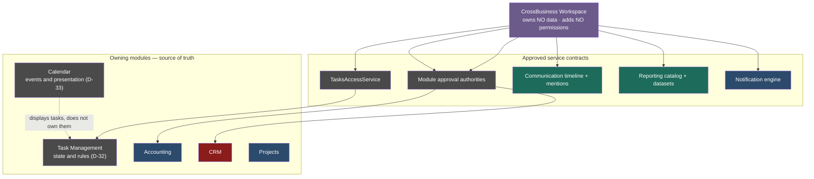

# CrossBusiness Platform — Roadmap v2 — 16 Product Vision

**CrossBusiness Workspace is the first integrated user-facing product.** *(Decision D-41 — APPROVED.)*

---

## 1. Why a workspace, and why first

The platform has 327 screens across nine mature modules, and a user who needs to know *what they should be doing today* has nowhere to look. Tasks live in a 5-view list. Approvals live in a separate single-view inbox. Notifications live in a third. Mentions do not surface at all because Communication is not activated. Reports cannot be reached because Reporting has no UI.

Every one of those capabilities exists. None of them meets the user in one place.

That is the case for the Workspace being **first**: it does not require new business capability, it requires *reaching* capability that is already built and paid for. R2 makes the three dark platforms reachable; R3 gives them somewhere to appear.

## 2. What the Workspace is

A single front door that unifies, over time:

| Surface | Source | Screen |
|---|---|---|
| My Work | Tasks, approvals, mentions | SCR-44 |
| Tasks | Task Management (D-32) | SCR-37 |
| Calendar | Calendar Platform (D-33) | SCR-37 |
| Approvals | Each module's approval authority | SCR-46 |
| Notifications | Notification engine | SCR-36 |
| Mentions | Communication Platform | SCR-36 |
| Recent Activity | Communication timeline | SCR-45 |
| Timeline | Business events + timeline projection | SCR-45 |
| Saved reports | Report catalog | SCR-47 |
| Recent reports | Report history | SCR-47 |
| Favourites | Report favourites | SCR-47 |
| Quick actions | Module services | SCR-48 |
| Personal dashboard | Reporting datasets | SCR-49 |
| Team dashboard | Reporting datasets + OrgHierarchy | SCR-50 |

## 3. What the Workspace is NOT — the binding constraints

These are constraints, not preferences. Each exists because the alternative is a defect.

**1 · Not a new business module.** It introduces no new domain, no new entity, no new table. `DatabaseStatus` for `WSP-01` is *"None — owns no tables"*.

**2 · It does not own Accounting, CRM, Task or Calendar data.** Ownership stays exactly where D-32, D-33 and the module assessments place it. The Workspace reads; it never becomes a source of truth.

**3 · It orchestrates through approved service contracts.** It calls the same module services a module screen calls. It does not query module tables directly, and it does not get its own read model over someone else's data.

**4 · It must not bypass module permissions.** This is the one that matters most.

> **The Workspace adds NO permissions of its own.** Every read delegates to the owning module's access service. A row appears in My Work only if the owning module would return it to that user on that module's own screen.

The reason is recorded as **RSK-23**: a unified surface that aggregates across modules is the classic place an authorization shortcut gets introduced — one efficient joined query that returns what the user could not see module by module. The platform already learned this lesson in the opposite direction: *hiding a UI control is not a control*. The inverse is equally true — **showing an aggregated row is an authorization decision**, and it must be made by the module that owns the row.

R3 therefore carries a specific test gate: **per-module delegation tests**, proving that for each surfaced item type, the Workspace result set equals what the owning access service authorizes — no wider.

**5 · It uses CrossBusiness Blue** (D-36).

**6 · It requires an approved Metronic reference before UI implementation.** Every Workspace screen in the inventory carries `REQUEST owner Metronic reference — CrossBusiness Blue` in its `DesignReference` field. That is a gate, not a note.

## 4. Architectural position

Every arrow out of the Workspace passes through a service contract. There is no arrow from the Workspace to a table.

## 5. Ownership boundaries this vision depends on

Settled by decision this increment:

| Concern | Owner | Decision |
|---|---|---|
| Task entity, assignment, status, priority, due dates, dependencies, checklists, subtasks, escalation, time tracking, task rules | **Task Management** | D-32 |
| Comments, mentions, attachments, reactions, followers, watchers, unified timeline rendering, notification generation contracts | **Communication** | D-32, D-12 |
| Calendar events, recurrence, attendees, meeting metadata, availability, reminders, resource booking, schedule views, external calendar contracts | **Calendar** | D-33 |
| Task due dates and task scheduling rules | **Task Management** (Calendar may display, not own) | D-33 |
| Domain schedules, milestones, activities | **Projects / Construction** | D-33 |
| Presentation and coordination across all of the above | **Workspace** (owns none of it) | D-41 |

**Tasks publishes events to the shared timeline and must not maintain a second independent general timeline.** That single rule prevents the most likely architectural regression here — three modules each growing their own activity feed.

## 6. Delivery sequence

| Phase | What the Workspace gains |
|---|---|
| **R2** | Nothing visible — but Communication and Reporting become reachable, which is the precondition |
| **R3** | Shell, navigation, My Work, notifications, mentions, approvals, recent activity, personal dashboard |
| **R4** | Saved, recent and favourite reports |
| **R5** | Unified Task and Calendar views |
| **R6** | Support cases via the converted CRM permission model |
| **R14** | The mobile workspace mirrors My Work |

Team dashboard (SCR-50) is deliberately held back from R3 until team-scope resolution through `OrgHierarchy` is settled — scope must be resolved by module services, never by the Workspace.

## 7. What success looks like

A user opens one surface and sees their tasks, approvals, mentions and recent activity across every module they work in — and **every item was authorized by the module that owns it**. Not one row appears because an aggregation query was more convenient than a delegation call.
