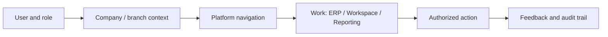

# 01 — Vision

CrossBusiness should feel like one dependable operating environment across ERP, people, collaboration, analysis, and frontline work. Familiarity comes from Metronic; identity and discipline come from CrossBusiness Blue and the approved design system.

The UX promise is: **the right business context, the next safe action, and a trustworthy result without unnecessary navigation**. Dense operational work may stay dense; management work may summarize; field work may become touch-first. Consistency means predictable hierarchy, states, language, and behavior—not identical page geometry.

## Product experience model

Success means users can identify context, understand status, complete the dominant task, recover from failure, and move to adjacent work. Evidence anchors include the context-rich Workspace shell (`Views/Shared/_LayoutWorkspace.cshtml`), analytical Reporting shell (`Views/Shared/_LayoutReporting.cshtml`), and specialized operational shells (`_LayoutPos.cshtml`, `_LayoutPosApp.cshtml`, `_LayoutHyperPos.cshtml`).

The future direction is evolution: consolidate navigation and state behavior, migrate raw styling to approved tokens, retain domain workflows, and start new surfaces compliant. It is not a mass visual rewrite.
