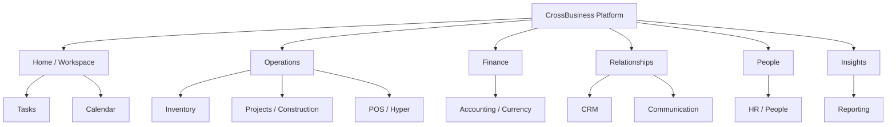

# 03 — Information Architecture

## Domain hierarchy

The primary object model is Organization → company → branch → module → work object → activity/history. Preserve the user's context when crossing modules; never imply a company switch through navigation alone.

## Screen families

- **Hub:** Workspace, dashboards, module landing pages.
- **Collection:** searchable/filterable lists, queues, inboxes, catalogs.
- **Record:** summary, details, related items, timeline, files, actions.
- **Editor:** create/update workflows, simple forms or stepped flows.
- **Analytical:** report center, viewer, financial statements, drill-down.
- **Planner:** Tasks, Calendar, Kanban, schedules.
- **Operational:** POS, KDS, scanning, stock floor, field execution.
- **Communication:** inbox, thread, comments, mentions, notification center.
- **Administration:** setup, policy, access, monitoring, configuration.
- **Embed/print/public:** report embed, printable output, login, Store/Portal.

Actual folders map in `38-Screen-Blueprints.md`; `Views/Shared/_MainMenu.cshtml` and the multiple shared layouts are current navigation evidence, not automatically the final taxonomy.
