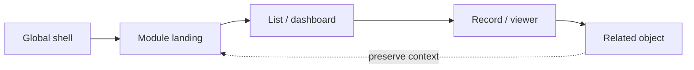

# 04 — Navigation Strategy

Use the Metronic aside/header/menu system. Do not build a parallel router or navigation widget.

## Levels

1. Global: product identity, company/branch context, global search, notifications, user menu.
2. Module: stable module destinations in the aside or module shell.
3. Local: tabs, subnavigation, breadcrumbs, view switcher.
4. Contextual: record actions, row menu, related-object links.

Rules: highlight exactly one active destination; show breadcrumbs after two hierarchy transitions; labels describe destinations, not internal controller names; group by user goal; retain filter/view state on back navigation; external/embed views declare exit behavior. Mobile uses Metronic drawers and a visible current-context title—not a second information architecture.

Permission-filter menus server-side and provide a stable authorized landing route. Do not show a disabled security-sensitive destination. For a known but currently unavailable capability, show it only when product policy calls for explanation.

Current evidence: `Views/Shared/_MainMenu.cshtml`, `_LayoutBackend.cshtml`, `_LayoutWorkspace.cshtml`, `_LayoutReporting.cshtml`, and specialized layouts. Their duplication is migration debt; changes require Integration Owner review.
