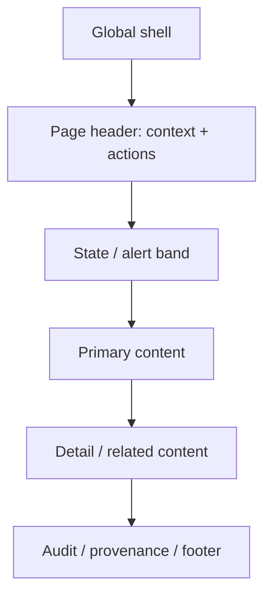

# 36 — Layout Patterns

## Approved shells

1. **Application shell:** header/aside/content for ERP, CRM, HR, Projects, Tasks and Calendar. Converges existing `_LayoutBackend.cshtml`, `_LayoutAccounting.cshtml`, `_LayoutInventory.cshtml`, `_LayoutPeople.cshtml` through separately approved migration.
2. **Workspace/analytical shell:** context-rich Blue application variant for `Views/Shared/_LayoutWorkspace.cshtml` and `_LayoutReporting.cshtml`.
3. **Operational shell:** task-optimized POS/Hyper/Manufacturing surfaces; reuse tokens and accessibility without forcing dashboard geometry.
4. **Embed/print/auth/public shell:** reduced navigation, explicit identity/exit and output fidelity; evidence `_LayoutEmbed.cshtml`, null-layout login/print views, `_mainLayout.cshtml`.

Collection blueprint: header → toolbar/filter → result summary → table/cards → pagination. Record: identity/status → actions → summary → tabs/sections → timeline. Editor: context → sections → validation → sticky/terminal actions. Operational: persistent task state → work surface → totals/status → immediate actions.

All layouts define landmarks, max readable width, responsive order, sticky behavior, drawer ownership, RTL logical edges and dark tokens. Shared layout changes belong to the Integration Owner.
