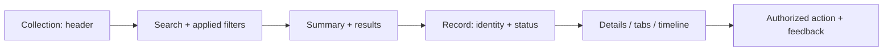
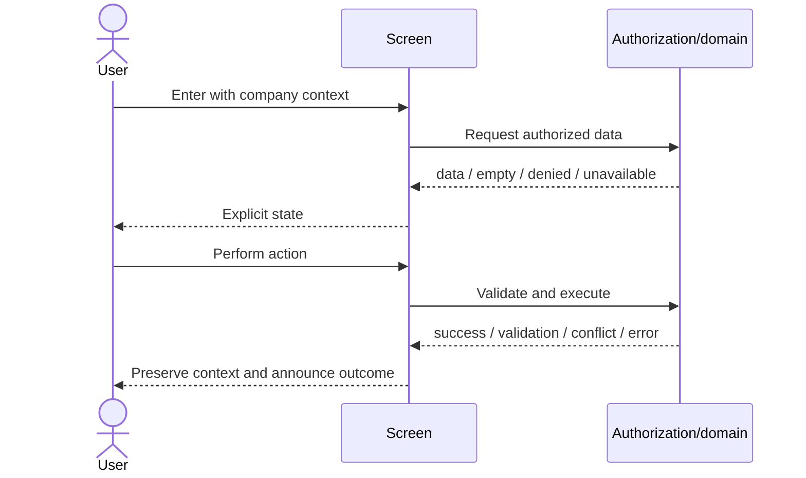

# 38 — Screen Blueprints

This is the normative record for **every current and future screen**. Each view inherits its family row and module chapter; exceptions require an explicit screen record.

## Mandatory screen record

| Field | Required decision |
|---|---|
| Purpose/users/business goal | one job, named roles, measurable outcome |
| Layout/sections/widgets | approved shell, reading order, bounded components |
| Navigation | entry, active destination, breadcrumbs/back/exit |
| Permissions | view/action/field/export scope; server authority |
| Filters/actions | defaults, persistence, one primary, destructive safety |
| States | loading, empty, unavailable, denied, validation, error, partial, success |
| Responsive/RTL/dark | order and transformations; logical direction; token behavior |
| Accessibility/keyboard | landmarks, heading, names, focus path, announcements |
| Expected flow | entry → decision → action → feedback → next route |
| Performance | initial critical data, paging/defer/cancel/cache boundaries |
| Future evolution | status, owner, dependencies, compatible migration path |

## Applied family catalog

| Views / screen family | Purpose and layout | Dominant flow and special rules | Status/posture |
|---|---|---|---|
| `Workspace/*` | personal hub; header + panel grid | scan attention → open source → return; independent panel states | reference/evolve |
| `Reports/*`, `Workspace/Reports` | find/run/analyze; catalog or parameter bar + canvas | choose → parameterize → run → drill/export; provenance/export auth | reference/evolve |
| `Accounting/*`, `Currency/*` | financial record/statement; collection/editor/report | find/create → validate → post/review; period/currency/audit | legacy-compatible/migrate |
| `Inventory/*` | stock/item/transaction; collection/editor/operational | search/scan → transact → validate/post; units/location/trace | legacy-compatible/migrate |
| `Crm/*` | relationship pipeline/record | queue → record → next activity → outcome | legacy-compatible/migrate |
| `People/*` | employee self-service/dashboard | review balance/status → request/view | implemented/evolve |
| `Admin/*` | HR/admin setup and queues | search/configure/approve → audit result | legacy-compatible/migrate |
| `Project/*` | project records and execution | portfolio → project → work object → status | implemented; construction base |
| dedicated Construction | project/site/contract workspace | context → field/commercial action → approval | planned/architecture-only unless disk proves otherwise |
| `Tasks/*` | list/board/detail/hours/report | prioritize → open/move/update → feedback | existing/evolve, not greenfield |
| `Calendar/Index` | schedule grid/agenda/editor | navigate → inspect/create/edit → feedback | existing/evolve, not greenfield |
| future Communication | inbox/thread/context/composer | choose → read → compose → delivery | planned/new platform |
| `Comm/*`, `Chat/*`, document comments | email/chat/comment compatibility | legacy-specific flow | legacy; distinct from new platform |
| `Pos/*`, `PosApp/*`, `Hyper/*` | cashier/KDS/mobile retail | open → scan/order → tender/fulfill → receipt | specialized operational |
| `BusinessEventMonitor/*` | operational event monitoring | filter → inspect event → retry/trace if authorized | implemented/admin |
| `Notifications/*`, `Announcements/*`, `Approvals/*` | attention and action queues | inspect → source/action → mark state | implemented/evolve |
| `FileManager/*` | file collection and actions | browse/search → inspect/upload/download | implemented; access-sensitive |
| `Portal/*`, `Store/*`, `Home/Store` | external/public task | enter context → transact/request → reference | separate public shell |
| `Account/*` | auth/profile/subscription | authenticate/manage → explicit outcome | implemented; privacy-sensitive |
| `Shared/*`, print/null-layout views | layout/partial/output | embed/print/support owning screen | shared; Integration-owned |

## Reference blueprints

Any view not individually named inherits from its folder row and its shape (hub, collection, record, editor, analytical, planner, operational, communication, administration, embed/public). Before implementation, its owner completes the mandatory record in the governing issue/PR.
