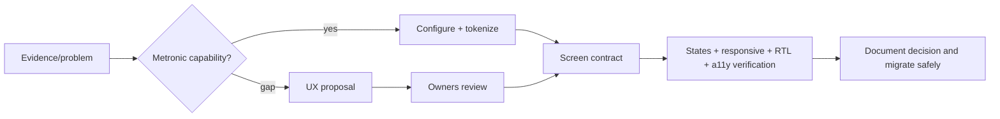

# 40 — UX Governance

## Ownership

- **UX System Owner:** this Bible, interaction/state standards and exceptions.
- **Design System Owner:** tokens, visual rules, component semantics.
- **Integration Owner:** shared layouts/assets/partials and Metronic integration.
- **Module Owner:** workflows, domain states, permissions and screen records.
- **Security/Privacy Owner:** authorization, company isolation, disclosure and AI review.
- **Accessibility/Localization reviewers:** WCAG, keyboard, Arabic RTL and English LTR evidence.

Until named people are assigned, no contributor may silently assume cross-platform ownership. Shared files under `Views/Shared` and shared assets require Integration Owner coordination; module tabs own their domain files.

## Change path

Proposal includes users/job, current evidence, Metronic alternatives, component/screen anatomy, all states, permissions, responsive/RTL/dark/accessibility/keyboard/motion behavior, performance, telemetry, migration/rollback and owners. A bespoke primitive requires demonstrated Metronic/Bootstrap gap.

## Release gates

- Correct status: implemented/verified, implemented/not activated, architecture-only, legacy, planned or blocked.
- Screen record complete; one primary action; all states designed.
- Metronic/Bootstrap/KeenIcons reused; approved tokens only.
- Server authorization and company isolation verified; no sensitive leakage in counts/previews/errors.
- Keyboard, focus, semantic structure, contrast, zoom, reduced motion and screen reader checks.
- Arabic RTL and English LTR; mobile/tablet/wide; dark-token review.
- Performance behavior for large/slow data; input survives recoverable failure.
- Shared-file ownership and module/integration gates pass.

## Exceptions and maturity

Exceptions name owner, reason, scope, risk, expiry/review date and migration target. Legacy debt begins warning-only; new/changed work must comply. Deprecation names replacement, inventories consumers, publishes migration, and removes only at zero approved usage. UX decisions receive stable IDs linked to roadmap/governance. Review this Bible quarterly and after material Metronic upgrades.
